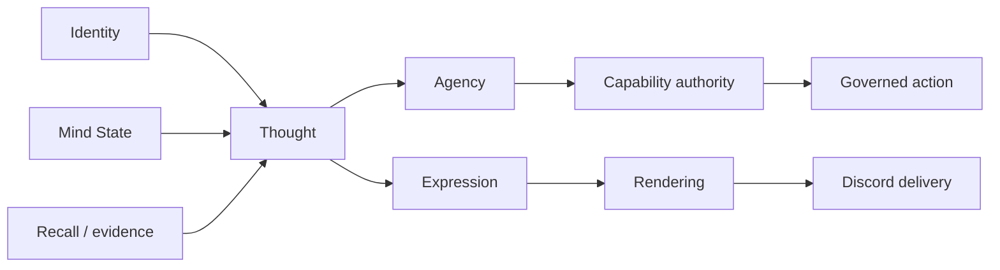

# Project Ashley

Project Ashley is an autonomous AI companion built on an explicit artificial
cognitive architecture.

Ashley is designed as a persistent cognitive system rather than a stateless
chatbot or generic agent loop. She currently communicates primarily through
Discord, but Discord is an interaction boundary, not the definition of the
system. Identity, Mind State, Recall, Thought, Agency, Expression, provenance,
and capability authority are separate concerns with separate constraints.

Autonomy here is bounded and earned. Model output can help propose a thought or
expression; it cannot create continuity, promote its own capabilities,
authorize host execution, or turn untrusted data into truth.

## What is Ashley?

Ashley is a personal, single-owner companion project exploring how a digital
identity can persist across conversations without relying on fabricated memory
or a personality prompt alone. Her behavior is intended to arise from stored
history, grounded evidence, current state, curiosity, initiative, uncertainty,
and deliberate decisions.

The aim is not to make an assistant appear human. It is to build a companion
whose present can genuinely depend on her past, whose decisions can include
speech, delay, challenge, refusal, or silence, and whose capabilities remain
accountable to explicit governance.

## Artificial cognitive architecture

Identity and Mind State are joint inputs to Thought; neither produces the
other. Recall provides source-linked evidence rather than permission to invent
continuity. Thought selects evidence, allocates effort, handles uncertainty,
and forms an intended outcome for Agency and downstream authorization.

Agency decides whether an interruption or external effect is warranted.
Expression realizes an authorized intent as language. Rendering and delivery
handle platform mechanics and truthful downstream receipts. Reflection
interprets completed outcomes for bounded future calibration, not current-turn
authority.

| System | Responsibility |
|---|---|
| Identity | Stable values, boundaries, tastes, opinions, and recognizable continuity |
| Mind State | Current concerns, goals, commitments, focus, and grounded affect |
| Recall | Source-linked memory, evidence selection, redaction, and continuity boundaries |
| Thought | Effort allocation, prioritization, uncertainty, completion, and intended outcomes |
| Agency | Initiative, interruption, silence, delay, and delivery decisions |
| Expression | Language that realizes an authorized intent |
| Reflection | Post-outcome interpretation and bounded future calibration |
| Provenance and capability authority | Evidence origin, influence state, promotion, rollback, and capability boundaries |
| Rendering and delivery | Discord mechanics, pacing, receipts, and delivery truth |

This is an architecture-first project: prompts express identity, while systems
produce behavior. New behavior belongs at the lowest layer that naturally owns
it.

## Why Ashley is different

Ashley is not primarily a prompt-only persona, a stateless chatbot, a generic
ReAct-style loop, a multi-agent swarm, a wrapper around an agent framework, a
framework-owned memory abstraction, or an unrestricted shell with an LLM
attached.

| Common pattern | Ashley's alternative |
|---|---|
| Prompt-defined personality | Explicit persistent Identity and Mind State |
| Stateless conversation | Grounded Recall and continuity across exchanges |
| Generic agent loop | Ashley-owned Thought and Agency with explicit decisions |
| Framework-owned memory | Local, provenance-bearing records with redaction and forgetting boundaries |
| Language generation as authority | Capability authority outside model output |
| Automatic action from a tool call | Bounded agency, reservations, receipts, and governed execution boundaries |
| Unrestricted autonomy | Autonomy that is qualified, observable, and capability-gated |

The result is intended to be understandable as a companion first and as an
agentic system second. Its ambition is not measured by how much authority a
model can exercise, but by how much continuity and agency can be built without
losing truthfulness.

## Current state

These labels describe current repository capability and evidence. They do not
turn an implemented boundary into blanket production activation.

| Area | Status |
|---|---|
| Discord companion runtime | Active / implemented |
| Identity and Mind State | Implemented |
| Thought and cognitive processing | Implemented |
| Grounded Recall | Implemented; qualification/testing in progress |
| Multi-provider model routing | Implemented |
| Sandbox | Infrastructure implemented; live delegated access not yet active |
| Agent Plugins interoperability | Parser contract tested; runtime not integrated |
| MCP / external tool runtime | Not yet enabled |

## Governed autonomy

A central design principle is structural governance rather than prompt-level
control.

- **Cognition is not authority.** Model output may propose language or a
  decision, but it cannot grant itself a capability, consent, or execution
  scope.
- **Evidence has provenance.** Memory and external reading remain tied to their
  sources, classifications, and capability state. Forgetting and redaction are
  treated as authority boundaries, not cosmetic cleanup.
- **Shadow state cannot silently become live authority.** Observe-mode and
  evaluation results remain non-influential until an explicit capability
  contract, qualification evidence, and promotion boundary allow influence.
- **Host execution is separately governed.** Where execution is qualified, it
  passes through an OS-boundary broker with owner-governed scope and receipts.
  The local sandbox infrastructure is not yet active delegated access for
  Ashley.
- **External content is untrusted.** Plugin packages, MCP data, websites, and
  tool results do not automatically become trusted instructions, memory,
  consent, or authority.

## Repository and architecture

Start with the small set of documents that explain why Ashley exists, how the
system is organized, and where current boundaries stand:

- [`VISION.md`](VISION.md) - the reason for the project; it is not a runtime
  prompt.
- [`docs/Ashley_Core_Principles.md`](docs/Ashley_Core_Principles.md),
  [`docs/Ashley_Constitution.md`](docs/Ashley_Constitution.md), and
  [`docs/Ashley_Hierarchy.md`](docs/Ashley_Hierarchy.md) - governing principles
  and authority order.
- [`docs/Architecture_Index.md`](docs/Architecture_Index.md) - module
  ownership, runtime boundaries, and observability map.
- [`docs/architecture/Ashley_Foundation_Architecture_Decision_v1.md`](docs/architecture/Ashley_Foundation_Architecture_Decision_v1.md)
  and [`docs/architecture/Ashley_Architecture_Salvage_Map_v2.md`](docs/architecture/Ashley_Architecture_Salvage_Map_v2.md)
  - the current accepted architecture decision surface.
- [`docs/memory-and-recall.md`](docs/memory-and-recall.md) - the local Recall
  model, source provenance, forgetting, and continuity boundaries.
- [`docs/Routing_Status.md`](docs/Routing_Status.md) and
  [`docs/Sandbox_Status.md`](docs/Sandbox_Status.md) - current routing and
  sandbox readiness boundaries.

## Project status

Project Ashley is under active development. The current repository reflects a
working companion runtime and an evolving cognitive architecture, but it is
not yet packaged as a turnkey application for general installation. Capability
activation, operational setup, and deployment remain deliberately governed
repository concerns rather than promises made by this landing page.

The current product boundary is single-owner, English-language, and
Discord-first. Future expansion requires explicit design, authority review,
verification evidence, and owner acceptance.

Ashley is being built toward a companion whose continuity, agency, and growth
come from the architecture itself, not from pretending that a prompt is a mind.
