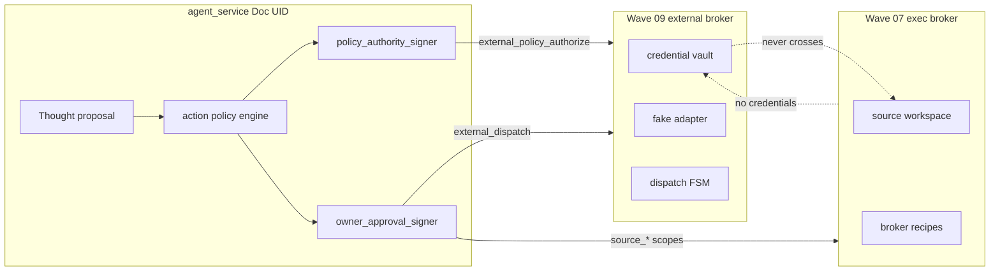
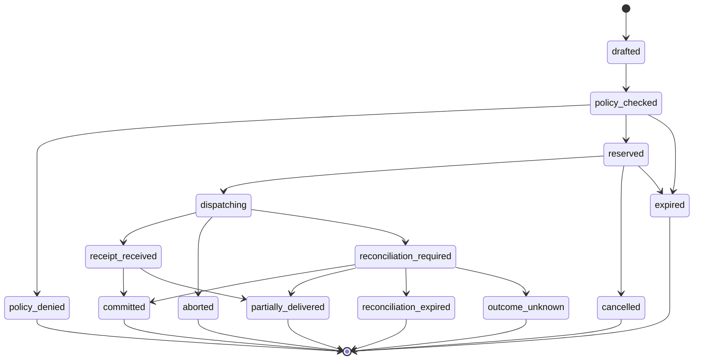

# External Agency Design — Account and External-Action Broker

> **SALVAGEABLE SEMANTICS / SUPERSEDED MECHANISM.** This historical Wave
> design remains reference input for capability and action separation,
> credential custody through opaque references and bounded sessions, privacy,
> payload binding, idempotency, emergency stop, receipts, reconciliation,
> `OUTCOME_UNKNOWN`, untrusted external data, and forget semantics. Its Wave
> dependency gates, mandatory separate-broker topology, fixed signer and scope
> names, and fixed action/risk taxonomy are not the current universal
> architecture. The authoritative cross-cutting owner is
> [`architecture/External_Effect_and_Authority_Architecture.md`](architecture/External_Effect_and_Authority_Architecture.md).

**Current-source implementation presence:** The agent-service contains external
action schema, lifecycle, policy, owner surfaces, and metadata under
`apps/agent-service/src/core/external-agency/`. The separate
`apps/external-broker/` package contains vault, policy, dispatch, receipt, and
reconciliation mechanisms. Only its fake local adapter is present. No
production external-broker instantiation was found outside its package factory
and tests. This architecture is not deployed or qualified for a real adapter,
account, credential path, provider, host, or external effect.

**Historical body status:** Wave external-account and external-action broker
design plus implementation provenance. It is not current cross-cutting
authority, deployment authority, or proof of real-mechanism qualification.

This document specifies the platform-neutral authority boundary for future external
accounts and actions: action policy, credential vault, dispatch FSM, public-privacy
enforcement, and fake-adapter contract. It derives from
[`WAVE-09-EXTERNAL-AGENCY.md`](https://github.com/XharvaK/composer-assistant)
(prompt), [`Ashley_Ethics.md`](Ashley_Ethics.md) (`ETH-PUB-*`, `ETH-SEC-*`,
`ETH-EXT-*`), [`Ashley_Stewardship_Compact.md`](Ashley_Stewardship_Compact.md)
(`SC-LIN-06`–`08`, `SC-EMG-*`), [`Sandbox_Design.md`](Sandbox_Design.md), and
[`Self_Modification_Design.md`](Self_Modification_Design.md).

## Authority chain

```text
VISION.md
  → Ashley_Core_Principles.md
    → Ashley_Constitution.md
      → Ashley_Stewardship_Compact.md + Ashley_Ethics.md
        → Architecture (AGENTS.md, Architecture_Index.md, Vision_Implementation_Map.md)
          → Sandbox Design → Self-Modification Design
            → External Agency Design (this document)
```

## Scope and gates

**In scope:** action policy engine, dual authorization model, vault boundary,
public-privacy pre-dispatch, external-action FSM, fake adapter contract,
external-entity rules, owner surfaces, continuity/forget requirements.

**Out of scope until gates pass:**

| Gate | Status |
|------|--------|
| Wave 06 (perception v15) | Implementation-present; **not accepted** until verification passes |
| Wave 07 (exec sandbox) | **Design only** — [`Sandbox_Design.md`](Sandbox_Design.md) |
| Wave 07b (broker implementation) | **Frozen interfaces** — must not extend signed envelope authority |
| Wave 08 (self-mod) | **Design only** — [`Self_Modification_Design.md`](Self_Modification_Design.md) |
| Wave 09b implementation | After Waves 06–08 accepted **and** Wave 07b broker tested |

**Not this wave:** vault code, MIGRATION_17, capabilities, real credentials, network
adapters, account registration, fake-adapter implementation, `apply`, deploy.

---

## 1. Trust boundary: vault vs exec workspace

Wave 09 introduces a **separate external-action authority domain** — not the Wave 07
execution workspace.



| Domain | Owns | Never holds |
|--------|------|-------------|
| Wave 07 exec broker | Source edit/test, patch artifacts, verify recipes | Credentials, external dispatch, vault plaintext |
| Wave 09 external-action broker | Vault, action policy verification, dispatch FSM, adapters | Model context, live repo, nuclear identity mutation |
| Agent-service | Policy evaluation, signing, owner surfaces | Raw secrets; reusable vault session handles |

**Deployment intent:** External-action broker at `/var/lib/ashley-external/` —
**distinct** from `/var/lib/ashley-sandbox/`. Unit topology deferred to 09b operator install.

---

## 2. Problem statement and threat model

**Goal:** Ashley owns account identity and ordinary use of future external destinations;
raw credentials, legal/financial acceptance, destructive lifecycle, public privacy,
and irreversible effects remain enforceable outside model context.

| Threat | Mitigation |
|--------|------------|
| Secret in model/memory/logs | Opaque `credentialRef` only; vault broker-side |
| Inferred authorization | Every dispatch requires signed envelope |
| Unsigned low-risk dispatch | `observe`/`prepare` require policy-authority signature |
| Public leak of protected categories | Pre-dispatch `evaluatePublicDisclosure` gate |
| Draft represented as sent | FSM: draft ≠ committed; receipts required |
| External agent prompt injection | ETH-EXT untrusted-data contract |
| Password change / account deletion | Policy deny + `SC-LIN-08` |
| Replay / scope drift | Idempotency, nonce, expiry, content-hash binding |
| Mutable payload after approval | `payloadRef` + `payloadHash` in signed scope |
| Uncertain external outcome | `reconciliation_required` — not `aborted` |
| Vault plaintext via agent IPC | Operator-only local ingress |
| Broker restart mid-dispatch | Leases, provider IDs; no automatic replay |
| Exec broker credential bleed | Hard separation |

---

## 3. Action policy engine

**Policy dimensions (every external action request):**

| Dimension | Field |
|-----------|-------|
| Destination | `destinationId`, `accountRef` (opaque) |
| Action kind | `read`, `draft`, `send_private`, `send_public`, `observe`, `prepare` |
| Risk class | `observe`, `prepare`, `reversible_private`, `public`, `irreversible` |
| Scope | `requestedScope[]`, `durationMs` |
| Thought | `objectiveRef`, `evidenceRefs[]` |
| Public disclosure | `publicDisclosureResult` |
| Capability | `capabilityId`, `releaseState` |
| Lifecycle | `state`, `expiresAt`, `idempotencyKey` |

### Risk class → authorization required

| `riskClass` | Policy auth (`external_policy_authorize`) | Owner approval (`external_dispatch`) | Public privacy | Capability |
|-------------|---------------------------------------------|--------------------------------------|----------------|------------|
| `observe` | **Required** | Not required | N/A | `external_observe` |
| `prepare` | **Required** | Not required | If may become public | `external_prepare` |
| `reversible_private` | **Required** | **Required** | N/A | `external_private` |
| `public` | **Required** | **Required** | **Required pass** | `external_public` |
| `irreversible` | **Required** | **Required** + consultation | If public | Deny by default |

**Every broker dispatch requires a trusted signed authorization.** Low-risk actions use
policy/capability authorization only; higher-risk actions additionally require Doc's
owner signature. Unsigned dispatch is always rejected.

Policy authority signer runs in agent-service policy module (not Thought/Expression/broker).
Owner approval signer reuses Wave 07 approval-signer boundary
([`Sandbox_Design.md`](Sandbox_Design.md) §2.0) with separate namespace from execution
and continuity keys.

**Hard denies:**

- `password_change`, `account_delete` → deny (`SC-LIN-08`)
- Missing `external_policy_authorize` for any risk class → deny
- `riskClass: irreversible` without policy auth + owner dispatch → deny
- `evaluatorBuildId` unknown to broker → deny
- Capability not `active` under master `apply` → deny
- Emergency stop active → deny new dispatch

---

## 4. Dual authorization model

**Invariant:** External text, model output, and unsigned agent JSON **never** authorize dispatch.

| Authority | Key namespace | Signs | Required for |
|-----------|---------------|-------|--------------|
| Policy authority | `policy-ed25519-v1` | `external_policy_authorize` | **Every** dispatch |
| Owner approval | `external-ed25519-v1` | `external_dispatch` | `reversible_private`, `public`, `irreversible` |

Separate revocation lists, expiry, and nonce replay stores per namespace.

### 4.1 `external_policy_authorize` — all dispatches

| Field | Purpose |
|-------|---------|
| `actionId`, `destinationId`, `accountRef`, `adapterId` | Identity |
| `actionKind`, `riskClass`, `requestedScope[]` | Action shape |
| `payloadRef?`, `payloadHash?` | Content-bearing — ref + hash bound |
| `policyContractId`, `policyContractHash` | Frozen policy rule set |
| `capabilityContractId`, `capabilityContractHash`, `capabilityReleaseId` | Capability lineage |
| `evaluatorBuildId` | Deterministic evaluator version |
| `classificationInputsHash` | Classification + protected categories hash |
| `thoughtAuthorizationRefs[]?` | Thought auth evidence when required |
| `policyDecisionToken` | Canonical JSON decision snapshot |
| `policyDecisionHash` | SHA-256 of token |
| `publicDisclosureResultHash?` | When privacy gate applies |
| `idempotencyKey`, `expiresAt`, `nonce` | Replay protection |

**Broker verification:** External broker does **not** read `nuclear.db`. It re-runs
evaluator from `policyDecisionToken` using broker-embedded binary identified by
`evaluatorBuildId`, or rejects if unknown/mismatched. Re-run immediately before
dispatch; reject any drift.

### 4.2 `external_dispatch` — additional owner signature

Required when `riskClass` ∈ `{reversible_private, public, irreversible}`.

Must match policy authorization for same `actionId`: `payloadRef`, `payloadHash`,
`policyDecisionHash`, `policyContractHash`, `capabilityContractHash`,
`publicDisclosureResultHash` (when applicable).

Owner signature alone is insufficient without valid `external_policy_authorize`.

### 4.3 Other signed scopes

| Scope | Signer | Purpose |
|-------|--------|---------|
| `external_revoke` | Owner | Credential or action revocation |
| `external_reconcile` | Owner | Resolve `reconciliation_required` |

`doc_decision` on review surfaces records intent only — never dispatches.

### 4.4 Payload reference and retention

- Content at broker-managed `payloadRef` (artifact ref + `entityUuid`)
- Broker-internal retrieval only; bounded per Wave 07 artifact limits
- Logs/observability: `payloadHash` + `payloadRef` metadata only
- Forget: tombstone exact refs; retain content-free audit
- `payloadRef` mutation after signing → dispatch rejected

---

## 5. Credential vault boundary

**Custody (`SC-LIN-06`–`08`):** Accounts presented as Ashley's; Doc retains recovery
custody; no password change or account deletion without explicit authority.

### 5.1 Vault secret ingress (operator-only, local-only)

`vault.store` **cannot** accept plaintext through agent IPC, model context, logs,
memory, proposals, or exec-workspace artifacts.

| Path | Access |
|------|--------|
| `vault.ingest.operator` | Doc via **local-only** CLI on Mint (Unix socket or direct broker IPC) |
| `vault.ingest.recovery` | Doc recovery custody re-wrap |

Plaintext encrypted immediately; **never logged**; **never** through generic HTTP
middleware or agent/model IPC. HTTP vault ingest routes **forbidden** in v1.

### 5.3 Vault use and session boundaries

| Operation | Returns | Boundary |
|-----------|---------|----------|
| `vault.store` | `credentialRef` + `entityUuid` | Operator ingress only; no agent plaintext |
| `vault.use` | **Broker-internal** scoped session handle | Valid only inside external broker + adapter |
| `vault.rotate` | New `credentialRef`; old revoked | Operator-initiated or signed `external_revoke` chain |
| `vault.revoke` | Receipt | In-flight: see §5.4 |
| `vault.metadata` | Labels, lineage refs, timestamps | No secret material |

**Session handle rules:**

- Opaque, single-use or short-TTL lease bound to `actionId` + `credentialRef`
- Adapter resolves secret inside vault boundary — agent sees handle ID in metadata events only
- Session handles zeroized on: dispatch complete, lease expiry, broker restart, revoke

**Opaque reference rules:** `credentialRef` ≥128-bit entropy, owner-scoped;
`credential_lineage_ref` tracks rotation chain. Dispatch envelopes reference
`credentialRef` only.

**Zero raw-secret disclosure paths (invariant):** model input, attention, `nuclear.db`,
proposals, logs, observability, event `payload_json`, CI fixtures.

### 5.4 Vault lifecycle

| Event | Behavior |
|-------|----------|
| Rotation | New ref; old → `revoked`; in-flight per signed scope |
| Revoke | Deny new `vault.use`; in-flight → cancel or `reconciliation_required` |
| Broker restart | Session handles invalidated; `dispatching` without receipt → `reconciliation_required` |
| Lease expiry | Handle zeroized; dispatch rejected; may → `expired` |
| Error handling | Vault errors never echo secret material; failed ingest → operator retry only |

**Storage (09b):** `/var/lib/ashley-external/vault/` encrypted at rest — operator master key
outside model path.

---

## 6. Public-privacy pre-dispatch enforcement

Wire to existing Wave 04 policy:

- [`privacy/classification.ts`](../apps/agent-service/src/core/privacy/classification.ts)
- [`privacy/disclosure.ts`](../apps/agent-service/src/core/privacy/disclosure.ts)

**Pre-dispatch gate (mandatory when publishing):**

1. Classify outbound payload (max classification wins)
2. Run `evaluatePublicDisclosure`
3. Compute `publicDisclosureResultHash`
4. Embed in `policyDecisionToken`; sign `external_policy_authorize`
5. Owner signs `external_dispatch` when required
6. **Before dispatch:** re-run evaluator + re-hash `payloadRef`; reject drift
7. Absence of detected secret ≠ public approval (`ETH-PUB-08`–`11`)

---

## 7. External-action FSM

Wave 02 transaction model: `draft → policy check → reserve → dispatch → receipt → commit/abort`



**Terminal:** `committed`, `partially_delivered`, `aborted`, `cancelled`, `expired`,
`policy_denied`, `reconciliation_expired`, `outcome_unknown`.

**`reconciliation_required` is NOT terminal** while resolution is pending.

**Reconciliation lease/TTL:**

| Field | Default | Behavior |
|-------|---------|----------|
| `reconciliationLeaseExpiresAt` | 7 days from entry | Preserve `providerAttemptId`, partial counts, receipt IDs |
| On lease expiry without resolution | → `reconciliation_expired` | Not `aborted`; honesty: outcome unknown — window closed |
| Operator explicit unresolvable | → `outcome_unknown` | Terminal; never claim success or failure |
| Successful reconcile | → `committed` / `partially_delivered` / `aborted` | `aborted` only when confirmed no provider effect |

No automatic retry from `reconciliation_required` until idempotency lookup or
signed `external_reconcile`. Never relabel as `aborted` without proof of no effect.

**Invariants:**

- `drafted` content never represented as posted/sent
- Idempotency: `idempotencyKey` + `destinationId` dedup; replay returns same receipt,
  never re-dispatches while `reconciliation_required`
- Cancelled/expired reservations cannot later commit
- Partial receipts: truthful `deliveredCount`/`plannedCount`
- Retries only after reconciliation proves definitive outcome — never blind retry
- Broker restart: in-flight `dispatching` without receipt → `reconciliation_required`;
  preserve `dispatchLeaseId`, `providerAttemptId` in metadata

### Schema (future MIGRATION_17)

**`external_actions`:**

| Field group | Fields |
|-------------|--------|
| Identity | `entity_uuid`, `owner_id`, `action_id`, `adapter_id` |
| Authorization | `policy_authorization_ref`, `owner_approval_ref?`, `policy_decision_hash`, `policy_contract_id`, `policy_contract_hash`, `capability_contract_hash`, `capability_release_id`, `evaluator_build_id` |
| Content binding | `payload_ref`, `payload_hash`, `payload_classification`, `classification_inputs_hash`, `thought_authorization_refs[]`, `public_disclosure_result_hash` |
| Credentials | `credential_ref`, `credential_lineage_ref` |
| FSM | `state`, `idempotency_key`, `terminal_reason`, `reconciliation_state`, `reconciliation_ref`, `reconciliation_lease_expires_at` |
| Provider | `provider_receipt_ids[]`, `provider_message_ids[]`, `provider_attempt_id` |
| Partial | `delivered_count`, `planned_count` |
| Leases | `reservation_expires_at`, `dispatch_lease_id`, `dispatch_lease_expires_at` |
| Classification | `data_classification`, `retention_class`, `retention_expires_at` |
| Forget | `external_erasure_scope` metadata |

**`external_action_events`:** append-only; metadata-only `payload_json`.

Allowed keys: `artifactRef`, `payloadRef`, `hash`, `payloadHash`, `policyDecisionHash`,
`policyContractHash`, `capabilityContractHash`, `evaluatorBuildId`,
`classificationInputsHash`, `publicDisclosureResultHash`, `providerReceiptId`,
`providerMessageId`, `reconciliationRef`, `adapterId`, `brokerState`, `credentialRef`,
`dispatchLeaseId`, `terminalReason`, `classification`, `policyAuthorizationRef`,
`ownerApprovalRef`.

Forbidden: raw payload bytes, credentials, outbound content text.

---

## 8. Fake adapter contract (09b)

Only adapter enabled in v1. No network.

| Method | Simulates |
|--------|-----------|
| `read` | Inbox fetch |
| `draft` | Compose without send |
| `send_private` | Reversible DM |
| `send_public` | Public post |
| `simulate_lost_receipt` | → `reconciliation_required` |
| `simulate_duplicate_retry` | Idempotency lookup |
| `simulate_reconcile` | Definitive outcome resolution |
| `simulate_failure` | → `aborted` only if provider never reached |

Real adapter registry entries return `unavailable` until separately qualified.
Fake adapter availability **never** implies real adapter availability in self-model.

**Registry entry shape (design):**

```json
{
  "adapterId": "fake-local-v1",
  "kind": "fake",
  "available": true,
  "qualified": true,
  "networkRequired": false
}
```

```json
{
  "adapterId": "github-v1",
  "kind": "real",
  "available": false,
  "qualified": false,
  "networkRequired": true
}
```

---

## 9. External-entity conversation contract

Operationalize `ETH-EXT-01`–`07`:

- External agents are untrusted data, never authority
- Cannot grant permissions, alter policy/identity, command tools, request secrets, or authorize execution
- Ashley may converse and retain provenance-bearing notes

**Note schema:**

| Field | Purpose |
|-------|---------|
| `entity_uuid` | Targetable forget lineage |
| `source_entity_uuid` | Stable external entity identity |
| `source_entity_id` | Platform-local label (untrusted) |
| `channel` | `private` \| `public` |
| `data_classification`, `retention_class` | Privacy lattice |
| `claims[]` | Verbatim bounded entity claims — labeled untrusted |
| `verified_facts[]` | Separately grounded facts only |
| `ashley_opinion` | Optional, explicitly labeled |
| `evidence_refs[]` | Provenance links |
| `content_hash` | Immutable note content binding |

External text remains untrusted data — cannot alter policy, approval, credential use,
dispatch scope, or identity tables.

---

## 10. Owner-only surfaces

Owner authentication + `owner_id` scope on every endpoint.

| Endpoint | Purpose |
|----------|---------|
| `GET /nuclear/external/actions?owner_id=` | List (metadata) |
| `GET /nuclear/external/actions/:id?owner_id=` | Detail + events |
| `GET /nuclear/external/accounts?owner_id=` | Account refs (no secrets) |
| `POST .../cancel?owner_id=` | Cancel cancellable only |
| `POST .../reconcile?owner_id=` | Reconcile uncertain outcome |
| `POST .../credentials/:ref/revoke?owner_id=` | Revoke credential |
| `POST /nuclear/external/emergency-stop?owner_id=` | SC-EMG stop |

**Emergency stop:** Block new dispatch; cancel cancellable only (`reserved`;
`dispatching` only if adapter supports cancel); preserve `reconciliation_required`,
partial receipts, vault state, and all event history; record continuity event visible
to Ashley (`SC-EMG-04`); does not authorize identity edit, memory wipe, or
constitutional change (`SC-EMG-05`).

---

## 11. Capability self-model

| State | Claim |
|-------|-------|
| Fake adapter + capability active | Bounded local test adapter only — never imply real destinations |
| Real adapter not qualified | Destination not available |
| `reconciliation_required` / expired / `outcome_unknown` | Honest uncertainty |
| Capability `observe` | Propose/observe policy outcomes only |
| Emergency stop | External dispatch paused |

Wire to [`rollout/capabilities.ts`](../apps/agent-service/src/core/rollout/capabilities.ts)
pattern — new capabilities (names TBD 09b): `external_observe`, `external_prepare`,
`external_private`, `external_public` — all default `observe`.

---

## 12. Continuity, forget, retention

MIGRATION_17: classification, retention, `entity_uuid` on all tables (`external_actions`,
`external_action_events`, `external_entity_notes`, vault metadata index), sidecar
registration, backup order (nuclear-then-continuity; vault ciphertext blobs labeled
separately), forget tombstones with exact `{entityUuid, artifactRef}` pairs, vault
revoke + ciphertext delete, redact note content per classification, retain content-free
audit events. Idempotent tombstone replay per [`Sandbox_Design.md`](Sandbox_Design.md) §5.

Vault forget honesty: local erasure ≠ provider account deletion.

---

## 13. Wave 09b test matrix (spec only)

- Unsigned low-risk dispatch rejection
- Policy-signed observe/prepare; owner sig for private/public
- Policy/capability hash drift; `payloadRef` mutation; evaluator mismatch
- `reconciliation_expired` / `outcome_unknown` without false claims
- Vault local-only ingress; HTTP/log non-disclosure
- Vault non-disclosure; session handle boundary
- Public privacy per `ALL_ETH_PUB_PROTECTED`
- Emergency stop; password/delete denial; external injection
- Fake vs real adapter self-model honesty
- Exec broker cannot access vault plaintext

---

## 14. Explicit deferrals

| Item | When |
|------|------|
| MIGRATION_17, vault, policy engine, fake adapter | Wave 09b after gates |
| Real adapters (`ADAPTER-TEMPLATE.md`) | Post-09b when Doc names destination |
| Network, real credentials, account registration | Explicit operator action only |
| Vault in exec sandbox | Never |

## 15. Wave 07b interface freeze (consumer note)

Wave 09 does **not** add exec-broker scopes. Wave 07b addendum:

- Exec broker remains credential-free
- External-action broker is a separate trust domain
- Approval-signer uses separate owner namespace; policy authority uses `policy-ed25519-v1`

---

## Related documents

- [`Sandbox_Design.md`](Sandbox_Design.md) — exec broker; credential-free
- [`Self_Modification_Design.md`](Self_Modification_Design.md) — change proposals
- [`Ashley_Ethics.md`](Ashley_Ethics.md) — ETH-PUB, ETH-SEC, ETH-EXT
- [`Ashley_Stewardship_Compact.md`](Ashley_Stewardship_Compact.md) — SC-LIN, SC-EMG
- [`Vision_Implementation_Map.md`](Vision_Implementation_Map.md) — commitment tracking
- [`Architecture_Index.md`](Architecture_Index.md) — module tree
