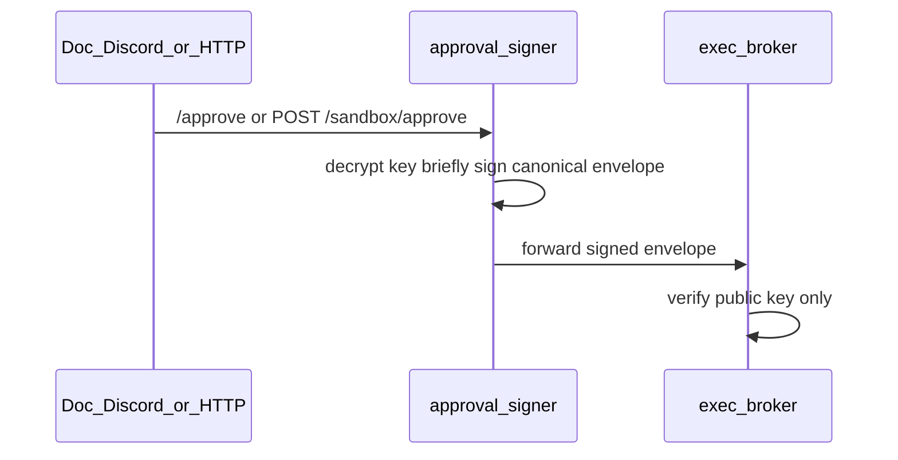
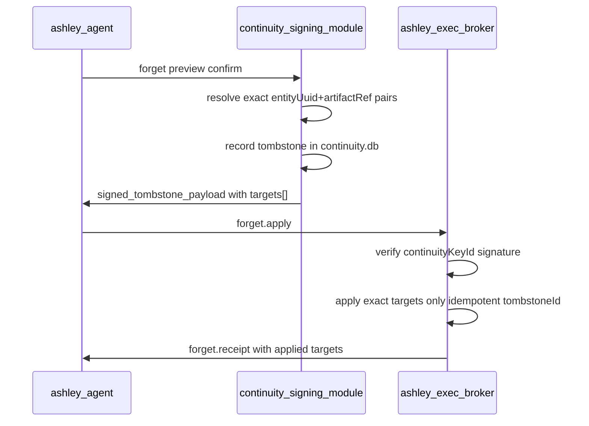

# Sandbox Design — Threat Model and OS Boundary

**Status:** Design/specification. Wave 07b fake broker is accepted and the Wave
07c daemon/transport is Wave_accepted but not release-qualified; neither is
deployed to Mint.

This document specifies the threat model, trust boundaries, and OS-boundary topology
for Ashley's dedicated execution broker on Linux Mint. It operationalizes
[Private Mint agency](https://github.com/XharvaK/composer-assistant) (see project
`DECISIONS.md` §Private Mint agency) and [`ETH-EXT-06`](Ashley_Ethics.md). It does
not override higher authority.

## Authority chain

```text
VISION.md
  → Ashley_Core_Principles.md
    → Ashley_Constitution.md
      → Ashley_Stewardship_Compact.md + Ashley_Ethics.md
        → Architecture (AGENTS.md, Architecture_Index.md, Vision_Implementation_Map.md)
          → Sandbox Design (this document)
```

## Scope and gates

**In scope (this document):** threat model, trust boundaries, approval-key governance,
continuity-tombstone key governance, IPC authority matrix, broker execution policy,
versioned chunked IPC, forget/tombstone protocol, OS hardening, resource enforcement,
workspace governance, residual risks, deferrals.

**Outside this design document's implementation scope (tracked by Wave 07b/07c):**

- Broker implementation, action schema, fake-broker tests, Mint systemd units, user
  creation, service install
- Execution capability name in capability contract material (**TBD**)
- Wave 08 self-modification, vault/credential injection, any code beyond this design
- Per-task cgroup delegation (`Delegate=yes`) — deferred to a later hardening wave

**Gate status:** Wave 06, Wave 07b, and Wave 08b are **Wave_accepted** (not
release-qualified); Wave 07 is **Design_accepted** (2026-08-04); Wave 07c is
**Wave_accepted** (2026-08-04), not release-qualified. No Mint user/service install,
agent opt-in, or restart is authorized by local verification or wave acceptance
alone. Design must
not bypass Wave 06 guarantees. Perception outputs remain untrusted data until a
separate signed owner approval.

---

## 1. Threat model

### Assets

- Operator secrets (`.env`, API keys, signing keys)
- `nuclear.db`, `continuity.db`, live repository
- Owner approval signing key, continuity tombstone signing key
- Broker workspace artifacts and metadata index
- Host integrity (Mint system, SSH, systemd)

### Actors

| Actor | Role |
|-------|------|
| Doc | Owner approval signer |
| Continuity signing module | Tombstone signer — **not** the SQLite file itself |
| Thought | Non-executing proposal only |
| Agency | Gate before forwarding to broker |
| Expression | Explain or ask permission; cannot sign or authorize |
| Broker (`ashley-exec-broker`) | Executor in isolated UID |
| External content | Untrusted; never holds any signing key |

### Mitigations

| Threat | Mitigation |
|--------|------------|
| Inferred approval | Signed envelope only; model/content cannot sign |
| Unapproved write/delete via `artifact.*` | IPC authority matrix; write/delete require signed scope |
| Replay / scope drift | Nonce/tombstoneId dedup + exact binding + expiry; reject post-signature scope/path/hash/limit/network changes |
| Forget over-delete | Tombstone `targets[]` exact pairs only; no topic inference |
| Socket abuse (Doc UID) | Socket unit ACL + peer cred + mandatory signature |
| Unguessable ref brute force | 128+ bit random ref IDs, owner/task scoped |

### Current production baseline

| Item | Today | Sandbox implication |
|------|--------|---------------------|
| `ashley-agent.service` | Doc user + `.env` | Agent proposes/forwards; never executes in sandbox UID |
| `~/.composer-assistant/` | Agent state root | Inaccessible from broker (`ProtectHome=true`) |
| `process-guards.ts` | In-process only | Complementary; not substitute for OS boundary |

**Locked topology:** System unit `ashley-exec-broker`, user `ashley-sandbox`, state
`/var/lib/ashley-sandbox`, socket `/run/ashley/broker.sock`, Unix IPC from agent
only. No same-user execution. No `systemd-run` substitute.

---

## 2. Authority and approval

**Thought:** Non-executing proposal only.

**Expression:** Explain or ask permission. Cannot sign, widen scope, or authorize.

**Owner approval:** Required for every mutating sandbox operation in the IPC matrix
**except** documented safety/cleanup exceptions (`artifact.write.abort`, `task.cancel`).
Never inferred from conversation, quotes, or external content.

### 2.0 Approval-signing path (unattended Mint)

**Default v1 model — isolated approval signer in agent-service:**

For unattended Mint operation, `/approve` (Discord) or authenticated HTTP approve is
handled by a **dedicated approval-signer component** inside agent-service — not Thought,
Expression, the broker, or the model.

| Stage | What happens |
|-------|----------------|
| 1. Proposal | Thought creates non-executing proposal; stored in nuclear DB; no signing |
| 2. Doc approves | Discord `/approve` or `POST /sandbox/approve` (owner-authenticated) |
| 3. Signer boundary | Approval-signer loads encrypted owner private key from operator-provisioned store (`~/.composer-assistant/keys/owner-approval.key.enc` or OS keychain — **not** in `.env`, **not** in model context) |
| 4. Brief key exposure | Private key decrypted **only inside approval-signer**, only for the signing call (~milliseconds), then zeroed from memory; never logged, never sent to broker, never included in IPC frames to model |
| 5. Envelope emit | Signer builds canonical envelope (see §2.3), signs, persists proposal→approved transition, forwards envelope to broker path |
| 6. Broker | Verifies signature against broker allowlisted **public** key only |



**Alternative (documented fallback):** Operator-signed envelopes externally (e.g.
manual CLI on Windows during development). Broker accepts same canonical format; agent
only forwards pre-signed envelope. Mint production uses in-agent approval-signer.

**Never holds private key:** model, external content, broker, workspace blobs, ordinary
IPC payloads, Discord messages, continuity SQLite file.

### 2.1 Owner approval-key governance

| Topic | Design choice |
|-------|----------------|
| **Algorithm** | Ed25519 (broker accepts only declared algorithms) |
| **Key ID** | `keyId` (e.g. `owner-ed25519-v1`); separate namespace from continuity tombstone keys |
| **Custody** | Private key in operator-provisioned encrypted store; decrypted **only** by approval-signer (§2.0) during `/approve` or authenticated HTTP approve. **Never** in model context, broker, workspace, or ordinary IPC |
| **Public key** | Broker allowlist at `/var/lib/ashley-sandbox/meta/keys/owner/` (operator-installed) |
| **Canonical serialization** | Deterministic JSON: object keys sorted lexicographically; **arrays preserve signed order** (do not re-sort array elements); UTF-8, no whitespace; prefix `ASHLEY-SANDBOX-APPROVAL-v1\n`; fields **except** `signature` |
| **Path normalization (pre-sign)** | `cwd` and all path fields: POSIX separators, no `..`, resolved relative to workspace root, no trailing slash except root; reject before signing if escape |
| **Argv normalization (pre-sign)** | Absolute allowlisted interpreter path + discrete args; no shell metacharacters; each arg UTF-8 NFC-normalized |
| **Post-signature rejection** | Broker rejects any change to scope, path, argv, hash, limit, or `networkMode` after signing |
| **Signature** | Base64url Ed25519 over canonical bytes |
| **Nonce** | 128-bit random; broker persists spent nonces until `expiresAt` + grace |
| **Rotation** | Multiple active `keyId` values; revoke by removing from allowlist |
| **Revocation** | Remove `keyId` from broker allowlist + continuity audit event; immediate reject |
| **Failure behavior** | Invalid/expired/revoked/unknown key/spent nonce → reject + audit; never partial execute |

**Signed envelope fields:** `protocolVersion`, `keyId`, `taskId`, `ownerId`, `scope`,
`argv[]` (normalized), `cwd` (normalized), `inputArtifactRefs[]` (ordered),
`inputHashes[]` (parallel ordered), `riskClass`, `limits`, `networkMode`, `expiresAt`,
`nonce`, `signature`.

### 2.2 Continuity tombstone-key governance

The continuity **database** is the authoritative **record** of tombstones and forget
lineage; it is **not** a signing primitive. Tombstone authority crosses the socket as
a **signed payload** produced by a separate continuity signing component (agent-service
continuity module with operator-provisioned key material — not SQLite itself).

| Topic | Design choice |
|-------|----------------|
| **Algorithm** | Ed25519 (separate from owner approval keys) |
| **Key ID** | `continuityKeyId` (e.g. `continuity-tombstone-ed25519-v1`) — distinct `keyId` namespace |
| **Custody** | Private key held operator-side or in agent-service secure store **inaccessible to broker and model**; used only when continuity module emits tombstone after confirmed forget preview. **Never** in workspace, IPC payloads to model, or broker writable paths |
| **Public key** | Broker allowlist at `/var/lib/ashley-sandbox/meta/keys/continuity/` (operator-installed) |
| **Canonical serialization** | Deterministic JSON (sorted keys) of tombstone fields **except** `signature`; prefix `ASHLEY-SANDBOX-TOMBSTONE-v1\n` |
| **Tombstone signed fields** | `protocolVersion`, `continuityKeyId`, `tombstoneId`, `ownerId`, `targets[]` (ordered list of `{entityUuid, artifactRef}` pairs — **exact**), `issuedAt`, `expiresAt?` |
| **Targeting rule** | Tombstone lists **only** explicit `entityUuid` + `artifactRef` pairs resolved at forget-preview time. **No** topic/hash-only targeting. Broker applies **only** listed targets |
| **Artifact metadata at commit** | Every `artifact.write.commit` assigns stable `entityUuid` (immutable) + opaque `artifactRef`; both stored in broker metadata index for forget preview |
| **Rotation** | Same pattern as owner keys; independent allowlist |
| **Revocation** | Remove `continuityKeyId` from broker allowlist; reject `forget.apply` using revoked key |
| **Replay handling** | Broker stores applied `tombstoneId` set; `forget.apply` idempotent — second apply returns `alreadyApplied` without error |
| **Failed verification** | Reject `forget.apply` + audit; no partial delete |

### 2.3 Signed-scope canonicalization rules

Apply **before** signing (approval-signer) and **re-verify** at broker:

1. **Paths:** `realpath` semantics within workspace root only; reject `..`, absolute
   paths outside workspace, symlinks escaping root
2. **Argv:** `[interpreterAbsolutePath, ...args]` — interpreter must be on broker
   allowlist; args unchanged order
3. **Arrays:** `inputArtifactRefs[]` and `inputHashes[]` are parallel-ordered pairs;
   order is part of signed scope
4. **Limits / networkMode:** Exact numeric fields; any broker-side relaxation rejected
5. **Upload sessions:** `artifact.write.begin` returns `uploadId` **and**
   `sessionCapability` (128-bit random, base64url); every `chunk`/`commit`/`abort`
   must present both; session bound to signed `artifact_upload` scope or authorized
   `taskId`

---

## 3. IPC authority matrix

### 3.0 Socket activation and runtime directory (future systemd units — spec only)

**Runtime directory:** `/run/ashley/` — created before bind, owned by
`ashley-sandbox:ashley-broker`, mode `0750`. Socket path: `/run/ashley/broker.sock`.

Do **not** rely on post-bind `chgrp`/`chmod`. The **socket unit** owns all listen-path
ACL:

**`ashley-exec-broker.socket` (authoritative for socket path):**

```ini
[Unit]
Description=Ashley exec broker socket

[Socket]
ListenStream=/run/ashley/broker.sock
SocketUser=ashley-sandbox
SocketGroup=ashley-broker
SocketMode=0660
RuntimeDirectory=ashley
RuntimeDirectoryMode=0750

[Install]
WantedBy=sockets.target
```

**`ashley-exec-broker.service`:**

```ini
[Unit]
Description=Ashley exec broker
Requires=ashley-exec-broker.socket
After=ashley-exec-broker.socket

[Service]
User=ashley-sandbox
Group=ashley-sandbox
# Inherits activated socket fd — no separate ListenStream here
# Do NOT duplicate RuntimeDirectory on service if socket unit already provides it
```

**tmpfiles.d fallback** (if target Mint systemd lacks `RuntimeDirectory=` on socket
units — verify with `systemd --version` before install):

```ini
# /etc/tmpfiles.d/ashley-broker.conf
d /run/ashley 0750 ashley-sandbox ashley-broker -
```

Install tmpfiles **only** when socket-unit `RuntimeDirectory=` is unsupported; never
leave both fighting for ownership.

**Operator install (not this wave):** Doc user in supplementary group `ashley-broker`
for socket connect. Broker runs as `ashley-sandbox`.

**Broker-side (mandatory regardless):** `SO_PEERCRED` on every connection; log
UID/PID; reject non-Doc-UID peers for mutating ops.

**Artifact references:** opaque `artifactRef` (≥128 bits entropy) + immutable
`entityUuid`, scoped to `ownerId` + optional `taskId`; never expose host paths. Broker
metadata index maps both for forget preview — **no** topic-based or hash-only
discovery.

| Operation | Approval required | Notes |
|-----------|-------------------|-------|
| `artifact.read` | No (read) | Owner-scoped ref; bounded chunked download |
| `artifact.list` | No (read) | Owner scope; refs + metadata only |
| `artifact.write.begin` | **Yes** — signed `artifact_upload` OR authorized `taskId` | Opens upload session; returns `uploadId` + `sessionCapability` |
| `artifact.write.chunk` | Same open session | Requires `uploadId` + `sessionCapability`; chunked only |
| `artifact.write.commit` | Same open session | Requires `uploadId` + `sessionCapability`; SHA-256 verify → issues `artifactRef` + `entityUuid` |
| `artifact.write.abort` | **No** — safety/cleanup exception | Requires `uploadId` + `sessionCapability` OR broker TTL sweeper |
| `artifact.delete` | **Yes** — signed `artifact_delete` OR continuity signed tombstone | Never agent-discretionary |
| `task.submit` | **Yes** — full execution envelope | After inputs committed |
| `task.cancel` | **No** — safety/cleanup exception | Doc-UID peer only; cancels running `taskId` by PGID |
| `task.receipt` / `task.result.fetch` | No (read) | Bounded retrieval |
| `forget.apply` | **Yes** — continuity signed tombstone | Broker verifies signature; applies **exact** `targets[]` only |

**Safety/cleanup exceptions:** `artifact.write.abort` and `task.cancel` do not require
a new owner-signed envelope; they operate only on existing sessions/tasks initiated
under prior authorization. All other mutating operations remain explicitly scoped and
owner- or continuity-authorized.

### 3.1 Chunked upload framing

1 MB max **frame** ≠ 10 MB artifact. Protocol: `begin` (signed scope) → `chunk`
(≤256 KB payload default; requires `uploadId` + `sessionCapability`) → `commit`
(hash verify; assigns `artifactRef` + `entityUuid`) → receipt; or `abort` (cleanup).
TTL sweeper for abandoned uploads. Reject any post-`begin` scope or size change.

### 3.2 Versioned frame protocol

`frameVersion`, `requestId`, `messageType`, `payloadLength` (max 1 MB), backpressure,
no FD passing.

---

## 4. Broker-side execution policy

Broker validates paths, interpreters, cwd, symlinks, env allowlist, process count,
output, and network — not agent-service.

- No shell invocation, arbitrary PATH, inherited env, sudo, Docker, or escalation
- Downloaded executables: post-download hash verification only
- Direct `execve` with allowlisted interpreter paths
- **PGID per task** for cancel/timeout kill

---

## 5. Forget and retention protocol

**Targeting is exact — no broker-side inference:**

1. At `artifact.write.commit`, broker assigns immutable `entityUuid` + opaque
   `artifactRef` and indexes both in broker metadata
2. Forget preview (agent-service continuity module) resolves **exact**
   `{entityUuid, artifactRef}` pairs from continuity sidecar + broker metadata index —
   not topics, not content hashes alone
3. Continuity signing module emits signed tombstone with ordered `targets[]` of those
   exact pairs; records tombstone in `continuity.db`
4. `forget.apply` verifies continuity signature; broker deletes **only** listed targets
5. Idempotent replay: duplicate `tombstoneId` → `alreadyApplied` (no error)
6. **Honesty:** local broker erasure ≠ external/provider erasure; receipt states scope

**No topic-based broker discovery.** If future waves add semantic forget, they require
a separately defined metadata index — not implied in v1.



Continuity DB holds tombstone **records**; signing module holds **key custody**. Broker
never trusts agent-forged tombstones without continuity key verification. Broker never
infers forget targets from opaque hashes or conversation topics.

**Backup/restore:** Label broker `meta/` separately from `nuclear.db`; restore order
documented; stale nonce/tombstone stores require operator acknowledgment.

---

## 6. Resource enforcement (4 GB / dual-core — conservative first broker)

**Design principle:** `ProtectControlGroups=true` on the broker unit — **no per-task
cgroup delegation** in v1. Service-level `MemoryMax`/`TasksMax` are the hard boundary.
PGID tracking + timeout cleanup are the per-task isolation mechanism. Per-task RSS
figures are **advisory logging only** until a future design explicitly enables
`Delegate=yes` with compatible cgroup hardening.

| Layer | Limit | Default | On exceed |
|-------|-------|---------|-----------|
| **Service** `MemoryMax` | Broker + all children (single running task) | 384 MB | systemd OOM kill; task → `failed`/`oom_service`; broker restart |
| **Service** `TasksMax` | Total processes in broker tree | 64 | Refuse spawn; `failed`/`service_task_limit` |
| **Service** `CPUQuota` | 100% = one full CPU per period | 100% | Throttle broker tree |
| **Concurrent tasks** | Broker-enforced | **1** | Reject/queue `task.submit` with `concurrency_limit` |
| **Per-task** `wallMs` | Envelope limit | 120 s | SIGTERM → SIGKILL **PGID**; `failed`/`timeout` |
| **Per-task** `maxProcesses` | Children in PGID | 16 | Refuse spawn; `failed`/`process_limit` |
| **Per-task** `maxOutputBytes` | stdout+stderr | 4 MB | Truncate; `truncated: true` |
| **Per-task** RSS (advisory) | Logged only; not hard-enforced in v1 | — | Inform operator; no separate cgroup kill |
| **Workspace disk** | Aggregate quota | 2 GB | Refuse writes |
| **Per-artifact** | Max declared size | 10 MB | Reject at `begin` |
| **Per-task artifacts** | Aggregate | 50 MB | Reject |

**Why max 1 concurrent task:** A 384 MB service `MemoryMax` cannot safely host two
memory-heavy tasks. Serial execution is the conservative v1 choice.

**Per-task accounting (v1):** One Linux process group (PGID) per `taskId`; track wall
clock, child count, advisory RSS from `/proc`. **No** delegated child cgroups
(`Delegate=yes` deferred).

**OOM:** Service `MemoryMax` is the hard kill — entire broker tree. Receipt
`oom_service`. No claim of independent per-task OOM cgroup in v1.

**Timeout:** SIGTERM PGID → 5 s → SIGKILL → `timeout` receipt.

**Broker restart:** Kill/reap PGID; mark `running` → `failed`/`broker_restart`; never
auto-reexecute.

**Host budget:** agent 512M + discord 256M + broker 384M + OS ~1.5G on 4 GB Mint.

---

## 7. OS boundary (system-level broker unit)

**State root:** `/var/lib/ashley-sandbox` only (`ProtectHome=true`).

### systemd hardening (broker service unit — spec for future install)

| Directive | Value / rationale |
|-----------|-------------------|
| `User=ashley-sandbox` `Group=ashley-sandbox` | UID separation |
| `NoNewPrivileges=true` | No privilege gain |
| `PrivateTmp=true` | Isolated `/tmp` |
| `PrivateDevices=true` | No device access |
| `ProtectSystem=strict` | OS read-only except allowlist |
| `ProtectHome=true` | All homes blocked → `/var/lib` state |
| `ProtectProc=invisible` | Hide other processes' `/proc` entries from broker |
| `ProtectKernelTunables=true` | Block sysctl writes |
| `ProtectKernelModules=true` | Block module load |
| `ProtectControlGroups=true` | **Keep true**; no child cgroup delegation in v1 |
| `RestrictNamespaces=user net` | Allow user + network namespace creation only (R5B): the unshare isolation mechanism needs `CLONE_NEWUSER\|CLONE_NEWNET`; mount/pid/uts/ipc/cgroup/time stay blocked. Broker refuses to start unless its boot-time active probe succeeds under this exact context |
| `RestrictSUIDSGID=true` | No setuid execution |
| `LockPersonality=true` | Block personality abuse |
| `DevicePolicy=closed` | Deny devices |
| `ReadWritePaths=/var/lib/ashley-sandbox` | Persistent writes only |
| `InaccessiblePaths=` | Doc secrets, live repo, SSH — hard deny |
| `MemoryMax=384M` `TasksMax=64` `CPUQuota=100%` | Service hard caps |
| `RestrictAddressFamilies=AF_UNIX` | Default no network |
| `Environment=` allowlist | No inherited secrets |
| `UMask=0077` | Restrictive creates |

**Socket unit** (separate `ashley-exec-broker.socket` — see §3.0): owns `ListenStream`,
`SocketUser`, `SocketGroup`, `SocketMode`, `RuntimeDirectory`, `RuntimeDirectoryMode`
for `/run/ashley/`. Service unit does **not** duplicate socket ACL.

**Deferred:** `Delegate=yes` per-task cgroups; `RestrictNamespaces` is already
narrowed to `user net` for the R5B-qualified isolation runtime — no further
namespace exceptions are planned.

### Residual risks

Doc-UID processes in `ashley-broker` group can connect to the socket. Mitigation:
signed approvals + peer cred; safety exceptions limited to abort/cancel on existing
sessions.

---

## 8. Application architecture intent (deferred)

**FSM:** `proposed` → `awaiting_approval` → `authorized` → `running` → terminal states.

**Credentials/vault:** Out of scope Wave 07. Wave 08 uses isolated source copy per
[`Self_Modification_Design.md`](Self_Modification_Design.md) — no credentials in sandbox.
**Wave 09:** credential vault and external dispatch live in a **separate** external-action
broker per [`External_Agency_Design.md`](External_Agency_Design.md); vault plaintext never
crosses into the exec workspace.

### Wave 07b addendum — Wave 08 consumer scopes

Wave 08 ([`Self_Modification_Design.md`](Self_Modification_Design.md)) requires one
additional signed scope on existing `task.submit` (not a new IPC message type):

| Scope | Purpose |
|-------|---------|
| `source_prepare` | Extract agent-uploaded sanitized archive manifest into proposal workspace |

Bound fields: `proposalId`, `baseCommit`, `baseTreeHash`, `sourceCleanliness`,
`archiveManifestRef`, `archiveAggregateHash`, `excludeRules[]`, `destinationNamespace`.

Wave 08 also requires operator-provisioned broker toolchain manifest and immutable
recipe table at `/var/lib/ashley-sandbox/meta/` — see Self-Modification Design §6.1.

---

## 9. Explicit deferrals

| Item | When |
|------|------|
| Broker code, schema, fake-broker tests | Wave 07b after Wave 06 **Wave_accepted** and Wave 07 **Design_accepted** |
| Mint socket/service units, user, group, install | Operator post–07b |
| Per-task cgroup delegation | Later hardening decision |
| Execution capability name | Frozen with Wave 06 |
| Vault, external dispatch | Wave 09 — see [`External_Agency_Design.md`](External_Agency_Design.md) |
| `source_prepare` scope + toolchain manifest | Wave 07b (Wave 08 consumer) |

---

## Related documents

- [`Ashley_Ethics.md`](Ashley_Ethics.md) — `ETH-EXT-06` external entity boundaries
- [`Self_Modification_Design.md`](Self_Modification_Design.md) — Wave 08 change proposals (design only)
- [`External_Agency_Design.md`](External_Agency_Design.md) — Wave 09 external-action broker; vault separate from sandbox
- [`Vision_Implementation_Map.md`](Vision_Implementation_Map.md) — commitment tracking
- [`Architecture_Index.md`](Architecture_Index.md) — module tree and observability
