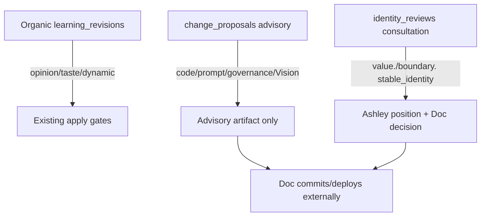
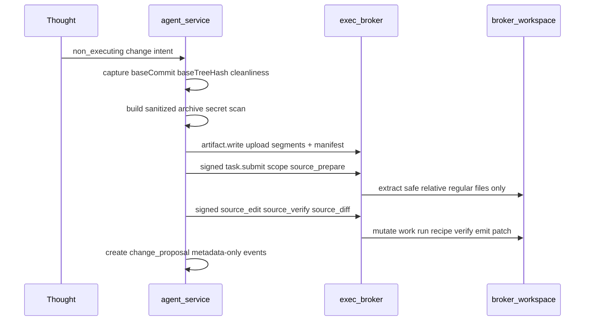

# Self-Modification Design — Change Proposals and Isolated Source Workflow

**Document class:** `HISTORICAL / SUPERSEDED MECHANISM` (salvageable semantics)

> **NOT CURRENT EXECUTABLE ARCHITECTURE.**
>
> Do not implement from this file. The Wave 07 broker workflow, Sandbox V1
> topology, signed `source_*` scopes, broker workspace layout, broker-owned
> execution path, self-improvement clone, and candidate-Git workflow are
> superseded. Imperative steps, schemas, gates, and interface contracts below
> are historical reconstruction of the Wave 08 design. They are not a current
> implementation contract.
>
> **Current mechanism:** Sandbox V2 M5/M7 in
> [`architecture/sandbox/ASHLEY_SANDBOX_V2_ROADMAP.md`](architecture/sandbox/ASHLEY_SANDBOX_V2_ROADMAP.md).
> **Current composition:** Self-Change Governance in
> [`architecture/Ashley_Cross_Phase_Architecture.md`](architecture/Ashley_Cross_Phase_Architecture.md)
> §6.1.
>
> Salvageable *concepts* remain reference input for V2 M5/M7 and Self-Change
> Governance: target classification, exact base identity, stale-base handling,
> source cleanliness, secret exclusion, system-derived receipts, immutable
> audit history, advisory artifacts, separate Ashley and Doc positions, and
> approval-is-not-effect. Preserve those as concepts. Do not resurrect Sandbox
> V1, the old broker topology, or Wave 07 implementation authority.

**Historical status:** Wave 08 design and local implementation provenance. Not
current Sandbox V2 execution authority, not deployment authority, and not an
executable runbook.

## Current Self-Change Governance disposition

Self-Change Governance is an extension of existing owners. The composition
owner is
[`architecture/Ashley_Cross_Phase_Architecture.md`](architecture/Ashley_Cross_Phase_Architecture.md)
§6.1. It is not a new roadmap phase, execution plane, generic
self-modification capability, independent cognitive owner, or standalone
document. Bounded research and contract reconciliation are required before
implementation.

The paths remain separate:

| Path | Current owner | Disposition |
|---|---|---|
| Organic learning and revisable interpretation | Learning, Memory Evidence, Identity, Mind State, Thought, Agency, and Reflection as applicable | Extend existing provenance, evaluation, rollback, qualification, and capability-promotion rules. |
| Foundational Identity or governance change | Identity review, constitutional governance, Ashley's position, and Doc's explicit decision | Preserve consultation and exact revision provenance. Neither self-confidence nor approval applies the change. |
| Code, prompt, procedure, model-policy, or architecture change | Advisory change proposal plus the current Sandbox V2 M5/M6/M7 owners | Author, verify, and effect only through the current milestone contracts. |

The current source includes change-proposal schema, lifecycle, routing,
source-archive, stale-base, patch-guard, secret-guard, verification, and owner
surfaces under `apps/agent-service/src/core/change-proposal/`. Historical V1
broker integration and the default-off engineering self-improvement source
remain implementation provenance. They do not become Sandbox V2 authority,
activation evidence, deployment evidence, or promotion evidence.

Required research must reconcile constitutional compatibility, proposal and
source provenance, exact-base and target classification, rollback or
compensation limits, deterministic evaluation, semantic evaluation where
meaning changes, exact-candidate qualification, independent review, and
separate explicit promotion. No self-change may silently merge the organic,
foundational, and engineering paths.

The remainder of this file reconstructs the superseded Wave 08 design: how
that design intended Ashley to inspect herself, work on isolated source
copies, run bounded verification through the Wave 07 broker, and present
change proposals without live mutation. It derives from the historical
`WAVE-08-SELF-MODIFICATION.md` prompt,
[`Ashley_Stewardship_Compact.md`](Ashley_Stewardship_Compact.md)
(`SC-CON-*`, `SC-REC-*`), and [`Sandbox_Design.md`](Sandbox_Design.md).
Treat every imperative sentence from this point as historical reconstruction.

## Historical authority chain (Wave 08)

```text
VISION.md
  → Ashley_Core_Principles.md
    → Ashley_Constitution.md
      → Ashley_Stewardship_Compact.md + Ashley_Ethics.md
        → Architecture (AGENTS.md, Architecture_Index.md, Vision_Implementation_Map.md)
          → Sandbox Design (docs/Sandbox_Design.md)
            → Self-Modification Design (this document)
```

## Historical scope and gates (Wave 08 reconstruction)

These gates and in-scope lists describe the Wave 08 design surface. They are
not current V2 implementation instructions.

**Historically in scope:** change-proposal records, immutable audit events,
consultation routing, source isolation workflow, broker interface consumption,
review surfaces, provenance/retention/forget, explicit deferrals.

**Out of scope until gates pass:**

| Gate | Status |
|------|--------|
| Wave 06 (perception v15 / contract v3) | Implementation-present; **not accepted** until remaining verification passes |
| Wave 07 (sandbox broker) | **Design_accepted**; Wave 07b fake broker **Wave_accepted**; Wave 07c daemon/transport **Wave_accepted** — see [`Sandbox_Design.md`](Sandbox_Design.md) and [`handoffs/wave-07c-gate-packet.md`](handoffs/wave-07c-gate-packet.md) |
| Wave 08b implementation | After Wave 06 accepted **and** Wave 07b broker tested |

**Not this wave:** MIGRATION_16, runtime code, capabilities, broker tasks, self-editing,
commit, deploy, `apply`, live broker use.

---

## 1. Problem statement and threat model

### Goal

Ashley inspects herself, edits and tests only within an isolated broker workspace,
and presents code, prompt, governance, and identity proposals naturally in
conversation. Doc retains exclusive authority over commit, merge, deploy, restart,
and capability promotion.

### Assets

- Live repository checkout, `nuclear.db`, `continuity.db`
- `.env`, API keys, signing keys
- Capability rollout state, protected identity records
- Broker workspace artifacts and toolchain image

### Threats and mitigations

| Threat | Mitigation |
|--------|------------|
| Live checkout mutation | Broker workspace only; agent never writes live repo |
| Inferred Doc approval | Separate `doc_decision`; approval ≠ commit/deploy/broker auth |
| Proposal → capability/identity back door | Routing matrix; no direct apply from proposal record |
| Secret leakage in patches/text | Fail-closed scan on objective, rationale, archives, patches; quarantine |
| False test claims | `verified` system-derived from broker receipt only |
| Stale/conflict patches | `baseCommit` + `baseTreeHash` binding; stale-base on either drift |
| Malicious repo instructions | Broker-owned immutable recipes; `package.json` is untrusted data |
| Oversized source tree | Bounded multipart archive + manifest; fail-closed — never silently omit |
| Untrusted repo widening scope | Repo files cannot widen argv, cwd, limits, network, or signing authority |

---

## 2. Relationship to existing systems

Preserve three distinct paths — no conflation:



**Reuse (do not duplicate in Wave 08b):**

- `learning/revisions.ts` — organic `proposeRevision`, `foundationalKind()` for `value.*` / `boundary.*`
- `identity_reviews` — separate Ashley position + Doc decision for foundational identity
- `process-guards.ts` — eval-fork outbound/writeback block (complementary; broker isolation is primary)

**New (design spec only):** `change_proposals` + `change_proposal_events` for
repository/governance/Vision proposals and broker-linked artifacts.

---

## 3. Change-proposal record schema (design)

**Table `change_proposals` (future MIGRATION_16 — not created this wave):**

MIGRATION_16 must include: `data_classification`, retention policy fields,
`entity_uuid` targetable registration, continuity sidecar lineage hooks, backup
watermark participation, and forget-preview/tombstone behavior per Wave 04/v13 patterns.

| Field group | Fields |
|-------------|--------|
| Identity | `id`, `entity_uuid` (immutable, v13 pattern), `owner_id`, `proposal_id` (unguessable external ref) |
| Classification | `data_classification` (privacy lattice), `retention_class`, `retention_expires_at` |
| Provenance | `proposer` (`ashley` \| `operator`), `capability_contract_id`, `capability_contract_hash`, `created_at`, `updated_at`, `expires_at` |
| Target | `target_category` (enum), `target_refs` (JSON: normalized paths/keys only) |
| Content | `objective`, `rationale`, `risk_class` (`low` \| `medium` \| `high` \| `consultation`) |
| Base | `base_commit`, `base_tree_hash`, `base_capture_at`, `repository_identity`, `source_cleanliness` (`clean` \| `dirty_blocked` \| `dirty_explicit_manifest`), `base_stale` |
| Archive | `source_archive_manifest_ref`, `source_archive_segment_refs[]`, `source_archive_aggregate_hash`, `source_archive_bytes`, `excluded_path_count` |
| Artifacts | `patch_artifact_ref`, `patch_entity_uuid`, `summary_artifact_ref` (broker artifact, not inline) |
| Tests | `test_receipt_refs` — `{artifactRef, entityUuid, taskId, verified, verifyStatus}`; `verifyStatus`: `succeeded` \| `failed` \| `unsupported` \| `unverified` |
| Consultation | `consultation_required`, `consultation_clause` (`SC-CON-01`…`06` or null) |
| Positions | `ashley_position`, `ashley_rationale`, `ashley_decided_at`, `doc_decision`, `doc_rationale`, `doc_decided_at` |
| Lifecycle | `state`, `linked_revision_entity_uuid`, `linked_identity_review_entity_uuid` |
| Outcome | `external_outcome` (`committed` \| `deployed` \| `abandoned` \| null), `external_outcome_at`, `external_outcome_note` (Doc only) |
| Quarantine | `quarantine_reason` (`secret_detected` \| `patch_unsafe` \| null), `quarantined_at` |

**`target_category` enum:** `runtime_code`, `prompt_expression`, `ordinary_identity`,
`foundational_identity`, `ethics_governance`, `capability_policy`, `evaluation`, `vision`.

**`state` enum:** `draft`, `proposed`, `awaiting_ashley_position`, `awaiting_doc_decision`,
`approved`, `rejected`, `deferred`, `expired`, `stale_base`, `quarantined`, `superseded`.

### Immutable audit events

**Table `change_proposal_events` (append-only):**

| Field | Purpose |
|-------|---------|
| `id`, `entity_uuid`, `proposal_entity_uuid`, `event_type`, `actor` | Immutable history; targetable for forget |
| `payload_json`, `created_at` | **Metadata only** — never UPDATE/DELETE |

**`payload_json` allowed keys:** `artifactRef`, `entityUuid`, `taskId`, `hash`,
`statusCode`, `errorCode`, `baseCommit`, `baseTreeHash`, `recipeId`, `brokerState`,
`verifyStatus`, `archiveManifestRef`, `archiveAggregateHash`, `segmentIndex`,
`excludedPathCount`, `tombstoneId`, `linkedEntityUuid`, `classification`.

**Forbidden in `payload_json`:** raw patches, test stdout/stderr, source URLs,
credentials, inline file content, rationale text.

**Event types:** `created`, `source_archive_uploaded`, `source_prepare_submitted`,
`source_prepare_completed`, `broker_task_submitted`, `broker_task_completed`,
`patch_artifact_committed`, `test_receipt_attached`, `secret_quarantined`,
`ashley_position_recorded`, `doc_decision_recorded`, `base_marked_stale`, `expired`,
`superseded`, `forget_tombstone_applied`.

---

## 4. Consultation and routing matrix

| Category | Consultation | Ashley position | Doc decision | May auto-apply? |
|----------|--------------|-----------------|--------------|-----------------|
| `runtime_code` | No (`SC-CON-07`) | Optional | Required for approve | **Never** — advisory only |
| `prompt_expression` | No | Optional | Required | **Never** |
| `ordinary_identity` | No | N/A | N/A | Via `learning_revisions` only |
| `foundational_identity` | Yes (`SC-CON-02`/`03`) | Required | Required | Via `identity_reviews` apply gate only |
| `ethics_governance` | Yes (`SC-CON-01`/`03`) | Required | Required | **Never** |
| `capability_policy` | Yes (`SC-CON-06`) | Required | Required | **Never** |
| `evaluation` | No | Optional | Required | **Never** |
| `vision` | Yes (`SC-CON-01`) | Required | Required | **Never** |

### Design invariants

1. `approved` does **not** mutate repo, DB identity, or capability release rows.
2. `external_outcome` is operator-recorded; Ashley cannot set it.
3. Foundational identity links `identity_reviews` by **`entity_uuid`**.
4. Capability changes require consultation + Doc decision; rollout remains human-only.
5. `doc_decision: approve` records intent only — **never** authorizes broker tasks,
   commit, merge, deploy, restart, or capability promotion.

---

## 5. Source isolation workflow

**Broker cannot read the live checkout.** The agent prepares and uploads a sanitized
source archive from read-only checkout inspection on the Doc side.



### v1 path (existing Wave 07 IPC + `source_prepare` scope)

1. Agent reads live repo **read-only**; computes `baseCommit`, `baseTreeHash`,
   `repository_identity`, `source_cleanliness`.
2. Agent builds sanitized archive; secret scan **fail-closed** on archive and on
   `objective`/`rationale` before persistence.
3. Upload via bounded `artifact.write`; multipart if tree >10 MB (see §5.1).
4. Signed `task.submit` with **`scope: source_prepare`** binding:
   `proposalId`, `baseCommit`, `baseTreeHash`, `sourceCleanliness`,
   `archiveManifestRef`, `archiveAggregateHash`, `excludeRules[]`, `destinationNamespace`.
5. Broker validates manifest, extracts into workspace; rejects absolute paths, `..`,
   unsafe symlinks, devices, unexpected mode/metadata.

**Wave 07b note:** `scope: source_prepare` is a **new signed scope** on `task.submit`
(documented in [`Sandbox_Design.md`](Sandbox_Design.md) §8 addendum). Uses existing
`artifact.write` + `task.submit` — not `task.prepare_snapshot`.

### Dirty worktree policy

| `source_cleanliness` | Policy |
|----------------------|--------|
| `clean` | Archive = committed tree at `baseCommit`; `baseTreeHash` = git tree hash |
| `dirty_blocked` | Default when uncommitted changes exist; cannot proceed until clean or superseded |
| `dirty_explicit_manifest` | Operator opt-in only; exact file paths+hashes; `baseTreeHash` = manifest hash |

### Stale-base handling

Before each broker batch, compare live `HEAD` **and** tree/manifest hash to stored
`base_commit` + `base_tree_hash`. Either drift → `stale_base`, block broker tasks
until refresh (supersede or new version). Approved intent preserved; patch may be
`conflict_likely` in bounded metadata.

### Secret exclusion (fail-closed)

Scan: `objective`, `rationale`, `ashley_rationale`, `doc_rationale`, archive segments,
patch artifacts, summary artifacts. Credential-shaped content → **quarantine**
(`secret_detected`); never silently redact into an applicable proposal.

### Workspace layout

```
/var/lib/ashley-sandbox/workspaces/{proposalId}/
  snapshot/    # extracted from uploaded archive
  work/        # writable edit surface
  out/         # patch + receipt artifacts (refs only in DB/events)
```

### 5.1 Source archive sizing

Per [`Sandbox_Design.md`](Sandbox_Design.md) §6:

| Limit | Value | Wave 08 policy |
|-------|-------|----------------|
| Per-artifact | 10 MB | Each archive segment ≤10 MB |
| Per-task artifacts | 50 MB aggregate | Archive + manifest + patch + receipts ≤50 MB per batch |
| Workspace disk | 2 GB | Proposal workspace ceiling |

**Multipart policy (tree >10 MB):**

1. Split sanitized tree into segments ≤10 MB.
2. Upload each via `artifact.write.begin/chunk/commit`.
3. Upload manifest artifact: `{aggregateHash, segmentCount, segments:[{index, artifactRef, segmentHash, byteLength}], excludedPaths[], excludedPathCount}`.
4. `source_prepare` binds `archiveManifestRef` + `archiveAggregateHash`.
5. Broker verifies hashes; **reject** if incomplete or over limit — never silently skip files.

**Mandatory exclusions** (counted in `excluded_path_count`): `.git/`, `node_modules/`,
`**/dist/`, `**/.env`, `**/*.key`, `**/*.pem`, `**/credentials*`,
`~/.composer-assistant/**`, signing key paths, large binaries (listed in manifest).

**Oversize fail-closed:** Cannot fit within per-task aggregate → stays `draft` with
`archive_too_large`; Ashley reports honestly that source cannot be uploaded under
current limits.

---

## 6. Broker interface contract (Wave 07b)

Wave 08 consumes existing Wave 07 IPC plus **`scope: source_prepare`** on `task.submit`.

| Operation | Wave 08 use |
|-----------|-------------|
| `artifact.write.*` | Upload archive segments, manifest, patch, receipts |
| `artifact.read` | Owner-authenticated inspection |
| `artifact.list` | Enumerate proposal artifacts |
| `task.submit` | `source_prepare`, `source_edit`, `source_verify`, `source_diff` |
| `task.receipt` / `task.result.fetch` | System-derived verification |
| `task.cancel` | Abort long verify |
| `forget.apply` | Remove workspace artifacts per continuity tombstone |

**Signed envelope scopes:**

| Scope | Bound fields |
|-------|--------------|
| `source_prepare` | `proposalId`, `baseCommit`, `baseTreeHash`, `sourceCleanliness`, `archiveManifestRef`, `archiveAggregateHash`, `excludeRules[]`, `destinationNamespace` |
| `source_edit` | `proposalId`, `cwd`, `argv[]` (recipe-bound), `inputArtifactRefs[]`, `limits`, `networkMode` |
| `source_verify` | `proposalId`, `recipeId`, `cwd`, `limits`, `networkMode` |
| `source_diff` | `proposalId`, `limits` → patch artifact ref |

Broker work requires **prior** owner-signed envelopes — `doc_decision: approve` does
not authorize broker tasks.

### 6.1 Broker-owned verification recipes

`package.json`, npm scripts, and lifecycle hooks are **untrusted**. Recipes must **not**
use `node --run`, `npm test`, `npm run`, shell expansion, or repo-resolved commands.

**Toolchain (operator-provisioned, no runtime install/network):**

- Root: `/var/lib/ashley-sandbox/toolchain/{toolchainId}/`
- Manifest: `/var/lib/ashley-sandbox/meta/toolchain-manifest.json`
- No `npm install`, `npm ci`, lifecycle hooks, or network in v1
- Dependencies must exist in broker toolchain image — not fetched from repo

**Immutable recipe record (broker-owned):**

```json
{
  "recipeId": "verify:agent-tsc",
  "toolchainId": "node22-ts5",
  "executable": "/var/lib/ashley-sandbox/toolchain/node22-ts5/bin/tsc",
  "argv": ["--noEmit", "-p", "/var/lib/ashley-sandbox/recipes/agent-service-tsconfig.json"],
  "cwdPolicy": "work/apps/agent-service",
  "envAllowlist": ["PATH", "NODE_OPTIONS"],
  "networkMode": "none",
  "wallMs": 120000,
  "maxOutputBytes": 4194304
}
```

`source_verify` binds **`recipeId` only** — broker resolves executable/argv/cwd from
its manifest.

| `recipeId` | Purpose | Unavailable when |
|------------|---------|------------------|
| `verify:agent-tsc` | Typecheck `apps/agent-service` | Toolchain missing/mismatched |
| `verify:repo-tsc` | Typecheck repo root | Same |
| `verify:agent-unit` | Vitest via broker config + toolchain deps | Deps absent → **unsupported** |

When toolchain unavailable: `verifyStatus: unsupported`, `verified: false` — never
fall back to repository scripts.

**`verified` derivation (system-only, Wave 07 `succeeded` vocabulary):**

```
verified = (broker_task.state == 'succeeded')
        && (broker_task.exit_code == 0)
        && (broker_task.recipe_id == signed_scope.recipeId)
        && (receipt_artifact.hash == broker_stored_hash)
        && (verifyStatus != 'unsupported')
```

Ashley/model cannot set `verified` or `verifyStatus`.

### 6.2 Patch safety (v1)

- **Supported:** normalized relative text paths; unified text diff
- **Rejected:** absolute paths, `..`, unsafe symlinks, devices, binary blobs (unless
  future `binary_patch` policy), unexpected mode changes, traversal outside `work/`
- Patch stored as broker artifact; proposal row holds refs + bounded metadata only
- Secret/unsafe at commit → quarantine, not silent redaction

---

## 7. Ashley position versus Doc decision

| Field | Who sets | Values |
|-------|----------|--------|
| `ashley_position` | Ashley | `affirm`, `object`, `defer`, null |
| `ashley_rationale` | Ashley | Evidence-linked text |
| `doc_decision` | Doc (owner auth) | `approve`, `reject`, `defer`, null |
| `doc_rationale` | Doc | Free text |
| `external_outcome` | Doc, post-hoc | `committed`, `deployed`, `abandoned`, null |

### Lifecycle preconditions

| Transition | Preconditions |
|------------|---------------|
| `draft` → `proposed` | Valid target, non-quarantined archive uploaded |
| `proposed` → `awaiting_ashley_position` | `consultation_required`; patch committed |
| `awaiting_ashley_position` → `awaiting_doc_decision` | `ashley_position` set |
| `proposed` → `awaiting_doc_decision` | No consultation; patch committed |
| `awaiting_doc_decision` → terminal | Owner-authenticated `doc_decision` |
| any active → `stale_base` | `baseCommit` or `baseTreeHash` drift |
| any → `quarantined` | Secret/unsafe detected |
| any → `expired` | `expires_at` passed |
| any → `superseded` | New proposal version linked |

Broker batches blocked when: `stale_base`, `quarantined`, `expired`, or missing
signed envelope for requested scope.

---

## 8. Review surfaces

**Authentication invariant:** Every endpoint requires **owner authentication** and
**owner-scoped authorization** (`owner_id` match).

| Endpoint | Auth | Purpose |
|----------|------|---------|
| `GET /nuclear/change-proposals?owner_id=` | Owner | List (metadata only) |
| `GET /nuclear/change-proposals/:id?owner_id=` | Owner | Record + events (no inline bytes) |
| `GET /nuclear/change-proposals/:id/patch?owner_id=` | Owner | Proxy `artifact.read` |
| `GET /nuclear/change-proposals/:id/receipts/:ref?owner_id=` | Owner | Proxy receipt read |
| `POST .../ashley-position` | Owner | Ashley position |
| `POST .../doc-decision` | Owner | Approve/reject/defer |
| `POST .../external-outcome` | Owner | Post-hoc outcome |

**Privacy:** Raw patch/receipt/archive bytes never in request logs, response logs,
generic observability, or event `payload_json`. `objective`/`rationale` classified
and secret-scanned before persist; excluded from default observability.

**Discord:** Natural dialogue primary; optional owner-only `/proposals` if needed.

**UI copy:** *"Approval records intent only. It does not run broker tasks, commit,
merge, deploy, restart services, or change capabilities."*

---

## 9. Provenance, retention, classification, and forget

- `data_classification` on proposals and events (Wave 04 lattice)
- `entity_uuid` on both tables; continuity sidecar targetable registry
- Retention class + backup in nuclear-then-continuity order
- Cross-system links use `entity_uuid` only (`linked_revision_entity_uuid`,
  `linked_identity_review_entity_uuid`)
- Forget: exact `{entityUuid, artifactRef}` tombstone targets; redact content per
  classification; retain content-free audit events
- Idempotent tombstone replay per Sandbox Design §5

---

## 10. Application architecture (deferred — Wave 08b)

| Layer | Owns |
|-------|------|
| Thought | Non-executing change intent |
| Agency | Whether to initiate workspace prep (gated) |
| Expression | Natural-language proposal presentation |
| change-proposal module | Lifecycle, routing, broker orchestration |
| approval-signer | Signed broker envelopes only |
| Broker | Isolated edit/test execution |
| Doc | Doc decision, external outcome, git commit/deploy |

```
draft → proposed → [awaiting_ashley_position] → awaiting_doc_decision
  → approved | rejected | deferred | expired | quarantined
approved + base drift → stale_base
any → superseded
```

Broker authorization is **only** via pre-submitted signed envelopes — never via `doc_decision`.

---

## 11. Explicit deferrals

| Item | When |
|------|------|
| MIGRATION_16, module code, HTTP routes, Discord command | Wave 08b after Wave 06 + 07b |
| Wave 07b `source_prepare` signed scope | Explicit 07b `task.submit` addition |
| Wave 07b toolchain manifest + recipe table | Operator install; required for `verified: true` |
| Auto-commit, auto-deploy, capability promotion from proposal | Never by design |
| Vault/credential injection into sandbox | Wave 09 — see [`External_Agency_Design.md`](External_Agency_Design.md) (separate broker; never in sandbox) |

---

## 12. Wave 08b test matrix (spec only)

- Isolated mutation cannot touch live checkout
- Stale base (commit + tree hash) blocks broker tasks
- Patch conflict detection
- Secret quarantine on text, archives, patches (fail-closed)
- Broker-owned recipes reject repo `package.json` scripts
- Toolchain unsupported → honest `unsupported` receipt
- `verified` uses Wave 07 `succeeded` vocabulary only
- Multipart archive manifest + aggregate limit rejection
- Owner auth on every proposal endpoint
- `doc_decision: approve` does not authorize broker or deploy
- Metadata-only event payloads
- MIGRATION_16 classification/retention/forget
- No direct capability or protected-identity mutation from proposal

---

## 13. Wave 08b implementation constraints (Doc conditions for design acceptance)

These constraints carry from design review into Wave 08b implementation. They do not
widen broker authority beyond [`Sandbox_Design.md`](Sandbox_Design.md) and this document.

1. **Do not overclaim broker capability.** Current Wave 07b defers `source_prepare`
   archive extraction (`validated_only`). Wave 08b must either implement **safe**
   extraction within the accepted broker contract (temp/isolated roots in tests) or
   report `unsupported` / `unverified` honestly — never bypass the broker or claim
   end-to-end extraction when unavailable.

2. **Keep the broker boundary frozen.** `source_edit`, `source_verify`, and
   `source_diff` use **broker-owned immutable recipes** only. Repository
   `package.json`, npm scripts, and lifecycle hooks remain **untrusted data** — never
   execution authority.

3. **Preserve routing distinctions.** `ordinary_identity` → existing
   `learning_revisions` path only. `foundational_identity` → link to
   `identity_reviews` by `entity_uuid`. Proposal `approved` **never** mutates
   identity, capabilities, the live repo, or deployment state.

4. **Keep MIGRATION_16 disciplined.** `nuclear.db` only. Include `entity_uuid`,
   classification, retention, targetable registration, continuity sidecar lineage
   hooks, and exact forget behavior. **No `continuity.db` schema changes.**

5. **Make evidence system-derived.** `verified` comes only from broker receipts with
   matching artifact hashes, succeeded task state, and matching `recipeId`. Model-
   written claims cannot certify tests.

6. **Keep all source and review paths owner-scoped and secret-safe.** No raw patches,
   credentials, source content, or test stdout/stderr in events, logs, or default HTTP
   responses. Owner authentication on every review endpoint.

7. **Treat resource limits and unsupported paths as real states.** `archive_too_large`,
   `unsupported`, `stale_base`, `quarantined`, and toolchain-missing are explicit
   lifecycle outcomes — not hidden failures or silent omissions.

**Design acceptance gate:** Doc said **Accept Wave 08 design** on 2026-08-04. Wave 08b implementation may proceed under §13 constraints.

---

## Related documents

- [`Sandbox_Design.md`](Sandbox_Design.md) — OS boundary, IPC, `source_prepare` scope addendum
- [`External_Agency_Design.md`](External_Agency_Design.md) — Wave 09 vault and external-action broker (separate from sandbox)
- [`Ashley_Stewardship_Compact.md`](Ashley_Stewardship_Compact.md) — consultation protocol
- [`Vision_Implementation_Map.md`](Vision_Implementation_Map.md) — commitment tracking
- [`Architecture_Index.md`](Architecture_Index.md) — module tree
