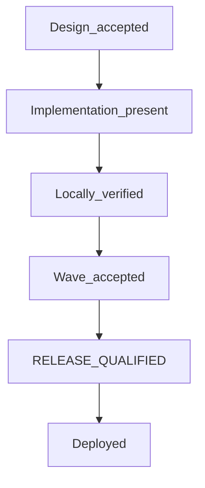

# Wave Acceptance Protocol

**Status:** Governing process document. Not a runtime prompt.

This protocol defines how Project Ashley waves advance from design through
deployment. It complements [`Vision_Implementation_Map.md`](Vision_Implementation_Map.md)
and [`Architecture_Review_Protocol.md`](Architecture_Review_Protocol.md).

**Critical rule:** Passing tests does not accept a wave. Each wave advances only
via a gate packet plus Doc's explicit sign-off phrase. Acceptance never implies
`apply`, **RELEASE_QUALIFIED**, or **Deployed**.

---

## Acceptance ladder



| Stage | Meaning | Who advances |
|-------|---------|--------------|
| **Design accepted** | Plan/docs and authority boundaries complete | Doc says e.g. "Accept Wave 07 design" |
| **Implementation present** | Code exists; not yet trusted | Engineering reports completion |
| **Locally verified** | Builds, migrations, security/offline checks, targeted tests pass | Agent produces gate packet with command output |
| **Wave accepted** | Doc explicitly accepts completion report | Doc says e.g. "Accept Wave 06" |
| **RELEASE_QUALIFIED** | Separate Mint/live validation authorized | Doc authorizes explicitly |
| **Deployed** | Separate deploy authorization | Doc authorizes explicitly |

Design waves (07, 08, 09, 10) use **Design_complete** while awaiting Doc review, then
**Design_accepted** after explicit design sign-off. Implementation waves use the
full ladder from **Implementation_present** onward.

## Current M-series acceptance ladder

The historical Wave ladder above remains exact provenance for Wave records. It
does not govern current Sandbox V2 milestone completion by itself. Sandbox V2
uses this expanded ladder:

```text
DESIGN ACCEPTED
  -> IMPLEMENTED
    -> LOCALLY VERIFIED
      -> INDEPENDENTLY REVIEWED
        -> PHYSICALLY QUALIFIED
          -> RELEASE_QUALIFIED
            -> DEPLOYED
              -> CAPABILITY PROMOTED
                -> PRODUCTION WITNESSED
                  -> PRODUCTION ACCEPTED
```

Each transition requires evidence bound to the exact candidate, contract, and
environment required by that stage. No stage implies a later stage. Historical
`Wave_accepted` records remain owner-acceptance provenance for their exact V1
scope. They MUST NOT be automatically relabeled as V2 independent review,
physical qualification, `RELEASE_QUALIFIED`, deployment, promotion, production witness,
or production acceptance.

`RELEASE_QUALIFIED` is the canonical release-readiness stage for both the
historical Wave ladder and the current M-series ladder. `RELEASED` is not a
separate stage. Historical `Release_qualified`, `Release-qualified`, and
`release-qualified` spellings are exact semantic aliases for
`RELEASE_QUALIFIED`; they do not grant a new or later authority state.

The [Sandbox V2 M-Series Roadmap](architecture/sandbox/ASHLEY_SANDBOX_V2_ROADMAP.md)
owns milestone-specific evidence requirements and predecessor gates. M4 remains
blocked until exact-candidate M3 is `PRODUCTION ACCEPTED`. A prior-SHA M3
physical result does not qualify a later SHA. Today’s pending gate and SHA
maturity are not recorded here. Resolve them live from Git, source,
exact-candidate packets, or production observation. If they cannot be
established from permitted evidence: `UNKNOWN`.

Owner-selected execution policy for Sandbox V2 M5–M7: do not run physical Mint
qualification after every remaining M-series implementation. Each of M5, M6,
and M7 still requires its own design, implementation, local verification, and
independent review. Host-dependent physical qualification is one coordinated
Mint campaign after the M-series implementation track is complete and an exact
candidate is frozen. This batches qualification. It does not skip physical
criteria, promote a capability, or confer `PRODUCTION ACCEPTED` by
inheritance. See roadmap §17.2.1. The ladder stages above remain distinct.

---

## Verification lifecycle

**Status:** Authoritative verification-economics owner for Project Ashley.
Passing tests does not accept a wave, qualify a release, deploy, promote a
capability, or prove production acceptance.

Verification is selected by the claim being made, not by ritual.

```text
MORE TESTS ≠ MORE USEFUL EVIDENCE
GENERIC CI ≠ PHYSICAL QUALIFICATION
```

```text
ITERATION
  -> focused falsification tests for the changed risk

SETTLEMENT
  -> affected regression + build/typecheck where relevant

CANDIDATE FREEZE
  -> one full corpus gate

PHYSICAL QUALIFICATION
  -> real host/environment evidence only where the claim depends on it

PRODUCTION
  -> exact-candidate production witness / acceptance
```

| Stage | Use when | Do not use as |
|---|---|---|
| `ITERATION` | Changing logic, docs, or contracts; need a cheap falsifier | Physical isolation proof; promotion |
| `SETTLEMENT` | Closing a local change set that can regress nearby behavior | Mint Bubblewrap proof; production acceptance |
| `CANDIDATE FREEZE` | Declaring a candidate ready for a corpus gate | A substitute for physical or production claims |
| `PHYSICAL QUALIFICATION` | Claims about real Bubblewrap, process, filesystem, or host timing | Docs-only edits; generic CI green |
| `PRODUCTION` | Exact-candidate witness on the production host/capability surface | Local tests; resemblance to an older SHA |

Docs-only changes require documentation verification, not Bubblewrap and not a
full corpus. Schema, migration, and data-plane changes require targeted
authority/migration regressions plus settlement build/typecheck where relevant,
and must not use the production database as a test fixture. Capability
promotion requires an exact-candidate production witness.

The worker-facing path matrix in [`AGENTS.md`](../AGENTS.md) summarizes
selection only. This section owns the semantics.

---

## Sequencing rules

| Allowed before predecessor implementation acceptance | Blocked before predecessor implementation acceptance |
|------------------------------------------------------|------------------------------------------------------|
| Design-only docs (Waves 07, 08, 09, 10 design) | Implementation code, broker use, runtime wiring |
| Design gate packets awaiting Doc design sign-off | `apply`, Mint install/user creation, release qualification, deploy |

- **Design-only work** may precede predecessor **implementation** acceptance when
  explicitly labeled design-only.
- **No implementation**, broker use, runtime wiring, `apply`, Mint action, release
  qualification, or deployment may proceed before the required predecessor acceptance.
- Wave 09 **Design_accepted** does not bypass Wave 06, Wave 07b, and Wave 08b
  implementation gates; 09b remains blocked until those gates are **Wave_accepted**
  (Wave 07 and Wave 09 design may already be **Design_accepted**).
- Wave 10 design acceptance authorizes only 10a implementation. It does not
  authorize 10b, 10c, release qualification, Mint work, live evaluation, `apply`,
  commit, push, or deployment.
- Wave 10a **Wave_accepted** now authorizes only 10b implementation and local
  verification. It does not authorize 10c, release qualification, Mint work,
  live evaluation, `apply`, commit, push, or deployment.
- Wave 10b **Wave_accepted** now authorizes only 10c implementation and local
  verification. It does not authorize release qualification, Mint work, live
  evaluation, `apply`, commit, push, or deployment.

### Implementation dependencies

| Wave | Requires |
|------|----------|
| 07b broker | Wave 06 **Wave_accepted** + Wave 07 **Design_accepted** |
| 08b change proposals | Wave 07b **Wave_accepted** |
| 09b external agency | Wave 06, Wave 07b, and Wave 08b **Wave_accepted**; Wave 07 and Wave 09 **Design_accepted** may already be done |
| 10a stabilization manifest | Wave 10 **Design_accepted** |
| 10b deterministic evaluation | 10a **Wave_accepted** |
| 10c health/resource assurance | 10b **Wave_accepted** |

---

## Gate packet template

Every wave gate packet lives under `docs/handoffs/` and must include:

1. **Scope** — what wave and what is in/out of scope
2. **Git state** — current SHA, worktree cleanliness, branch
3. **Guarantees** — what behavior the evidence supports
4. **Non-guarantees** — what is explicitly not claimed
5. **Commands** — each command, exit code, pass/fail
6. **Skipped checks** — if any, with reason
7. **Output** — scrubbed transcript (never secrets, API keys, or raw credentials)
8. **Evidence matrix** — claim → verified file/test paths only
9. **Open risks / follow-ups**
10. **Status** — current ladder stage
11. **Recommended sign-off** — exact phrase Doc should use to advance

Never mark **Wave_accepted** until Doc explicitly signs off.

---

## Historical V1 wave status (living provenance)

| Wave | Stage | Gate packet |
|------|-------|-------------|
| 00–05 | **Implementation_present** (`legacy_local`; Doc acknowledged 2026-08-04; not Wave_accepted) | [`handoffs/waves-00-05-implementation-record.md`](handoffs/waves-00-05-implementation-record.md) |
| 06 | **Wave_accepted** (not `RELEASE_QUALIFIED`) | [`handoffs/wave-06-gate-packet.md`](handoffs/wave-06-gate-packet.md) |
| 07 | **Design_accepted** | [`handoffs/wave-07-design-gate-packet.md`](handoffs/wave-07-design-gate-packet.md) |
| 07b | **Wave_accepted** (not `RELEASE_QUALIFIED`) | [`handoffs/wave-07b-gate-packet.md`](handoffs/wave-07b-gate-packet.md) |
| 07c | **Wave_accepted** (not `RELEASE_QUALIFIED`) | [`handoffs/wave-07c-gate-packet.md`](handoffs/wave-07c-gate-packet.md) |
| 08 | **Design_accepted** | [`handoffs/wave-08-design-gate-packet.md`](handoffs/wave-08-design-gate-packet.md) |
| 08b | **Wave_accepted** (not `RELEASE_QUALIFIED`) | [`handoffs/wave-08b-gate-packet.md`](handoffs/wave-08b-gate-packet.md) |
| 09 | **Design_accepted** | [`handoffs/wave-09-design-gate-packet.md`](handoffs/wave-09-design-gate-packet.md) |
| 09b | **Wave_accepted** (not `RELEASE_QUALIFIED`) | [`handoffs/wave-09b-gate-packet.md`](handoffs/wave-09b-gate-packet.md) |
| 10 | **Design_accepted** | [`handoffs/wave-10-design-gate-packet.md`](handoffs/wave-10-design-gate-packet.md) |
| 10a | **Wave_accepted** (not `RELEASE_QUALIFIED`) | [`handoffs/wave-10a-gate-packet.md`](handoffs/wave-10a-gate-packet.md) |
| 10b | **Wave_accepted** (not `RELEASE_QUALIFIED`) | [`handoffs/wave-10b-gate-packet.md`](handoffs/wave-10b-gate-packet.md) |
| 10c | **Wave_accepted** (not `RELEASE_QUALIFIED`) | [`handoffs/wave-10c-gate-packet.md`](handoffs/wave-10c-gate-packet.md) |

Update this table when gate packets are produced or Doc signs off.

Waves 00–05 are now recorded as **Implementation_present** / `legacy_local`:
Doc acknowledged the existing local implementation on 2026-08-04. They remain
outside the formal **Wave_accepted** ladder until separately verified and
accepted.

**Historical next-gate note:** This record formerly pointed from Wave 07c to a
V1 Mint broker release-qualification review. That is not the current Sandbox
V2 next gate. For V2, M4 is blocked until M3 satisfies its exact-candidate gate
under the expanded ladder. Wave 07c acceptance remains V1 implementation
provenance only. It authorizes no live services, Mint installation,
credentials, network adapters, production dispatch, `apply`, commit, push, or
deploy.

---

## Related documents

- [`Vision_Implementation_Map.md`](Vision_Implementation_Map.md) — commitment tracking
- [`Architecture_Index.md`](Architecture_Index.md) — module tree and governance index
- [`Architecture_Review_Protocol.md`](Architecture_Review_Protocol.md) — boundary review artifacts
- [`architecture/sandbox/ASHLEY_SANDBOX_V2_ROADMAP.md`](architecture/sandbox/ASHLEY_SANDBOX_V2_ROADMAP.md) — current Sandbox V2 milestones and acceptance gates
