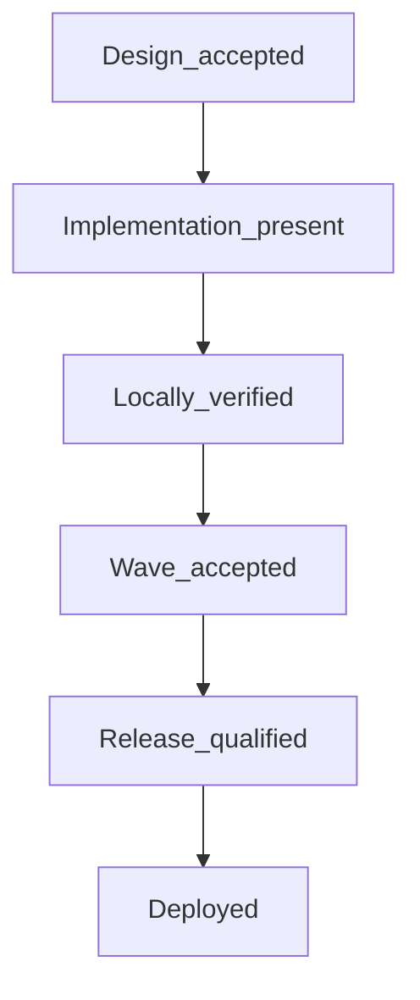

# Wave Acceptance Protocol

**Status:** Governing process document. Not a runtime prompt.

This protocol defines how Project Ashley waves advance from design through
deployment. It complements [`Vision_Implementation_Map.md`](Vision_Implementation_Map.md)
and [`Architecture_Review_Protocol.md`](Architecture_Review_Protocol.md).

**Critical rule:** Passing tests does not accept a wave. Each wave advances only
via a gate packet plus Doc's explicit sign-off phrase. Acceptance never implies
`apply`, **Release_qualified**, or **Deployed**.

---

## Acceptance ladder

| Stage | Meaning | Who advances |
|-------|---------|--------------|
| **Design accepted** | Plan/docs and authority boundaries complete | Doc says e.g. "Accept Wave 07 design" |
| **Implementation present** | Code exists; not yet trusted | Engineering reports completion |
| **Locally verified** | Builds, migrations, security/offline checks, targeted tests pass | Agent produces gate packet with command output |
| **Wave accepted** | Doc explicitly accepts completion report | Doc says e.g. "Accept Wave 06" |
| **Release-qualified** | Separate Mint/live validation authorized | Doc authorizes explicitly |
| **Deployed** | Separate deploy authorization | Doc authorizes explicitly |

Design waves (07, 08, 09, 10) use **Design_complete** while awaiting Doc review, then
**Design_accepted** after explicit design sign-off. Implementation waves use the
full ladder from **Implementation_present** onward.

---

## Sequencing rules

| Allowed before predecessor implementation acceptance | Blocked before predecessor implementation acceptance |
|------------------------------------------------------|------------------------------------------------------|
| Design-only docs (Waves 07, 08, 09, 10 design) | Implementation code, broker use, runtime wiring |
| Design gate packets awaiting Doc design sign-off | `apply`, Mint install/user creation, release qualification, deploy |

- **Design-only work** may precede predecessor **implementation** acceptance when
  explicitly labeled design-only.
- **No implementation**, broker use, runtime wiring, `apply`, Mint action, release
  qualification, or deployment may proceed before the required predecessor acceptance.
- Wave 09 **Design_accepted** does not bypass Wave 06, Wave 07b, and Wave 08b
  implementation gates; 09b remains blocked until those gates are **Wave_accepted**
  (Wave 07 and Wave 09 design may already be **Design_accepted**).
- Wave 10 design acceptance authorizes only 10a implementation. It does not
  authorize 10b, 10c, release qualification, Mint work, live evaluation, `apply`,
  commit, push, or deployment.
- Wave 10a **Wave_accepted** now authorizes only 10b implementation and local
  verification. It does not authorize 10c, release qualification, Mint work,
  live evaluation, `apply`, commit, push, or deployment.
- Wave 10b **Wave_accepted** now authorizes only 10c implementation and local
  verification. It does not authorize release qualification, Mint work, live
  evaluation, `apply`, commit, push, or deployment.

### Implementation dependencies

| Wave | Requires |
|------|----------|
| 07b broker | Wave 06 **Wave_accepted** + Wave 07 **Design_accepted** |
| 08b change proposals | Wave 07b **Wave_accepted** |
| 09b external agency | Wave 06, Wave 07b, and Wave 08b **Wave_accepted**; Wave 07 and Wave 09 **Design_accepted** may already be done |
| 10a stabilization manifest | Wave 10 **Design_accepted** |
| 10b deterministic evaluation | 10a **Wave_accepted** |
| 10c health/resource assurance | 10b **Wave_accepted** |

---

## Gate packet template

Every wave gate packet lives under `docs/handoffs/` and must include:

1. **Scope** — what wave and what is in/out of scope
2. **Git state** — current SHA, worktree cleanliness, branch
3. **Guarantees** — what behavior the evidence supports
4. **Non-guarantees** — what is explicitly not claimed
5. **Commands** — each command, exit code, pass/fail
6. **Skipped checks** — if any, with reason
7. **Output** — scrubbed transcript (never secrets, API keys, or raw credentials)
8. **Evidence matrix** — claim → verified file/test paths only
9. **Open risks / follow-ups**
10. **Status** — current ladder stage
11. **Recommended sign-off** — exact phrase Doc should use to advance

Never mark **Wave_accepted** until Doc explicitly signs off.

---

## Current wave status (living)

| Wave | Stage | Gate packet |
|------|-------|-------------|
| 00–05 | **Implementation_present** (`legacy_local`; Doc acknowledged 2026-08-04; not Wave_accepted) | [`handoffs/waves-00-05-implementation-record.md`](handoffs/waves-00-05-implementation-record.md) |
| 06 | **Wave_accepted** (not release-qualified) | [`handoffs/wave-06-gate-packet.md`](handoffs/wave-06-gate-packet.md) |
| 07 | **Design_accepted** | [`handoffs/wave-07-design-gate-packet.md`](handoffs/wave-07-design-gate-packet.md) |
| 07b | **Wave_accepted** (not release-qualified) | [`handoffs/wave-07b-gate-packet.md`](handoffs/wave-07b-gate-packet.md) |
| 07c | **Wave_accepted** (not release-qualified) | [`handoffs/wave-07c-gate-packet.md`](handoffs/wave-07c-gate-packet.md) |
| 08 | **Design_accepted** | [`handoffs/wave-08-design-gate-packet.md`](handoffs/wave-08-design-gate-packet.md) |
| 08b | **Wave_accepted** (not release-qualified) | [`handoffs/wave-08b-gate-packet.md`](handoffs/wave-08b-gate-packet.md) |
| 09 | **Design_accepted** | [`handoffs/wave-09-design-gate-packet.md`](handoffs/wave-09-design-gate-packet.md) |
| 09b | **Wave_accepted** (not release-qualified) | [`handoffs/wave-09b-gate-packet.md`](handoffs/wave-09b-gate-packet.md) |
| 10 | **Design_accepted** | [`handoffs/wave-10-design-gate-packet.md`](handoffs/wave-10-design-gate-packet.md) |
| 10a | **Wave_accepted** (not release-qualified) | [`handoffs/wave-10a-gate-packet.md`](handoffs/wave-10a-gate-packet.md) |
| 10b | **Wave_accepted** (not release-qualified) | [`handoffs/wave-10b-gate-packet.md`](handoffs/wave-10b-gate-packet.md) |
| 10c | **Wave_accepted** (not release-qualified) | [`handoffs/wave-10c-gate-packet.md`](handoffs/wave-10c-gate-packet.md) |

Update this table when gate packets are produced or Doc signs off.

Waves 00–05 are now recorded as **Implementation_present** / `legacy_local`:
Doc acknowledged the existing local implementation on 2026-08-04. They remain
outside the formal **Wave_accepted** ladder until separately verified and
accepted.

**Next authorized gate:** Release-qualification review for the Mint sandbox.
Wave 07c acceptance is an implementation sign-off only; no live services, Mint
installation, credentials, network adapters, production dispatch, `apply`,
commit, push, or deploy is authorized by wave acceptance alone.

---

## Related documents

- [`Vision_Implementation_Map.md`](Vision_Implementation_Map.md) — commitment tracking
- [`Architecture_Index.md`](Architecture_Index.md) — module tree and governance index
- [`Architecture_Review_Protocol.md`](Architecture_Review_Protocol.md) — boundary review artifacts
