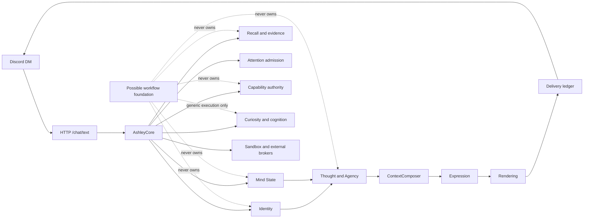

# ASHLEY ARCHITECTURE SALVAGE MAP v1

**Research date:** 2026-08-09  
**Mode:** architecture research, forensic mapping, implementation preparation  
**Implementation status:** none; only the authorized salvage documents were written  
**Baseline:** `0efb0250989e2b67a9b0b3d7e8fce81568ae0975` (`HEAD == origin/master`, clean tracked worktree at start)

## Executive summary

Ashley is not an empty application waiting for an agent framework. It is a
substantial, tested, Ashley-owned semantic system with a replaceable but
currently bespoke support substrate. The correct salvage posture is selective:

1. **Keep the semantic core.** Identity, Mind State, Thought, Agency, grounded
   Recall, relationship semantics, provenance, capability authority, refusal,
   and the delivery truth boundary are not generic framework assets.
2. **Do not replace SQLite or the authority ledgers with framework memory.** A
   workflow checkpoint can carry execution state; it cannot become Ashley's
   identity, Recall, provenance, capability authority, or behavioral truth.
3. **Probe one narrow workflow seam.** Mastra is the leading TypeScript-first
   workflow hypothesis for an adapter spike; LangGraph.js is the mandatory
   comparator and may be stronger on explicit checkpoint/interrupt semantics.
   Neither is a winner or an approved dependency.
4. **Treat Agent Plugins and MCP as interoperability surfaces.** They may
   reduce packaging and tool-transport maintenance, but neither grants
   authority, trust, consent, provenance, or execution permission.
5. **Reevaluate OpenHands and AgentFS narrowly.** OpenHands can be an optional
   coding specialist behind the existing sandbox broker. AgentFS can be a
   filesystem snapshot/audit substrate for an isolated workspace. Neither is a
   cognitive brain, memory authority, workflow authority, or identity store.
6. **Reject framework accretion.** Do not compose Mastra + LangGraph + Letta +
   OpenHands + AgentFS into a new stack. One responsibility gets one candidate
   spike; other candidates remain research-only until a human decision.

The largest credible retirement opportunity is not Ashley's reasoning. It is
the generic portion of durable job leasing, retry/recovery, scheduling,
workflow observation, and possibly platform transport plumbing. Authority-
carrying portions remain Ashley-owned even if their persistence or execution
implementation changes.

## Scope, authority, and evidence rules

This is a salvage map, not an implementation plan. It records dispositions for
current subsystems and bounded research decisions for possible foundations.

Source precedence used here:

1. Current source and tests at the baseline commit.
2. Durable Ashley governance and architecture documents.
3. The referenced overnight goal contract.
4. Current official candidate documentation, source, releases, and licenses.
5. Older research and community material only when explicitly labelled.

The map distinguishes **semantic ownership** from **implementation ownership**.
Ashley semantic ownership means that changing the implementation must not
change what counts as identity, evidence, authority, consent, a grounded
refusal, an actual delivery, or behavioral influence. Generic implementation
ownership means a replaceable substrate may provide persistence, retries,
suspension, scheduling, traces, transport, or filesystem mechanics behind a
stable Ashley interface.

No candidate was installed, executed, benchmarked, added to `package.json`, or
connected to production. Official web evidence is summarized with links in
[`Foundation_Candidate_Dossiers.md`](salvage/Foundation_Candidate_Dossiers.md).

## Baseline and current-state boundary

Verified before research artifacts were written:

```text
git rev-parse HEAD          0efb0250989e2b67a9b0b3d7e8fce81568ae0975
git rev-parse origin/master 0efb0250989e2b67a9b0b3d7e8fce81568ae0975
git status --short          <empty>
```

The current implementation is text-based and nuclear-only. The source has no
Mastra, LangGraph, Letta, OpenHands, AgentFS, Agent Plugins, or Monoma
dependency. Existing framework research in the repository is incidental or
superseded rather than a current candidate dossier.

The roadmap facts that must not be disturbed:

- Smart model routing is complete and Ashley-owned; this map does not reopen
  provider selection.
- Text-based cognitive foundations are late-stage and largely built.
- Recall/Mind State/Thought exists with shadow execution, deterministic
  capability governance, provenance/authority-at-creation, counterfactual
  non-interference, explicit cutover, rollback, and schema-v22 Recall
  authority hardening.
- Production Recall remains observe/shadow qualification. No candidate may
  promote it, alter `masterMode`, or create live evidence during a salvage
  spike.
- Local sandbox and external-agency implementations are not Mint deployment
  evidence. Wave acceptance is not release qualification, installation,
  restart, opt-in, or deployment.

## Current Architecture



The stable conceptual stack remains:

```text
Identity + Mind State -> Thought -> Expression -> Rendering
```

`ContextComposer` assembles transport context. It does not make semantic
decisions downstream. `Expression` turns an already-authorized decision into
language. `Rendering` is platform mechanics. A generic foundation may sit
beside the cognitive loop for durable jobs; it must not become a second
decision-maker between Thought and Expression.

## Semantic core versus generic support machinery

### Ashley semantic core — KEEP

- Vision-derived constitution, identity entries, boundaries, values, tastes,
  and foundational review.
- Dynamic Mind State: goals, concerns, commitments, unfinished items,
  grounded digital affect, owner absence/return, and urgent grounded wakes.
- Thought/Agency: effort allocation, evidence selection, prioritization,
  decision kinds, refusal, silence, delay, challenge, revisit, share, and
  authorization of claims/actions.
- Recall: exact message provenance, grounded episodes, facts, evidence links,
  redaction/forget receipts, live/shadow provenance, and authority at artifact
  creation.
- Relationship semantics: reminders, Ashley self-commitments, mutual
  commitments, scheduled proactive messages, tensions, withdrawals, and
  relationship motivation claims without a scalar attachment/trust shortcut.
- Curiosity and reading meaning: untrusted public sources become bounded
  evidence/takes; reading never directly sends.
- Capability rollout: observe versus influence, dependency gates, contract
  hashes, model-continuity epochs, shadow/live qualification, cutover, and
  rollback.
- Honest delivery: reservation, send attempt, receipt, committed/partial/
  aborted outcome, and no claim of delivery without a receipt.
- Privacy/classification and untrusted-input rules for external text,
  attachments, plugin data, MCP output, and agent output.
- Sandbox and external-action authorization: signed envelopes, owner/policy
  approval, continuity tombstones, capability gates, vault separation, and
  reconciliation outcomes.

### Generic support machinery — candidate for WRAP or SPIKE

- Durable job claim/lease/recovery and bounded retry policy.
- Workflow step state, suspend/resume, event streams, run inspection, and
  trace export.
- Timer/schedule registration and platform wake-up mechanics.
- Generic tool transport and plugin package discovery/validation.
- Filesystem copy-on-write, snapshot, diff, and audit mechanics for an
  isolated coding workspace.
- HTTP routing, SDK serialization, and some adapter boilerplate.

The test is not “does it use SQLite?” The test is “could changing this
mechanism change what Ashley is allowed to believe, say, influence, send,
forget, or execute?” If yes, the semantic contract stays Ashley-owned.

## Salvage disposition summary

The complete field-level inventory is in
[`Ashley_Subsystem_Inventory.md`](salvage/Ashley_Subsystem_Inventory.md).

| Disposition | Count | Meaning |
|---|---:|---|
| KEEP | 22 | Preserve Ashley ownership; optimize only behind tests and seams. |
| WRAP | 3 | Retain semantics and place generic mechanics behind an explicit boundary. |
| SPIKE REQUIRED | 2 | Run a bounded, non-production proof before any port decision. |
| DEFER | 2 | Valuable, but not needed for the current foundation decision. |
| DELETE | 1 | Retired legacy surface; confirm exact residual files before removal. |
| RESEARCH NEXT | 1 | Candidate identity lacks enough evidence for a spike. |
| PORT / REPLACE | 0 | No overnight port or replacement is justified. |

The inventory has 31 rows. The spike dispositions are `Cognition jobs and
worker` and `Plugin/tool interoperability`. The WRAP dispositions are
`Attention admission`, `Discord initiative scheduling`, and `Generic HTTP/SDK
boundary`. Full contracts are in
[`Porting_Spike_Backlog.md`](salvage/Porting_Spike_Backlog.md).

## Full subsystem salvage matrix

The supporting inventory carries every required field. This compact matrix is
the decision surface for tomorrow's review.

| ID | Subsystem | Disposition | Primary seam / owner | Current LOC signal | Main risk |
|---|---|---|---|---:|---|
| S01 | Governance and constitution | KEEP | Governance review | docs | Semantic drift |
| S02 | Identity and foundational review | KEEP | MemoryAuthority | 904 | Unauthorized identity change |
| S03 | Mind State, affect, own-time | KEEP | MemoryAuthority + CapabilityAuthority | 1,035 | Shadow state becomes live |
| S04 | Thought and Agency | KEEP | CapabilityAuthority + EvidenceResolver | 5,016 | Framework agent loop erases agency |
| S05 | Context composition | KEEP | EvidenceResolver | 225 | Generic retrieval leaks/fabricates |
| S06 | Expression and rendering | KEEP | DeliveryLedger + route registry | 247 | Expression gains authority |
| S07 | Recall and redaction | KEEP | MemoryAuthority + EvidenceResolver | 2,367 | False continuity |
| S08 | Reflection and learning | KEEP | WorkflowRuntime + revision gate | 1,810 | Replay changes behavior |
| S09 | Relationship state | KEEP | CapabilityAuthority + EvidenceResolver | 1,684 | Engagement metric substitution |
| S10 | Curiosity and public reading | KEEP | EvidenceResolver + WorkflowRuntime | 1,760 | Untrusted source influence |
| S11 | Model routing | KEEP | CapabilityAuthority + route registry | 175+ | Provider policy drift |
| S12 | Capability/provenance authority | KEEP | CapabilityAuthority | 1,546 | Observe becomes influence |
| S13 | Attention admission | WRAP | AshleyAttentionPolicy | 2,457 | Unauthorized/starved model work |
| S14 | Cognitive jobs and worker | SPIKE REQUIRED | WorkflowRuntime + semantic worker | 1,088 | Duplicate materialization |
| S15 | Delivery ledger | KEEP | DeliveryLedger | 1,174 | Draft mistaken for sent |
| S16 | Discord boundary | KEEP | DeliveryLedger + HTTP contract | 3,791 | Duplicate turns/sends |
| S17 | HTTP/API boundary | WRAP | Versioned Ashley service interfaces | 1,500 | Auth/redaction bypass |
| S18 | Nuclear SQLite schema | KEEP | Ashley-owned repositories | 2,208+ | Split source of truth |
| S19 | Continuity sidecar | KEEP | MemoryAuthority + tombstones | 1,938 | Lost lineage/false forget |
| S20 | Privacy/classification | KEEP | ToolRuntime + EvidenceResolver | 2,096 | Secret/public disclosure |
| S21 | Sandbox policy/client | KEEP | ExecutionBroker | 14,222 | Scope widening |
| S22 | Sandbox broker | KEEP | Signed broker protocol | 25,609 | Host execution authority |
| S23 | Self-modification proposals | DEFER | WorkflowRuntime + broker later | 1,702 | Premature self-change |
| S24 | External agency broker | KEEP | Separate ExecutionBroker sibling | 3,894 | Credential/public action leak |
| S25 | Initiative scheduling | WRAP | Wake event + Agency | 191+ | Timer-driven personality |
| S26 | Qualification/evaluation | KEEP | Capability/report schema | 194 test files | Demo mistaken for release |
| S27 | Observability/diagnostics | KEEP | Owner diagnostic contract | shared | Trace mistaken for authority |
| S28 | Retired legacy surface | DELETE | Separate reference audit | unknown | Delete archival/live residue |
| S29 | Plugin/tool interoperability | SPIKE REQUIRED | PluginRuntime -> ToolRuntime | 0 current | Tool/path/secret injection |
| S30 | Learned autonomy/CSM | DEFER | Future reviewed proposal path | future | Unbounded self-authority |
| S31 | Unresolved external research | RESEARCH NEXT | Research ledger | 0 current | False candidate certainty |

## Foundation candidate matrix

The scores use the goal's weighted 100-point rubric. They are **raw planning
scores for the named generic responsibility**, not a claim that any candidate
fits Ashley as a whole. They are non-empirical and must be replaced by spike
evidence before adoption.

| Candidate / scoped responsibility | Raw score | Role now | Primary veto or caveat |
|---|---:|---|---|
| LangGraph.js / durable graph execution | 70/100 | Secondary comparator; SPIKE REQUIRED with Mastra | Graph/checkpoint state and node replay can become an accidental semantic state machine. |
| Mastra / TypeScript workflow execution | 68/100 | Leading workflow hypothesis; SPIKE REQUIRED with LangGraph | Strong workflow/storage/HITL fit, but no Ashley authority model; `ee/` licensing needs review. |
| MCP / tool transport | 42/100 | WRAP / RESEARCH NEXT | Transport and optional authorization are not Ashley permission or trust. |
| Agent Plugins v1 / skills + MCP packaging | 39/100 | RESEARCH NEXT; packaging spike | Working Draft; discovery does not define Ashley authority or sandboxing. |
| OpenHands SDK / coding specialist | 38/100 | SPIKE REQUIRED only behind broker | Python-first coding-agent stack with its own agent loop and workspace semantics. |
| Microsoft Agent Framework / workflows | 38/100 | RESEARCH NEXT | Official graph/workflow path exists; TypeScript/Node fit is not established here. |
| AgentFS / isolated filesystem substrate | 37/100 | RESEARCH NEXT; narrow filesystem spike | Beta and filesystem-specific; not Recall/identity/workflow authority. |
| Letta / stateful memory-agent platform | 35/100 | REJECT as cognitive substrate | Its central memory-agent runtime conflicts with Ashley-owned Recall and Thought. |
| elizaOS / agent-loop runtime | 30/100 | REJECT as central foundation | Multi-agent/plugin/personality runtime overlaps Ashley semantics. |
| OpenClaw / personal-assistant application | 25/100 | REJECT as foundation | Application scope and broad assistant integration are not a substrate seam. |
| Poke recipes / hosted MCP integration | 14/100 | REFERENCE ONLY | Hosted product, account, integration, and credential model. |
| Monoma | N/A | RESEARCH GAP; REFERENCE ONLY at most | Official search located a closed modular-sensor project, not the hypothesized AI foundation. |

Arithmetic, source evidence, licenses, maintenance caveats, and rejection tests
are in [`Foundation_Candidate_Dossiers.md`](salvage/Foundation_Candidate_Dossiers.md).

## Mastra versus LangGraph

| Requirement | Mastra | LangGraph.js | Ashley conclusion |
|---|---|---|---|
| TypeScript/Node integration | Direct TypeScript framework and packages | Direct JS/TS graph runtime and checkpoint packages | Both qualify for a local seam spike. |
| Durable state | Workflow snapshots persisted to configured storage | Checkpointers persist graph state; stores hold application-defined data | Neither store may replace Recall or authority tables. |
| Suspend/resume / HIL | `suspend()` / `resume()` with persisted snapshots | `interrupt()` / `Command` resume with persisted checkpoints | Both support the proof; test exact restart and external resume. |
| Retry/re-execution | Workflow steps and retry visibility are documented; pin and verify exact version later | Retry policies are explicit; interrupted/retried nodes re-run from node start | Idempotency fixtures are mandatory. |
| Inspection/traces | Built-in observability and run inspection | Graph state/history plus LangSmith ecosystem | Ashley keeps its own decision/evidence/receipt audit. |
| Schedules/events | Current docs/releases expose schedules and workflow event ingestion | Runtime/event/checkpoint primitives; scheduling is more host-shaped | Do not move initiative semantics into either scheduler. |
| Lock-in/reversibility | Workflow definitions and storage schema create coupling; core mostly Apache-2.0, `ee/` separate | MIT core; graph topology and checkpoint schema still couple migration | Adapter contract and fixture parity decide. |
| Main failure mode | Framework encourages an agent/workflow-centered architecture | Framework encourages graph-state-centered architecture and replay | Both are unsafe if allowed to own semantic authority. |

**Current decision:** do not adopt either. Run one adapter-shaped spike that
implements the same `consolidate_thread` fixture twice. The future choice, if
any, must provide mechanics while `AshleyWorkflowRuntime` owns job identity,
capability/provenance boundaries, idempotency keys, and influence eligibility.

## Agent Plugins and MCP

Agent Plugins v1.0.0 is a Working Draft. Its normative format requires a root
`plugin.json`, fixed `skills/` and `mcp.json` locations, closed schemas,
version selection without fetching schemas at load time, package-root
containment, and isolated component failures. It intentionally defines
packaging/discovery for skills and MCP; it does not define a portable trust,
permission, consent, capability, identity, or sandbox authority model.

The useful future seams are:

- `AshleyPluginRuntime`: inspect, validate, version, and quarantine components
  without giving a package authority.
- `AshleyToolRuntime`: map an admitted MCP tool to a narrow capability and
  return untrusted data until Thought/Policy authorizes use.
- `AshleyExecutionBroker`: remain the only mutating sandbox/external path.

The first safe step is a parser/fixture spike. It must not install a plugin,
launch a stdio command, expand credentials, connect to a remote MCP server, or
execute `SKILL.md` scripts. See P-02.

## Other candidates

Letta is rejected as a central cognitive substrate because its value is a
stateful memory-agent runtime, which duplicates Ashley-owned Recall and
Thought. elizaOS is rejected as a central runtime because its agent loop,
plugin model, personality, and multi-agent scope overlap Ashley semantics.
OpenClaw is an application-level personal assistant, not a replaceable
substrate. Microsoft Agent Framework remains a research comparator because
its official path is graph/workflow-oriented and TypeScript/Node fit is not
established here. Poke recipes are reference-only hosted integration evidence.
The candidate dossier records the source and disposition for each.

## OpenHands and AgentFS

OpenHands V1 describes a modular Python SDK with agent, conversation, tools,
events, workspaces, and an optional remote agent server. Its runtime/sandbox
architecture is useful as a comparison for Ashley's broker, but its agent loop
must not become Ashley's Thought. The only plausible future use is a coding
specialist whose proposals and artifacts cross the existing signed broker.

AgentFS provides a SQLite-backed, copy-on-write filesystem with snapshots,
tool-call audit, and SDKs. It is complementary to a sandbox: it can answer
“what changed and what was recorded in this workspace?” It cannot answer “what
does Ashley remember?” or “what is Ashley authorized to influence?”. Its only
plausible use is a bounded filesystem layer inside a broker-created workspace.

## LOC analysis and file-level retirement map

This is a map, not a deletion order. Do not remove any file during this goal.

| Current area | Plausible future retirement/port target | Must remain Ashley-owned |
|---|---|---|
| `core/cognition/jobs.ts` (159 LOC) | Generic claim/lease/recovery behind `AshleyWorkflowRuntime`. | Job identity, provenance, capability mode, idempotency, influence eligibility. |
| Generic portions of `core/cognition/worker.ts` (644 LOC) | Retry/step/event plumbing after fixture parity. | Model-output normalization, exact user-message provenance, episodes, Mind State, Affect, learning. |
| Generic portions of `core/attention/ledger.ts` (599 LOC) | Queue/lease primitives only. | Lane policy, quotas, deadlines, starvation, contract/epoch checks, outbound eligibility. |
| `discord-bot/src/initiative/scheduler.ts` (191 LOC) | Timer/poll wake-up behind durable scheduling. | Proactive eligibility, pause/resume, receipts, urgent-wake authorization. |
| Generic parts of `agent-service/src/server.ts` (1500 LOC) | Route/serialization boilerplate may later be split. | Owner auth, redaction, health boundary, diagnostics, delivery endpoints. |
| `apps/sandbox-broker/src/**` (25,609 LOC under `src`) | Not a wholesale target; optional coding substrate can sit inside it. | Signed envelopes, UID/socket, paths, recipes, approval, tombstones, audit, secrets. |
| `apps/external-broker/src/**` (2,090 LOC under `src`) | Generic adapter plumbing can be reviewed later. | Policy signatures, vault boundary, dual authorization, dispatch FSM, reconciliation. |
| Any residual retired integrations | Delete only after exact reference/test/config check. | Discord-only contract and current source of truth. |

No `PORT` or `REPLACE` disposition is justified. A candidate earns one only
after a bounded spike proves parity and a human approves a later plan.

## Stable seams

These are contracts for research and review, not code to add now:

- `AshleyWorkflowRuntime`: submit/claim/suspend/resume/recover a generic job;
  never decides behavioral authority.
- `AshleyMemoryAuthority`: Recall selection, provenance, redaction,
  tombstones, and read records.
- `AshleyCapabilityAuthority`: master mode, release, contract hash, model
  epoch, provenance, and influence readiness.
- `AshleyToolRuntime`: tool metadata, classification, capability, budgets, and
  untrusted results.
- `AshleyExecutionBroker`: the only mutating sandbox/external execution path.
- `AshleyEvidenceResolver`: exact evidence refs and live/shadow eligibility.
- `AshleyPluginRuntime`: portable package validation and quarantine.
- `AshleyDeliveryLedger`: draft, attempt, committed, partial, aborted truth.

## Top three bounded spikes

1. **P-01 — Durable cognition adapter parity.** Run the same non-authoritative
   `consolidate_thread` fixture through Ashley-shaped code and Mastra/LangGraph
   comparators. Prove restart recovery, suspend/resume, retries, idempotency,
   and no influence while capability authority says observe. No package
   installation or production DB.
2. **P-02 — Agent Plugins/MCP quarantine.** Parse valid, invalid, mismatched,
   path-escaping, unknown-component, and failing-component fixtures. Prove
   package validation and component isolation without launching a process or
   making a network request.
3. **P-03 — OpenHands/AgentFS broker seam.** Use fake broker interfaces and
   temporary fixtures to model a coding proposal plus filesystem snapshot/diff.
   Prove the broker remains sole execution authority and artifacts cannot
   become Recall or identity without an Ashley-owned evidence path.

Full spike contracts, fixtures, acceptance/rejection, rollback, and estimates
are in [`Porting_Spike_Backlog.md`](salvage/Porting_Spike_Backlog.md).

## Contradictions and superseded research

The evidence ledger is in
[`Research_Gaps_and_Contradictions.md`](salvage/Research_Gaps_and_Contradictions.md).
Important resolutions:

- Earlier “Mastra cognitive brain”, “Mastra AgentFS memory”, direct OpenHands
  executor, and warmed OpenHands container concepts are superseded. They are
  hypotheses to falsify at seams, not architecture.
- `Wave_accepted` is not `Release_qualified` and neither means deployed.
- `ASHLEY_COGNITION_MODE=observe` records shadow evidence; it does not grant
  behavioral influence.
- Workflow state is not behavioral authority state.
- The current smart router is complete and remains Ashley-owned.
- “Monoma” remains unresolved as a candidate identity; current official
  results point to a closed modular-sensor project, not an AI framework.

## Human decision queue

1. Approve or reject P-01 with both Mastra and LangGraph as comparators.
2. Decide whether P-02's interoperability value justifies a future plugin
   adapter while the specification remains a Working Draft.
3. Decide whether OpenHands is wanted as a narrow coding specialist; if yes,
   approve only a fake-broker seam spike.
4. Decide whether AgentFS's snapshot/audit value justifies an isolated
   filesystem spike or current broker work is sufficient.
5. Confirm Recall, Mind State, Thought, provenance, capability contracts,
   delivery, and sandbox authority remain KEEP regardless of framework choice.
6. Pick one future generic substrate investigation after spike evidence; do
   not approve a multi-framework stack.
7. Decide whether residual legacy files have any exact deletion value. No
   deletion is part of this goal.

## Deferred topics

- Learned autonomy and substrate independence.
- Continuous Self-Modification (CSM).
- Production Recall promotion or Mint release qualification.
- New model-routing/provider work.
- Reopening retired Voice, Telegram, habits, Moltbook, or generic skills.
- Multi-agent/swarm architectures.
- Broad external-action integrations, credentials, deployment, and live model
  evaluation.

## Completion boundary

This goal is complete only as a research/documentation artifact:

- no production TypeScript, tests, package files, config, schema, migration,
  model routing, sandbox, service, deployment, database, or secret changed;
- no package installed or third-party code executed;
- only the authorized architecture documents were added;
- baseline and final worktree checks are clean except for those documents;
- human review still owns implementation, commit, push, deploy, capability
  promotion, and release decisions.
