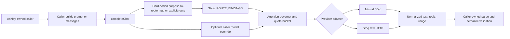

# MODEL-FABRIC-01 Codebase Reconnaissance

- **Research date:** 2026-08-13
- **Mode:** documentation and codebase reconnaissance only
- **Implementation status:** not implemented, not activated, not deployed
- **General source baseline:** local `master` at `82b30a9d218855bd1373121fc5a656a3403b1c85`
- **Engineering-source baseline:** `origin/master` at `2a4b448b74b407aad3dfa6cecb593c167e9f0501`
- **Production host:** Linux Mint; live state was not inspected

## Executive finding

Ashley already has a useful routing and attention substrate. It does not yet have one enforceable model-fabric contract.

The current transport entry point is `completeChat`. It combines route resolution, caller-selected model overrides, quota accounting, attention admission, provider dispatch, error normalization, and continuity recording. Provider capabilities are implicit. Structured output is prompt-and-parse. Context profiles are labels rather than executable projection contracts. Retry and fallback policy are distributed across callers.

The safest first implementation slice is the existing `thought_observation` shadow path. That path has no current-turn authority, already expects structured data, and exposes a real routing defect: it asks for purpose `thought_observation` but `runThoughtModel` forces route `thought`. The first slice MUST remain shadow-only and MUST NOT touch the sandbox or Autonomous Engineering Workstation.

## Contract reconciliation status

The source findings below remain unchanged. The target contracts were reconciled with the parallel [Ashley Evaluation / Qualification Plane](Ashley_Evaluation_Qualification_Plane.md):

- profile ID, version, provider/model binding, and deterministic fingerprint are stable Model Fabric facts;
- mutable qualification history and PASS/promotion semantics are not part of `ModelCapabilityProfile`;
- `EvaluationDefinition` and `QualificationResult` own reusable qualification meaning;
- the current closed `ProviderId` union remains a source fact, but the target core uses an Ashley-validated provider identifier and adapter registry;
- exact projection content binding is distinct from the content-free telemetry fingerprint;
- definitive provider error responses are distinct from local admission refusal and ambiguous post-send failures;
- semantic validation and durable cognitive materialization remain caller-owned.

The selected first slice remains default-off `thought_observation_shadow` transport replacement. It does not dual-dispatch and does not change active Thought.

### Owner-approved target model policy

The current-source findings in this reconnaissance remain historical and
diagnostic truth. They do not define the amended target binding.

- Main `thought.decision` remains Groq `openai/gpt-oss-120b` primary.
- The first `thought.observation` Model Fabric profile is NVIDIA
  `nvidia/nemotron-3.5-lightning-30b-a3b`.
- Later non-Thought specialist and utility migrations target the same Lightning
  family as primary, subject to purpose-specific qualification.
- Groq `openai/gpt-oss-120b` is a later fallback candidate for those
  Lightning-backed routes, but only after both models are qualified for the
  exact route claim.
- The former Groq 20B utility candidate has no planned architecture role.
- Mistral Medium remains Expression primary.
- The first Thought-observation spike remains `single_attempt` with
  `fallbackRouteIds = []` and at most one provider request. It does not enable
  GPT-OSS-120B fallback.

## Scope and authority

This reconnaissance follows the repository authority chain:

1. [VISION.md](../../VISION.md)
2. [Ashley_Core_Principles.md](../Ashley_Core_Principles.md)
3. [Ashley_Constitution.md](../Ashley_Constitution.md)
4. [Ashley_Stewardship_Compact.md](../Ashley_Stewardship_Compact.md)
5. [Ashley_Ethics.md](../Ashley_Ethics.md)
6. [Ashley_Hierarchy.md](../Ashley_Hierarchy.md)

The design preserves these boundaries:

- Ashley owns Identity, Mind State, Thought, Reflection, Expression, consent, refusal, provenance, capability authority, and delivery authority.
- A model provider, SDK, trace, evaluation framework, or model response is machinery. It is never semantic or execution authority.
- Model output can propose structured data. Existing Ashley-owned validation and capability gates decide whether anything is accepted or used.
- External content remains untrusted input.
- Prompts, outputs, media, credentials, private paths, and raw memory MUST NOT become telemetry by default.

The following paths were explicitly excluded from modification:

- `apps/sandbox-policy/**`
- `apps/sandbox-broker/**`
- `apps/agent-service/src/core/sandbox/**`
- `scripts/mint/**`
- `deploy/linux-mint/sandbox/**`

The engineering audit is therefore source-only and pinned to `origin/master`. The working tree contained unrelated in-progress sandbox changes during this research. They were not modified.

## Current model architecture summary

`config/models.json` declares semantic-purpose routes and provider/model/context bindings. The runtime also contains a static registry with the same bindings. `completeChat` resolves a route, accepts an optional caller model override, enters the durable attention governor, selects a provider adapter, dispatches once, and records usage and model-continuity metadata.

### Declared active routes

| Route | Provider | Configured model | Context label | Primary current use |
|---|---|---|---|---|
| `ashley_expression` | Mistral | `mistral-medium-latest` | `full_expression` | Full reactive and proactive expression |
| `ashley_expression_fallback` | Groq | `llama-3.3-70b-versatile` | `minimal_expression_identity` | One-hop expression fallback |
| `thought` | Groq | `openai/gpt-oss-120b` | `thought_summary` | Thought decisions; accidentally also Thought observation |
| `utility_bulk` | Groq | `openai/gpt-oss-20b` | `utility_redacted` | Exchange cognition and curiosity consolidation |

Evidence: [registry.ts:16-44](../../apps/agent-service/src/core/model-routing/registry.ts#L16-L44), [models.json](../../config/models.json), and [Routing_Status.md:7-28](../Routing_Status.md#L7-L28).

Disabled sandbox, reviewer, auditor, and multimodal routes are declared in [registry.ts:45-79](../../apps/agent-service/src/core/model-routing/registry.ts#L45-L79). Their presence is configuration evidence only. It is not activation or capability proof.

### Split routing authority

The config loader reads `routes` and `purpose_routes`. Actual dispatch does not use both as authority:

- `loadRouteRecords` parses provider, model, context profile, enabled state, and quota contract from JSON: [router.ts:34-105](../../apps/agent-service/src/core/model-routing/router.ts#L34-L105).
- The parsed `purpose_routes` value is never used. Runtime purpose selection uses the separate `PURPOSE_TO_ROUTE` constant: [router.ts:127-145](../../apps/agent-service/src/core/model-routing/router.ts#L127-L145).
- `requireRouteEnabled` consults JSON only for `enabled`, then returns the static registry binding: [router.ts:155-164](../../apps/agent-service/src/core/model-routing/router.ts#L155-L164).
- The registry comment says it “must stay in sync” with the config: [registry.ts:10-16](../../apps/agent-service/src/core/model-routing/registry.ts#L10-L16).
- JSON parse failure is silently converted to “no configured routes”: [router.ts:74-105](../../apps/agent-service/src/core/model-routing/router.ts#L74-L105).
- `resolveRoute` accepts `opts.modelAlias` but does not use it: [router.ts:136-146](../../apps/agent-service/src/core/model-routing/router.ts#L136-L146).

Result: `config/models.json` appears authoritative but provider, model, context, and purpose routing remain code-authoritative. Drift can be silent.

### Current transport contract

The current public contract is deliberately small but mixes policy and transport:

- `ProviderId` is a closed union of Mistral, Groq, and NIM.
- `ChatMessage` supports text plus optional inline base64 image URLs.
- `CompletionOptions` exposes an arbitrary `model?: string` override, purpose, route, attention lane, deadlines, correlations, tools, and provider-like generation options.
- `TokenUsage` records only prompt and completion tokens.
- `ModelProviderAdapter.dispatch` receives the already selected model identifier.

Evidence: [types.ts:11-42](../../apps/agent-service/src/core/model-routing/types.ts#L11-L42), [types.ts:44-54](../../apps/agent-service/src/core/model-routing/types.ts#L44-L54), and [types.ts:76-118](../../apps/agent-service/src/core/model-routing/types.ts#L76-L118).

`completeChat` uses `options.model ?? binding.configuredModelId`. A caller can therefore select a model that does not belong to the selected provider route. It also records `routeAlias: null` when routing was purpose-derived instead of explicit. Evidence: [mistral-client.ts:152-185](../../apps/agent-service/src/mistral-client.ts#L152-L185).

### Attention and continuity

`runAttentiveDispatch` is valuable existing infrastructure. It owns durable admission, attention lanes, RPS and token budgets, deadline and cancellation checks, estimated and actual usage, model-continuity epochs, and correlation identifiers. The loop with a maximum of 120 iterations is admission polling. It is not a provider retry loop. Evidence: [governor.ts:110-205](../../apps/agent-service/src/core/attention/governor.ts#L110-L205).

The provider dispatch callback is invoked once after admission. Provider retries can still exist inside a provider SDK. They are not controlled by the attention governor.

Attention observability remains partly Mistral-specific. Its model epoch is read using `env.mistralModel` even though the governor serves multiple providers: [governor.ts:400-437](../../apps/agent-service/src/core/attention/governor.ts#L400-L437).

### Current abstraction disposition

| Current abstraction | Disposition | Reason and bounded change |
|---|---|---|
| Ashley semantic-purpose routing | **KEEP** | Frozen route semantics remain Ashley authority. Do not delegate selection or fallback to an SDK. |
| `config/models.json` plus static `ROUTE_BINDINGS` | **REPLACE INTERNALLY** | Preserve all current route IDs and bindings, but consolidate split authority into one validated registry snapshot. |
| `completeChat` facade | **EXTEND, THEN DEPRECATE LATER** | Keep as a compatibility facade during shadow migrations. New consumers should target `ModelFabric`. Remove only after every caller is qualified. |
| `runAttentiveDispatch` and attention ledger | **KEEP + EXTEND** | Keep durable admission, quotas, deadlines, usage, and continuity. Extend receipts with route/profile/registry facts after the contract stabilizes. |
| Manual Mistral and Groq provider adapters | **REPLACE INTERNALLY** | Replace transport mechanics behind the same Ashley-owned route decision after adapter conformance. Do not rewrite callers wholesale. |
| `CompletionOptions.model` caller override | **DEPRECATE LATER** | It is needed by legacy callers today but violates an immutable route binding. It is absent from new Fabric contracts. |
| Closed current `ProviderId` union | **REPLACE INTERNALLY** | Preserve current provider names and enablement. The target core uses an Ashley-validated identifier so later qualified adapters do not require core-contract rewrites. |
| `ChatMessage.imageUrls` | **DEPRECATE LATER** | Preserve for legacy Expression. New Fabric calls use Ashley-owned `ModelContentPart` and `MediaRef`. |
| Caller-owned semantic validators | **KEEP** | Transport schema validation does not replace Thought, cognition, Reflection, Expression, or engineering invariants. |
| Explicit minimal Expression fallback policy | **KEEP** | It is an existing example of Ashley-owned, bounded, one-hop fallback. Only its transport should later change. |
| Perception artifacts and fetch/retention gates | **KEEP + EXTEND** | Reuse as media authority. Add document-page or audio representations only in later Perception-owned phases. |
| Provider-specific attention health fields | **REPLACE INTERNALLY** | Derive multi-provider status from immutable receipts instead of ambient Mistral environment values. |
| Direct evaluation judge transport | **DEPRECATE LATER or document exception** | It is not production behavior. Later use a dedicated evaluation transport or preserve an explicit provider-test boundary. |

## Current model call inventory

The inventory below covers production code paths that can reach an external model. Dormant diagnostics and evaluation-only calls are listed separately.

| ID | Ashley semantic purpose | Current route and provider | Input context | Output type and authority | Retry/fallback behavior |
|---|---|---|---|---|---|
| M1 | Full Expression | `ashley_expression`; Mistral; `mistral-medium-latest` | Full TurnContext, capability self-model, bounded history, decision, user message, licensed perception parts | Free text. Ashley applies honesty finalization and Rendering. | Eligible failures can enter M2. Otherwise caller produces bounded offline text. |
| M2 | Expression fallback | `ashley_expression_fallback`; Groq; Llama 3.3 70B | Minimal identity and current-turn material only | Free text. No full Identity, raw memory, history, reads, images, or tools. | No third model attempt. Failure returns offline text. |
| M3 | Thought decision | `thought`; Groq; GPT-OSS 120B | Deterministic base plus at most 12 bounded motivations | Prompted JSON. Ashley parses and validates the decision. | Parse/provider failure returns deterministic base/fallback. |
| M4 | Thought observation | **Actual:** `thought`; Groq; GPT-OSS 120B. **Intended by purpose:** `utility_bulk`; GPT-OSS 20B | Current Thought inputs and decision summary | Prompted JSON proposal. Shadow comparison only. | Fire-and-forget error is dropped. |
| M5 | Exchange cognition | `utility_bulk`; Groq; GPT-OSS 20B | Up to 24 unconsolidated exchange messages | Prompted JSON for episode, open items, Mind State, affect, revisions, and facts. Ashley gates and integrates. | Missing key yields offline result. Other errors fail the cognitive job. |
| M6 | Curiosity consolidation | `utility_bulk`; Groq; GPT-OSS 20B | Bounded untrusted read metadata and excerpts | Prompted JSON for takes, interests, questions, opinions, and source proposals. Ashley gates provenance and use. | Missing key yields empty offline result. Other errors throw. |
| M7 | Reflection open-item review | Explicit `thought`; Groq route, but caller overrides model with `env.mistralModel` | Bounded open cognitive item metadata | Parsed KEEP/WITHDRAW/SUPERSEDE/RESOLVE proposal. Transition owner revalidates. | Failure or malformed data is skipped or keeps item open. |
| M8 | Engineering next-action proposal | No explicit route or purpose; defaults to utility Groq route, then overrides model with `env.mistralModel` | Task objective, project/workspace IDs, diagnostics, prior results, budgets, time | Raw JSON proposal. Existing operator validates type, paths, capability, approval envelope; broker remains final authority. | No retry or fallback. Exception fails the task. |

### Per-call operational matrix

| ID | Call site and caller | Current provider abstraction | Timeout and budget | Observability | Downstream consumer |
|---|---|---|---|---|---|
| M1 | `expressSpeak` at [expression.ts:55-169](../../apps/agent-service/src/core/conversation/expression.ts#L55-L169), called by reactive and proactive runtime paths at [runtime.ts:915](../../apps/agent-service/src/core/runtime.ts#L915) and [runtime.ts:1434](../../apps/agent-service/src/core/runtime.ts#L1434) | `completeChat` → attention governor → Mistral SDK adapter | 900 output tokens for Discord or 500 proactive; caller deadline when supplied; attention RPS/TPM admission; AbortSignal through the facade | Attention request, route/bucket/model, usage, latency/outcome, owner/decision/delivery correlations when supplied | Expression honesty finalization → Rendering → Discord delivery reservation |
| M2 | Fallback branch inside `expressSpeak`; options built by [expression-fallback.ts:145-170](../../apps/agent-service/src/core/conversation/expression-fallback.ts#L145-L170) | `completeChat` → attention governor → raw Groq HTTP adapter | 900 output tokens; same live deadline and correlations; one hop maximum | Separate attention request on fallback route; same bounded correlations | Same Expression honesty/Rendering consumer as M1 |
| M3 | `runThoughtModel` at [thought.ts:145-251](../../apps/agent-service/src/core/agency/thought.ts#L145-L251), called by `deliberateDecision` and runtime at [runtime.ts:746-761](../../apps/agent-service/src/core/runtime.ts#L746-L761) and [runtime.ts:1310-1319](../../apps/agent-service/src/core/runtime.ts#L1310-L1319) | `completeChat` → attention governor → raw Groq HTTP adapter | 450 output tokens; temperature 0.15; reactive Thought sub-deadline and abort; proactive path currently has no explicit deadline; attention quota | Reactive owner/delivery correlations; proactive correlations can be absent; normalized model identity returns to proposal | `deliberateDecision` applies Ashley validation and deterministic fallback; accepted decision feeds Agency and Expression |
| M4 | `enqueueThoughtObservation` at [thought-observation.ts:23-77](../../apps/agent-service/src/core/agency/thought-observation.ts#L23-L77), called at [runtime.ts:973-980](../../apps/agent-service/src/core/runtime.ts#L973-L980) | Reuses `runThoughtModel` → `completeChat` → attention → raw Groq HTTP | Same 450/0.15/medium request shape; no production deadline passed; attention quota; fire-and-forget | Decision ID is passed; owner and injected attention DB are absent in the production call; errors are intentionally not surfaced | `recordLiveShadowEvent` stores only bounded comparison/model metadata |
| M5 | Cognition analysis at [worker.ts:239-288](../../apps/agent-service/src/core/cognition/worker.ts#L239-L288), called by `processNextCognitiveJob` at [worker.ts:345-380](../../apps/agent-service/src/core/cognition/worker.ts#L345-L380) | `completeChat` → attention governor → raw Groq HTTP adapter | 1,100 output tokens; temperature 0.2; reasoning medium requested but current Groq adapter ignores it; no explicit deadline | Attention plus `cognitive_runs`; owner, cognitive-job, and DB correlation supplied | Atomic cognition normalization/integration, then capability and provenance gates for episodes, open items, Mind State, affect, revisions, and facts |
| M6 | `consolidateCuriosityRead` at [consolidate.ts:103-236](../../apps/agent-service/src/core/curiosity/consolidate.ts#L103-L236), called from [worker.ts:345-380](../../apps/agent-service/src/core/cognition/worker.ts#L345-L380) | `completeChat` → attention governor → raw Groq HTTP adapter | 900 output tokens; temperature 0.35; reasoning medium requested but ignored by current Groq adapter; no explicit deadline | Attention and cognitive-run records exist, but owner/cognitive-job/DB are not passed to `completeChat`, so the records are not directly joined | Curiosity normalization and provenance gates; accepted shadow/live takes, interests, questions, opinions, and source proposals |
| M7 | `modelReflectionAdjudicator` at [initiative.ts:210-256](../../apps/agent-service/src/core/reflection/initiative.ts#L210-L256), called by async review processing and runtime at [runtime.ts:1267-1271](../../apps/agent-service/src/core/runtime.ts#L1267-L1271) | `completeChat` → attention governor → raw Groq HTTP adapter, with incompatible Mistral model override | 300 output tokens; temperature 0; no explicit deadline; attention quota | Owner and DB correlation supplied; no decision/delivery/cognitive-job ID | Reflection parser and transition owner; safe fallback keeps the item open |
| M8 | `createEngineeringThinkingModel` at `origin/master:apps/agent-service/src/core/sandbox/engineering-model-adapter.ts:46-69`, constructed by engineering runtime; consumed by operator | `completeChat` → default utility route → attention → raw Groq HTTP adapter, with incompatible Mistral model override | Adapter default output ceiling because caller supplies no maximum; no explicit deadline, signal, task correlation, or per-call attention DB; coordinator has separate wall/model/tool budgets | Generic attention record only; engineering task ID and operator budget are not correlated into the model receipt | Existing Engineering operator validates proposal, capability, path, and approval; existing broker port retains execution authority |

All eight production paths ultimately enter `completeChat` and the registered provider adapters. No production caller was found that directly imports a provider SDK or sends provider HTTP outside those adapters. M7 and M8 misuse the routed facade through model overrides; they do not bypass it.

The `maintenance` purpose is declared in routing, but no production `maintenance` model caller was found under `apps/agent-service/src`. Tool-call types exist in the transport contract, but none of the eight production calls supplies tools.

### M1 — Full Expression

`expressSpeak` builds Ashley’s full expression request in [expression.ts:55-169](../../apps/agent-service/src/core/conversation/expression.ts#L55-L169). It selects `ashley_expression` at [expression.ts:157-169](../../apps/agent-service/src/core/conversation/expression.ts#L157-L169).

The context can include:

- stable Identity and dynamic Mind State through TurnContext;
- the current Thought decision;
- capability and activity licenses;
- bounded hot conversation history;
- the user message exactly once;
- attachment excerpts, conversational reads, and inline images only when Perception and capability gates license them.

The model produces language, not authority. Post-model honesty checks and platform Rendering remain Ashley-owned.

There is no same-model retry in caller code. Fallback eligibility is an explicit Expression policy.

### M2 — Minimal Expression fallback

The fallback contract is documented and implemented in [expression-fallback.ts:145-170](../../apps/agent-service/src/core/conversation/expression-fallback.ts#L145-L170).

It is intentionally context-poor. It excludes full Identity, raw Recall, conversation history, conversational reads, images, and tools. It is limited to interactive or urgent expression and an eligible primary failure while the deadline remains live. This is a good existing example of explicit fallback as an Ashley-owned semantic policy.

### M3 — Thought decision

`runThoughtModel` calls `completeChat` with a strict prompt, maximum 450 output tokens, temperature 0.15, reasoning effort `medium`, and route `thought`: [thought.ts:145-197](../../apps/agent-service/src/core/agency/thought.ts#L145-L197).

The caller manually extracts and validates JSON. Provider or parse failure returns the deterministic Thought base. There is no alternate-provider fallback.

### M4 — Thought observation

`thought-observation.ts` passes purpose `thought_observation`: [thought-observation.ts:23-77](../../apps/agent-service/src/core/agency/thought-observation.ts#L23-L77).

The called `runThoughtModel` forces `route: "thought"` regardless of purpose: [thought.ts:189-195](../../apps/agent-service/src/core/agency/thought.ts#L189-L195). The router maps `thought_observation` to `utility_bulk`: [router.ts:127-134](../../apps/agent-service/src/core/model-routing/router.ts#L127-L134).

Therefore the actual request uses GPT-OSS 120B, not the current
`utility_bulk` binding to GPT-OSS 20B. Router unit tests cannot detect this
caller-level override. This is the strongest first-slice route-preservation
regression test. The future corrected shadow target is NVIDIA
`nvidia/nemotron-3.5-lightning-30b-a3b`, not the former 20B utility candidate.

The path is shadow-only. It compares the active decision with a proposed kind and model identifiers. It does not alter the current Thought decision.

### M5 — Exchange cognition

The call and its generation settings are in [worker.ts:239-288](../../apps/agent-service/src/core/cognition/worker.ts#L239-L288). It selects purpose `exchange_cognition` and route `utility_bulk`.

The transcript is bounded to the unconsolidated exchange set. The response is manually normalized into cognition structures. Existing capability, provenance, and atomic-integration logic remains the acceptance authority.

Two defects matter:

- Mistral-era names remain in a Groq-routed path.
- A later continuity comparison uses `env.mistralModel` for a result produced on the utility Groq route. This can misclassify model-continuity provenance: [worker.ts:460-485](../../apps/agent-service/src/core/cognition/worker.ts#L460-L485).

### M6 — Curiosity consolidation

The call is in [consolidate.ts:103-145](../../apps/agent-service/src/core/curiosity/consolidate.ts#L103-L145). The normalized result and return are in [consolidate.ts:146-236](../../apps/agent-service/src/core/curiosity/consolidate.ts#L146-L236).

The input contains untrusted source metadata and excerpts. The model’s output is only a proposal. Provenance and capability gates decide whether any take can become live influence.

Unlike exchange cognition, this call does not pass owner, cognitive-job, or injected attention-database correlations to `completeChat`. The attention ledger can therefore lose the relationship between the dispatch and the cognitive run.

### M7 — Reflection open-item review

The review call is in [initiative.ts:210-256](../../apps/agent-service/src/core/reflection/initiative.ts#L210-L256). It explicitly selects route `thought` and purpose `thought_observation`, then overrides the model with `env.mistralModel`.

The selected provider remains Groq because provider choice comes from the route. The model identifier can therefore be a Mistral identifier sent to the Groq endpoint and accounted under a Groq bucket. The current type system permits this mismatch.

The result has no direct authority. Existing Reflection transition logic revalidates the proposal.

### M8 — Engineering next-action proposal on origin/master

This audit used `origin/master` at `2a4b448b74b407aad3dfa6cecb593c167e9f0501` because the local sandbox paths contained unrelated in-progress work.

The existing engineering seam is narrow:

- `ThinkingModel.proposeNextAction` receives `EngineeringOperatorContext`: `origin/master:apps/agent-service/src/core/sandbox/engineering-types.ts:111-126`.
- `createEngineeringThinkingModel` calls `completeChat` without an explicit route or purpose and overrides the model with `env.mistralModel`: `origin/master:apps/agent-service/src/core/sandbox/engineering-model-adapter.ts:46-69`.
- The operator validates the object, action type, capability, path, and approval envelope before using the execution port: `origin/master:apps/agent-service/src/core/sandbox/engineering-operator.ts:96-165`.
- The coordinator owns durable lifecycle, concurrency, wall time, and model/tool budgets: `origin/master:apps/agent-service/src/core/sandbox/coordinator.ts:45-170`.
- `EngineeringExecutionPort` states that the broker remains final authority: `origin/master:apps/agent-service/src/core/sandbox/engineering-types.ts:86-109`.

The proposed future migration is transport-only:

`ThinkingModel.proposeNextAction` → `SpecialistSession<EngineeringAction>` → existing operator validation → existing approval envelope → existing broker port.

No part of Model Fabric should gain action execution methods, approval authority, Mint access, or broker authority.

A separate source finding exists at `origin/master:apps/agent-service/src/core/sandbox/engineering-operator.ts:96-100`: the model call occurs before the incremented call count is checked. A budget of zero can still dispatch once. This document records the finding only. It MUST NOT be fixed during MODEL-FABRIC-01 preparation or the first spike.

## Provider adapter findings

### Mistral

The Mistral adapter uses `@mistralai/mistralai` and calls `mistral.chat.complete`: [mistral-adapter.ts:143-169](../../apps/agent-service/src/core/model-routing/adapters/mistral-adapter.ts#L143-L169).

It manually converts Ashley messages, inline images, tools, usage, and errors. It places `reasoning_effort` in the request body: [mistral-adapter.ts:46-80](../../apps/agent-service/src/core/model-routing/adapters/mistral-adapter.ts#L46-L80).

The repository declares `@mistralai/mistralai ^1.7.0`. The installed lock resolution observed during research was 1.15.1. The installed request type exposes `promptMode` rather than a typed `reasoningEffort` field. Because the adapter casts through a generic record, the effect of `reasoning_effort` is not proven. It needs a fixture or live qualification before any capability claim.

The installed SDK defaults observed in source were no retry strategy and an unlimited timeout. The adapter passes an AbortSignal but has no Ashley-owned wall-clock timeout at this layer. Cancellation normalization checks only an `AbortError` name. SDK wrapping behavior requires a test.

### Groq

The Groq adapter performs a raw HTTP `fetch` to the OpenAI-compatible chat-completions endpoint: [groq-adapter.ts:173-194](../../apps/agent-service/src/core/model-routing/adapters/groq-adapter.ts#L173-L194).

It has no provider retry. It relies on the caller’s AbortSignal for cancellation and timeout. It manually normalizes response text, tools, usage, and error classes.

The adapter ignores `reasoningEffort` even though Groq documents low, medium, and high reasoning effort for GPT-OSS 20B and 120B. Source: [Groq reasoning documentation](https://console.groq.com/docs/reasoning).

The raw multimodal payload uses an object with `imageUrl`. Because this is raw JSON and not SDK serialization, it must be checked against Groq’s accepted wire schema before it can be called supported: [groq-adapter.ts:51-67](../../apps/agent-service/src/core/model-routing/adapters/groq-adapter.ts#L51-L67). No current production Groq caller was found that sends images, so this is a latent risk rather than a confirmed production failure.

Groq documents strict JSON Schema output for GPT-OSS 20B and 120B. It cannot be combined with streaming or tool use. Source: [Groq Structured Outputs](https://console.groq.com/docs/structured-outputs).

### NIM

NIM routes are declared but disabled. The global facade fails closed rather than dispatching them. This is not a current integration and MUST NOT be described as one.

## Current multimodal seam

Perception already owns the correct pre-model boundary:

- `PerceptionInlinePart` separates image, text excerpt, and conversational-read material: [types.ts:59-85](../../apps/agent-service/src/core/perception/types.ts#L59-L85).
- Current limits are four attachments per turn, 2 MiB per attachment, 4 MiB aggregate, 8,000 model characters, and 2,000 stored excerpt characters: [types.ts:49-55](../../apps/agent-service/src/core/perception/types.ts#L49-L55).
- Fetched image bytes are converted to ephemeral inline data URIs for Thought and Expression: [index.ts:110-145](../../apps/agent-service/src/core/perception/index.ts#L110-L145).
- The database stores artifact metadata, hashes, status, model representation, and model-part metadata. It does not persist raw attachment bytes in `perception_artifacts`: [migration-15.ts:2-35](../../apps/agent-service/src/core/perception/migration-15.ts#L2-L35).
- PDFs are currently marked unsupported at this path: [index.ts:110-118](../../apps/agent-service/src/core/perception/index.ts#L110-L118).

Model Fabric should extend this seam. It should not create a second media database or let provider message types leak into Perception.

## Current observability seam

The attention ledger already records operational model facts: provider, route or route-like alias, quota bucket, purpose, lane, estimated and actual tokens, timestamps, outcome, error, delivery/decision/cognitive correlations, and continuity metadata.

It does not provide a provider-neutral nested trace for:

- route decision;
- context projection;
- specialist session;
- model dispatch;
- structured-output validation;
- caller acceptance or rejection.

The future trace seam must complement the attention ledger. It must not replace durable admission, quota accounting, or model-continuity records.

## Dormant and non-production model calls

The following calls bypass production routing but are not production Ashley behavior:

- `scripts/phase0/test-mistral.mjs` directly calls the Mistral HTTP API for a phase-zero connectivity test.
- `scripts/persona-eval/judge.mjs` directly calls Mistral as an evaluation judge.
- `smokeTest` is exported from [mistral-client.ts:221](../../apps/agent-service/src/mistral-client.ts#L221) but no production caller was found.

The phase-zero connectivity test may remain a direct provider test because its purpose is to test the provider boundary itself. The evaluation judge should later either use a dedicated evaluation transport contract or document why production route parity is intentionally not required.

## Technical debt and risks found

| Priority | Finding | Evidence | Risk | Required treatment |
|---|---|---|---|---|
| P0 design | Caller model override can violate route/provider binding | [types.ts:76-98](../../apps/agent-service/src/core/model-routing/types.ts#L76-L98), [mistral-client.ts:152-185](../../apps/agent-service/src/mistral-client.ts#L152-L185) | Wrong provider/model pair, wrong quota bucket, false continuity | Remove override from caller-facing Fabric contracts. Resolve an immutable route before dispatch. |
| P0 design | Config and code split route authority | [router.ts:74-164](../../apps/agent-service/src/core/model-routing/router.ts#L74-L164), [registry.ts:10-16](../../apps/agent-service/src/core/model-routing/registry.ts#L10-L16) | Silent configuration drift | One validated registry snapshot must own provider, model, context, enablement, and purpose mapping. |
| P0 current | Thought observation purpose is overridden to Thought route | [thought-observation.ts:23-77](../../apps/agent-service/src/core/agency/thought-observation.ts#L23-L77), [thought.ts:189-195](../../apps/agent-service/src/core/agency/thought.ts#L189-L195) | 120B use instead of the current `utility_bulk` 20B binding; route tests give false confidence | Make this the first route-preservation acceptance test and prove the separately configured Lightning target without claiming current routing already changed. |
| P0 current | Reflection review selects Groq route plus Mistral model override | [initiative.ts:210-256](../../apps/agent-service/src/core/reflection/initiative.ts#L210-L256) | Provider rejection or misleading accounting | Correct only in a separately authorized cognition-sensitive slice. |
| P0 current | Engineering adapter has the same route/model mismatch | `origin/master:.../engineering-model-adapter.ts:46-69` | Operator thinking request can target an incompatible model | Wait for sandbox freeze. Migrate only the `ThinkingModel` transport seam. |
| P1 | Context profiles are labels, not executable projections | [types.ts:24-31](../../apps/agent-service/src/core/model-routing/types.ts#L24-L31) | Callers can over-share or diverge from intended context | Introduce bounded, inspectable `ContextProjection`. |
| P1 | Structured output is prompt-and-parse in every caller | Thought, cognition, curiosity, Reflection, engineering paths above | Schema drift and inconsistent malformed-output behavior | Add provider-neutral output contracts. Keep Ashley validation after transport validation. |
| P1 | Retry policy is not explicit or testable end to end | Attention dispatch and caller-specific fallback paths | SDK retries could consume budget or duplicate an ambiguous request | Set SDK retries to zero. Record dispatch truth. Make all fallback explicit in Ashley policy. |
| P1 | Groq reasoning effort is ignored | [groq-adapter.ts](../../apps/agent-service/src/core/model-routing/adapters/groq-adapter.ts), [Groq reasoning docs](https://console.groq.com/docs/reasoning) | Requested effort is not applied | Capability profile and adapter conformance test. |
| P1 | Mistral reasoning effort is unqualified against installed SDK types | [mistral-adapter.ts:46-80](../../apps/agent-service/src/core/model-routing/adapters/mistral-adapter.ts#L46-L80) | False capability claim | Treat as unknown until fixture/live qualification. |
| P1 | Curiosity call omits attention correlations | [consolidate.ts:103-145](../../apps/agent-service/src/core/curiosity/consolidate.ts#L103-L145) | Dispatch cannot be reliably joined to cognitive run | Require correlation envelope in Fabric requests. |
| P1 | Exchange cognition compares utility result to Mistral model identity | [worker.ts:460-485](../../apps/agent-service/src/core/cognition/worker.ts#L460-L485) | Incorrect shadow/live continuity interpretation | Use the immutable model receipt, not ambient environment model. |
| P1 | Purpose-derived calls record no route alias | [mistral-client.ts:152-185](../../apps/agent-service/src/mistral-client.ts#L152-L185) | Operational audit loses resolved route | Receipt must always record route ID and registry version. |
| P1 | Config parse failure is silent | [router.ts:74-105](../../apps/agent-service/src/core/model-routing/router.ts#L74-L105) | Runtime can use stale defaults without a clear fault | Validate once at startup and fail closed for invalid active configuration. |
| P2 | Quota fallback is Mistral-environment based | [router.ts:177-190](../../apps/agent-service/src/core/model-routing/router.ts#L177-L190) | Unknown or mismatched buckets can receive incorrect limits | Unknown buckets must be configuration errors. |
| P2 | Usage shape lacks cached and reasoning tokens | [types.ts:51-54](../../apps/agent-service/src/core/model-routing/types.ts#L51-L54) | Incomplete cost and budget evidence | Extend normalized usage with optional provider-reported fields. |
| P2 | Groq multimodal wire form is unqualified | [groq-adapter.ts:51-67](../../apps/agent-service/src/core/model-routing/adapters/groq-adapter.ts#L51-L67) | Latent image request failure | Capability fixture before enabling multimodal Groq routes. |
| P2 | Attention health remains Mistral-specific | [governor.ts:400-437](../../apps/agent-service/src/core/attention/governor.ts#L400-L437) | Multi-provider status can misreport model epoch | Make status consume model receipts per route. |
| Recorded only | Engineering zero-call budget can still dispatch once | `origin/master:.../engineering-operator.ts:96-100` | Budget ceiling violation | Wait for sandbox work to finish; fix and qualify in sandbox-owned work. |

## Source-research notes

Primary-source research supports the contract draft:

- AI SDK Core `generateText` exposes explicit abort, total/step/chunk timeouts, provider options, output contracts, and `maxRetries`. Its default retry count is two, so Ashley MUST set it to zero: [AI SDK generateText](https://ai-sdk.dev/docs/reference/ai-sdk-core/generate-text).
- `Output.object` validates a JSON object against a schema and reports `NoObjectGeneratedError` when generation or validation fails: [AI SDK Output](https://ai-sdk.dev/docs/reference/ai-sdk-core/output).
- `ModelMessage` represents text, image, and file parts: [AI SDK ModelMessage](https://ai-sdk.dev/docs/reference/ai-sdk-core/model-message).
- Official Mistral and Groq providers exist: [AI SDK Mistral](https://ai-sdk.dev/providers/ai-sdk-providers/mistral), [AI SDK Groq](https://ai-sdk.dev/providers/ai-sdk-providers/groq).
- AI SDK provider registries and fallback providers exist, but they MUST NOT become Ashley route or fallback authority: [AI SDK provider management](https://ai-sdk.dev/docs/ai-sdk-core/provider-management).
- OpenTelemetry defines backend-neutral trace APIs: [OpenTelemetry Trace API](https://opentelemetry.io/docs/specs/otel/trace/api/).
- OpenTelemetry GenAI attributes can contain sensitive prompts, tool arguments, and results. Content attributes therefore require an explicit deny-by-default policy: [OpenTelemetry GenAI attributes](https://opentelemetry.io/docs/specs/semconv/registry/attributes/gen-ai/).
- OpenInference has an AI SDK 7 integration through `@ai-sdk/otel`. Its default privacy settings do not hide all inputs, outputs, tools, images, or prompts: [OpenInference AI SDK instrumentation](https://arize-ai.github.io/openinference/js/packages/openinference-vercel/), [OpenInference configuration](https://arize-ai.github.io/openinference/spec/configuration.html).
- Phoenix is a replaceable OpenTelemetry/OpenInference backend and evaluation UI. Self-hosting is available: [Phoenix documentation](https://arize.com/docs/phoenix), [Phoenix self-hosting](https://arize.com/docs/phoenix/self-hosting/configuration).
- Inspect AI structures evaluations as dataset, solver, and scorer. Its default evaluation logs can include raw model requests and responses, including some error calls even when normal API logging is disabled: [Inspect tasks](https://inspect.aisi.org.uk/tasks.html), [Inspect eval logs](https://inspect.aisi.org.uk/eval-logs.html).

## Reconnaissance conclusion

No single dependency should be allowed to “become” Model Fabric. The target is an Ashley-owned boundary:

1. Ashley resolves purpose to a route policy.
2. The route policy points to a mechanically accurate capability profile.
3. The caller supplies a bounded Context Projection.
4. A Specialist Session owns call-local purpose, cumulative budget, correlation, and output contract.
5. A provider adapter performs exactly the permitted transport operation.
6. A normalized result and receipt return transport facts.
7. The existing Ashley layer validates meaning and decides whether anything can influence behavior.

For the first slice, that provider/model candidate is NVIDIA
`nvidia/nemotron-3.5-lightning-30b-a3b`. The exact transport mechanism and
mechanical profile facts remain blocked on the dependency qualification packet.

The detailed contracts are in [Model_Fabric_01_Contract_Draft.md](Model_Fabric_01_Contract_Draft.md). The bounded first slice is in [Model_Fabric_01_Implementation_Spike.md](Model_Fabric_01_Implementation_Spike.md).
