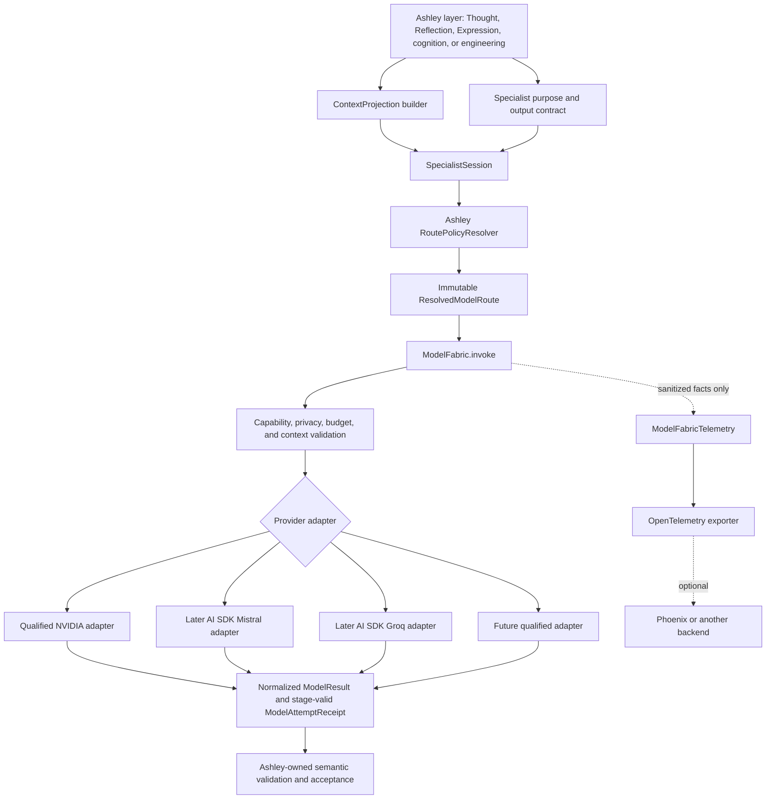
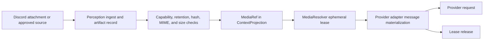

# Project Ashley Model Fabric Contract

- **Status:** `SUPPORTING`; field contracts reconciled beneath the current Model Fabric architecture. Historical first-slice (Thought-observation / Lightning / no fallback) is **F1-obs**: deferred optional witness, **not** the first implementation milestone.
- **Canonical phase owner:** [`Model_Fabric_Architecture.md`](Model_Fabric_Architecture.md)
- **First implementation milestone:** **MF-M1** (seam around existing production routes). Owner **scope** closed 2026-08-25. Local implementation candidate `d918572c`; acceptance and production routing remain separate.
- **Historical filename:** retained to preserve existing links and reconciliation provenance. The canonical phase name is **Model Fabric**.
- **Normative language:** MUST, MUST NOT, SHOULD, and MAY are requirements at their stated strength
- **Applies to:** future provider-neutral model dispatch inside `apps/agent-service`
- **Does not authorize:** this file does not itself implement MF-M1 or authorize acceptance. It does not authorize OpenCode production routing, provider migration, sandbox changes, deployment, capability promotion, or Recall changes.

## Decision summary

Model Fabric will be an Ashley-owned policy and transport boundary. It will not be a model router imported from an SDK.

The target separates five concepts that are currently mixed:

1. `ModelRoutePolicy` owns Ashley’s semantic dispatch decision.
2. `ModelCapabilityProfile` describes provider/model mechanics.
3. `ContextProjection` is the only content boundary passed to Fabric.
4. `SpecialistSession` binds one bounded specialist purpose, budget, and correlation scope.
5. `ModelProviderAdapter` converts Ashley contracts to provider wire contracts.

AI SDK 7 is approved for a bounded mechanism spike, not architectural
selection or wholesale adoption. Model Fabric emits through an Ashley-owned
telemetry port governed by the
[Observability Plane](Ashley_Observability_Plane.md). OpenTelemetry is a
candidate adapter for that port, not a required semantic interface.
OpenInference and Phoenix remain optional, replaceable candidates. Inspect AI
is a reference evaluation substrate, not an acceptance authority.

The deferred F1-obs specification decisions are resolved **as supporting
historical policy beneath the current owner document**. They do not authorize
implementation and they do not define MF-M1.

- `thought_observation` remains the historical first *semantic* slice in this
  file;
- `ASHLEY_MODEL_FABRIC_MODE=off` remains the default in this specification;
- `thought_observation_shadow` replaces the existing shadow transport while enabled;
- dual dispatch is prohibited;
- active Thought remains unchanged;
- no durable telemetry exporter, Phoenix, or OpenInference is part of that slice;
- the compatibility resolver is temporary and has explicit removal criteria;
- Vitest and injected fixtures remain the implementation-test mechanism;
- Inspect AI remains deferred;
- live provider qualification is a separate, later gate.

**2026-08-25 delivery-order (CLOSED):** the
[Model Fabric Architecture](Model_Fabric_Architecture.md) first
implementation milestone is **MF-M1** (no-behavior-change seam around
*existing* production routes). This file's Thought-observation shadow slice
is **F1-obs**: supporting, deferred, optional. Implementers MUST NOT treat
this file's first-slice identity as MF-M1. Field contracts (profiles,
receipts, ContextProjection, SpecialistSession) remain in force unless the
architecture explicitly supersedes them. These decisions still do not
implement code.

The model IDs in the next list are historical `2026-08-13 F1-obs PLANNED
TARGET` policy, not MF-M1 policy. Live IDs live in
[`docs/Routing_Status.md`](../Routing_Status.md). If a string here disagrees
with Routing Status or `registry.ts`, **source wins**.

- `thought.decision` remains Groq `openai/gpt-oss-120b` primary;
- Lightning-backed specialist and utility routes target NVIDIA
  `nvidia/nemotron-3.5-lightning-30b-a3b` primary;
- Groq `openai/gpt-oss-120b` is a later, route-qualified fallback candidate for
  those Lightning-backed routes;
- the then-proposed retirement of Groq 20B from future utility is provenance
  only; current shared utility/Thought-failover use is preserved in MF-M1;

Changing a provider or model binding must update versioned policy and profile
identity. It must not require an architecture rewrite when the semantic
purpose, privacy ceiling, reliability class, output contract, and authority
boundary remain unchanged.

## Document hierarchy

This file is the supporting field-contract and deferred F1-obs specification. Semantic
phase ownership lives in
[`Model_Fabric_Architecture.md`](Model_Fabric_Architecture.md).

| Document | Current role |
|---|---|
| [`Model_Fabric_Architecture.md`](Model_Fabric_Architecture.md) | `CURRENT PHASE CONTRACT` for Model Fabric meaning, ownership, state, and authority |
| This contract | `SUPPORTING` field contracts, MF-M1 receipt reconciliation, and deferred F1-obs specification |
| [`Model_Fabric_01_Codebase_Reconnaissance.md`](Model_Fabric_01_Codebase_Reconnaissance.md) | `HISTORICAL` source snapshot at its named baseline |
| [`Model_Fabric_01_Implementation_Spike.md`](Model_Fabric_01_Implementation_Spike.md) | `SUPPORTING / DEFERRED F1-obs`; mechanism choices remain subject to dependency qualification |
| [`research/Model_Fabric_01_Final_Implementation_Packet.md`](research/Model_Fabric_01_Final_Implementation_Packet.md) | `REFERENCE / PLANNING SNAPSHOT`; not implementation authority |
| [`../Routing_Status.md`](../Routing_Status.md) | `SUPPORTING / LIVING SOURCE STATUS` for current route bindings |

The historical filenames retain `01` for provenance. Current prose and roadmap
identity use the clean phase name **Model Fabric**. Planned target policy,
including Mistral Medium as Expression primary and a no-fallback first
`thought.observation` slice, is recorded in the phase architecture. Those
bindings are policy, not architectural identity.

## Model-Fabric target architecture



The arrows do not grant authority:

- The route resolver can select only configured routes. It cannot grant Ashley capabilities.
- The provider adapter can send a request. It cannot decide semantic purpose, retry, fallback, or acceptance.
- The model result is a proposal or language artifact. It is not Thought, Reflection, Identity, memory, evidence, consent, or execution authorization.
- Telemetry is operational evidence about a call. It is not Ashley’s semantic evidence store.

## Boundary invariants

### Semantic authority

- Purpose IDs MUST be Ashley-owned identifiers.
- Route policies MUST be versioned and validated before use.
- Provider SDK route registries, provider fallback wrappers, and model aliases MUST NOT resolve Ashley semantic purpose.
- Callers MUST NOT supply arbitrary provider IDs or model IDs.
- A model response MUST NOT directly mutate Identity, Mind State, Recall, capability contracts, delivery state, approval state, or execution state.
- Existing layer-specific validators and capability gates remain authoritative after transport validation.

### Dispatch authority

- The resolved route MUST be immutable for one attempt.
- One explicit attempt MUST perform zero or one provider HTTP dispatch.
- The provider adapter MUST NOT retry.
- Any SDK used by an adapter MUST be configured with `maxRetries: 0` or its proven equivalent.
- MF-M1 MAY preserve multiple explicit attempts or invocations only where the
  current Thought failover or Expression fallback policy already permits them.
  It MUST receipt each attempt and MUST NOT add a new retry or fallback path.
- Deferred F1-obs MUST use `reliabilityClass = single_attempt` and
  `fallbackRouteIds = []`. Its invocation may attempt at most one provider
  dispatch.
- A deterministic local fail-closed result that makes no additional provider request is not provider fallback.
- A later route policy MAY name Ashley-owned fallback routes. A caller using that later policy MUST NOT name a provider or model.
- Timeout and cancellation MUST NOT automatically cause fallback in any policy.
- A post-send failure MUST preserve ambiguous outcome as `sent_outcome_unknown`.

### Context authority

- Fabric MUST accept only a `ContextProjection`. It MUST NOT receive a database handle, Recall reader, conversation store, retrieval callback, or implicit “load more context” capability.
- A projection MUST identify its builder policy and include byte, token, and part ceilings.
- Projection construction remains owned by the calling Ashley layer.
- Provider adapters MUST NOT fetch URLs or attachments.
- Raw media bytes MUST be leased only for the duration of provider message materialization.

### Privacy

- Prompts, system instructions, outputs, reasoning text, user content, attachment bytes, base64 data, URLs, filenames, private paths, secrets, credentials, headers, cookies, tool arguments, and tool results MUST NOT be recorded in telemetry.
- Full exception messages and stacks MUST NOT be exported when they can contain request or response content.
- A content-bearing debug mode is outside Model Fabric. It would require separate owner authorization, an isolated sink, bounded retention, and explicit deletion behavior.
- Trace IDs MUST NOT become Recall, epistemic evidence, capability authority, or delivery truth.

## Proposed contracts

The following TypeScript is a contract draft. Names may change during the spike. Semantics MUST remain.

### Stable identifiers

```ts
export type ModelPurposeId =
  | "expression.primary"
  | "expression.fallback"
  | "thought.decision"
  | "thought.observation"
  | "cognition.exchange"
  | "curiosity.consolidation"
  | "reflection.open_item_review"
  | "execution.action_proposal"
  | "execution.review"
  | "execution.verify";

export type LogicalModelRole =
  | "thought"
  | "expression"
  | "thought_observation"
  | "reflection_initiative"
  | "exchange_cognition"
  | "curiosity_consolidation"
  | "maintenance"
  | "engineering"
  | "research";

export type SpecialistRequirement = {
  seat: string;
  requiredIndependenceGroup?: string;
};

export type ModelRouteId = string & { readonly __brand: "ModelRouteId" };
export type ProviderId = string & { readonly __brand: "ProviderId" };
export type ModelProfileId = string & { readonly __brand: "ModelProfileId" };
export type ModelProfileVersion = number & {
  readonly __brand: "ModelProfileVersion";
};
export type ModelProfileFingerprint = `sha256:${string}` & {
  readonly __brand: "ModelProfileFingerprint";
};
export type ContextPolicyId = string & { readonly __brand: "ContextPolicyId" };
export type ProjectionId = string & { readonly __brand: "ProjectionId" };
export type SpecialistSessionId = string & {
  readonly __brand: "SpecialistSessionId";
};
```

The brands prevent accidental interchange. They are not runtime validation. Runtime parsers MUST validate every configuration-sourced identifier.

`ProviderId` is an Ashley-owned validated identifier, not a provider union
imported from an SDK. The adapter registry determines which provider IDs are
recognized and enabled. MF-M1 registers mechanical profiles for the exact
current Mistral, Groq, and NIM bindings under `existing_compatibility`; this is
not qualification. The deferred F1-obs spike may later register `nvidia` for
the exact configured Lightning model after its dependency packet. Adding any
new provider requires adapter registration, exact qualification, and owner
approval, but MUST NOT require rewriting every core contract.

### ModelCapabilityProfile

A capability profile is mechanical truth about one provider/model binding. It MUST NOT encode Ashley’s semantic suitability.

```ts
export type ModelInputCapabilities = {
  text: true;
  image: "none" | "inline_bytes" | "provider_file";
  document: "none" | "page_images" | "provider_document";
  audio: "none" | "inline_bytes" | "provider_file";
};

export type ModelOutputCapabilities = {
  text: true;
  structured: "none" | "json" | "json_schema";
  toolCalls: boolean;
  streaming: boolean;
};

export type ModelReasoningCapabilities =
  | { mode: "none" }
  | { mode: "fixed" }
  | {
      mode: "configurable";
      efforts: readonly ("low" | "medium" | "high")[];
    };

export type ModelCapabilityProfileDefinition = {
  profileId: ModelProfileId;
  profileVersion: ModelProfileVersion;
  provider: ProviderId;
  configuredModelId: string;
  input: ModelInputCapabilities;
  output: ModelOutputCapabilities;
  reasoning: ModelReasoningCapabilities;
  cancellation: "abort_signal" | "unsupported";
  limits: {
    contextTokens: number;
    maxOutputTokens: number;
    maxMediaBytes: number | null;
    maxMediaParts: number | null;
  };
  providerOptionsPolicy: {
    allowedKeys: readonly string[];
  };
};

export type ModelCapabilityProfile = Readonly<
  ModelCapabilityProfileDefinition & {
    profileFingerprint: ModelProfileFingerprint;
  }
>;

export type ModelProfileQualificationReference = {
  profileId: ModelProfileId;
  profileVersion: ModelProfileVersion;
  profileFingerprint: ModelProfileFingerprint;
  qualificationResultRef: string;
};

export type ModelProfileQualificationBinding = {
  profileId: ModelProfileId;
  profileVersion: ModelProfileVersion;
  profileFingerprint: ModelProfileFingerprint;
  provider: ProviderId;
  configuredModelId: string;
};
```

Rules:

- `configuredModelId` is the provider request identifier. A provider’s resolved or dated model identifier belongs in the receipt.
- `ModelCapabilityProfileDefinition` is the canonical, versioned mechanical provider-model contract.
- `profileFingerprint` is deterministic SHA-256 over a canonical JSON representation of the complete `ModelCapabilityProfileDefinition`. The representation excludes `profileFingerprint` itself and all qualification history.
- Changing a normative profile field requires a new `profileVersion` and fingerprint.
- A capability remains false or `none` unless it is declared in the canonical profile. Declaration is not proof that the capability was demonstrated.
- Documentation claims do not substitute for adapter fixtures.
- `providerOptionsPolicy` is an allow-list. Callers cannot pass arbitrary provider options.
- Purpose, privacy, latency, cost, fallback, and execution suitability do not belong in this profile.
- `EvaluationDefinition` and `QualificationResult` belong to the Evaluation / Qualification Plane. A model-profile `QualificationResult` MUST bind `profileId`, `profileVersion`, `profileFingerprint`, `provider`, and `configuredModelId`. Model Fabric MUST NOT create qualification status or promotion semantics.
- `ModelProfileQualificationBinding` is the lossless Model Fabric fact shape consumed by that plane. It carries no status, score, recommendation, or promotion decision.
- A local index MAY expose `ModelProfileQualificationReference` values as derived, rebuildable discoverability metadata. The Evaluation Plane owns the target `QualificationResult`. Such references are outside the canonical profile, MUST NOT be consulted during Model Fabric dispatch, and grant no qualification, promotion, enablement, or dispatch authority.

The first **deferred F1-obs** new-provider binding is:

```text
profileId: nvidia.nemotron-3.5-lightning-30b-a3b
profileVersion: 1
provider: Ashley-validated ProviderId("nvidia")
configuredModelId: nvidia/nemotron-3.5-lightning-30b-a3b
```

No GPT-OSS capability value may be copied into this profile. Input modalities,
structured output and strict JSON Schema behavior, reasoning controls,
cancellation, limits, usage fields, provider request IDs, resolved-model
identity, timeout and ambiguity behavior, API compatibility, and rate or quota
facts remain conservative until the dependency packet proves them.

### ModelRoutePolicy

Route policy is Ashley-owned dispatch policy.

```ts
export type RouteAdmissionBasis =
  | {
      kind: "existing_compatibility";
      compatibilityBindingId: string;
    }
  | {
      kind: "qualification_owner_approved";
      qualificationResultRef: string;
      ownerApprovalRef: string;
    };

export type ReasoningPolicy =
  | "disabled"
  | "economical"
  | "standard"
  | "high"
  | "max_supported";

export type InferencePolicyFingerprint = string;

export type ModelRoutePolicy = {
  routeId: ModelRouteId;
  logicalRole: LogicalModelRole;
  purposes: readonly ModelPurposeId[];
  specialistRequirement: SpecialistRequirement | null;
  enabled: boolean;
  profileId: ModelProfileId;
  profileVersion: ModelProfileVersion;
  profileFingerprint: ModelProfileFingerprint;
  reasoningPolicy: ReasoningPolicy;
  contextPolicyId: ContextPolicyId;
  quotaClass: string;
  latencyClass: "interactive" | "urgent" | "background" | "batch";
  reliabilityClass: "single_attempt" | "explicit_fallback";
  privacyPolicyId: string;
  permittedSeats: readonly string[];
  fallbackRouteIds: readonly ModelRouteId[];
  admissionBasis: RouteAdmissionBasis;
};

export type ResolvedModelRoute = {
  logicalRole: LogicalModelRole;
  requestedPurpose: ModelPurposeId;
  specialistRequirement: SpecialistRequirement | null;
  configuredRouteId: ModelRouteId;
  dispatchedRouteId: ModelRouteId;
  profileId: ModelProfileId;
  profileVersion: ModelProfileVersion;
  profileFingerprint: ModelProfileFingerprint;
  provider: ProviderId;
  configuredModelId: string;
  reasoningPolicy: ReasoningPolicy;
  effectiveReasoning: string | null;
  inferencePolicyFingerprint: InferencePolicyFingerprint;
  contextPolicyId: ContextPolicyId;
  quotaClass: string;
  latencyClass: ModelRoutePolicy["latencyClass"];
  reliabilityClass: ModelRoutePolicy["reliabilityClass"];
  privacyPolicyId: string;
  fallbackRouteIds: readonly ModelRouteId[];
  admissionBasis: RouteAdmissionBasis;
  registryVersion: string;
};
```

Rules:

- One validated registry snapshot MUST own purpose-to-route mapping, binding, enablement, context policy, quota, and fallback.
- Resolution MUST fail closed for an unknown purpose, disabled route, unknown profile, profile-binding mismatch, or invalid registry.
- The result MUST be immutable.
- No `model?: string` field is permitted in a caller-facing request.
- MF-M1 MAY ingest current caller `model` overrides only inside its temporary
  compatibility adapter so the seam can expose existing mismatches without
  changing behavior. The normalized caller-facing Fabric contract still
  prohibits arbitrary model selection.
- A fallback route MUST have a compatible or stricter privacy policy and satisfy the request’s required mechanical capabilities.
- `existing_compatibility` MUST bind the exact pre-MF-M1 role, configured and
  dispatched routes, provider, model, fallback/failover topology, and a
  behavior-affecting **inference-policy fingerprint** (reasoning, temperature,
  top_p, max-output, structured-output, and other semantic provider options
  when material). Same model id with a different material reasoning setting is
  a different compatibility identity. The tuple cannot authorize any normative
  change.
- The deferred F1-obs route MUST set `reliabilityClass` to `single_attempt`
  and `fallbackRouteIds` to `[]`. That F1-obs restriction does not erase the
  current Thought failover or Expression fallback that MF-M1 must preserve.

### ContextProjection

`ContextProjection` is an immutable, bounded content artifact built by the caller.

```ts
export type ProjectionClassification =
  | "public"
  | "owner_private"
  | "project_private"
  | "system_private";

export type EvidenceRef = {
  kind: "message" | "episode" | "read" | "artifact" | "task" | "result";
  entityUuid: string;
  provenance: "shadow" | "live" | "external_untrusted" | "system";
};

export type ModelContentPart =
  | {
      kind: "text";
      role: "instruction" | "user" | "assistant" | "evidence";
      text: string;
      classification: ProjectionClassification;
      evidenceRef?: EvidenceRef;
    }
  | {
      kind: "image_ref";
      mediaRef: MediaRef;
      classification: ProjectionClassification;
      evidenceRef?: EvidenceRef;
    }
  | {
      kind: "document_page_ref";
      mediaRef: MediaRef;
      page: number;
      classification: ProjectionClassification;
      evidenceRef?: EvidenceRef;
    }
  | {
      kind: "audio_ref";
      mediaRef: MediaRef;
      classification: ProjectionClassification;
      evidenceRef?: EvidenceRef;
    }
  | {
      kind: "structured_observation";
      schemaId: string;
      value: Readonly<Record<string, unknown>>;
      classification: ProjectionClassification;
      evidenceRefs: readonly EvidenceRef[];
    };

export type ProjectionContentBinding = {
  canonicalization: "context_projection_content_v1";
  algorithm: "sha256";
  value: string;
  privacyPolicyId: string;
};

export type ProjectionTelemetryFingerprint = `projection_structure_v1:${string}` & {
  readonly __brand: "ProjectionTelemetryFingerprint";
};

export type ContextProjection = {
  projectionId: ProjectionId;
  contextPolicyId: ContextPolicyId;
  purpose: ModelPurposeId;
  parts: readonly ModelContentPart[];
  evidenceRefs: readonly EvidenceRef[];
  contentBinding: ProjectionContentBinding;
  telemetryFingerprint: ProjectionTelemetryFingerprint;
  bounds: {
    maxParts: number;
    maxUtf8Bytes: number;
    maxEstimatedTokens: number;
    maxMediaBytes: number;
  };
  measured: {
    parts: number;
    utf8Bytes: number;
    estimatedTokens: number;
    mediaBytes: number;
  };
};
```

Rules:

- `contentBinding` binds the exact bounded projection. It is computed over canonical content parts, evidence references, media content hashes, purpose, context-policy ID, and declared bounds, excluding the binding fields themselves.
- `contentBinding` is privacy-sensitive metadata. It MUST follow the projection’s retention and privacy policy and MUST NOT be exported to general telemetry by default. A Qualification Result may reference it only when its `EvaluationDefinition` permits that evidence and retention.
- `telemetryFingerprint` is computed from a content-free structural descriptor such as purpose, context-policy ID, part kinds, classification classes, counts, and bounded size buckets. It excludes text, evidence identifiers, media identifiers and hashes, URLs, filenames, and exact content lengths.
- `telemetryFingerprint` supports operational correlation only. It MUST NOT be represented as proof of the exact content that was evaluated.
- `projectionId` is an opaque run-local correlation identifier. It proves neither exact content nor structural equality.
- The projection MUST contain the current user content at most once unless the context policy explicitly requires a duplicated quoted artifact.
- A projection builder MUST apply current capability and provenance gates before Fabric sees the parts.
- The Fabric validator MUST independently check the declared measurements and route/profile compatibility.
- The projection MUST NOT contain provider-native message objects.
- The projection MUST NOT expose mutable arrays or records after validation.

### MediaRef and MediaResolver

```ts
export type MediaRef = {
  artifactEntityUuid: string;
  contentHash: string;
  mime: string;
  byteSize: number;
  retentionUntilMs: number | null;
  representation: "source_attachment" | "document_page" | "derived_audio";
  parentArtifactEntityUuid: string | null;
};

export type MediaLease = {
  bytes: Uint8Array;
  mime: string;
  byteSize: number;
  release(): void;
};

export interface MediaResolver {
  open(
    ref: MediaRef,
    request: {
      ownerId: string;
      purpose: ModelPurposeId;
      deadlineAtMs: number | null;
      signal: AbortSignal;
    },
  ): Promise<MediaLease>;
}
```

Rules:

- `MediaRef` extends the existing `perception_artifacts` ownership model. It does not introduce a second authoritative media store.
- Raw bytes are ephemeral. The adapter MUST release the lease in `finally`.
- The resolver MUST recheck owner, artifact status, capability, retention, hash, size, and MIME.
- Provider adapters MUST NOT follow network URLs.
- A document page is a derived Perception artifact linked to its parent document.
- PDF conversion and audio ingestion are future Perception capabilities. They are not enabled by declaring these types.

### Structured output contract

```ts
declare const outputType: unique symbol;

export type OutputContract<T> = (
  | {
      kind: "text";
      schemaId: null;
    }
  | {
      kind: "object";
      schemaId: string;
      jsonSchema: Readonly<Record<string, unknown>>;
    }
) & {
  /** Compile-time result association only. No runtime validator callback. */
  readonly [outputType]?: T;
};
```

Transport schema validation and Ashley semantic validation are separate:

1. Model Fabric may normalize provider text, parse structured output, and confirm that an object conforms to the requested JSON Schema.
2. Model Fabric returns the transport-valid text or object in `ModelResult`.
3. The calling Ashley layer then applies domain invariants, provenance requirements, capability gates, current state, and authorization.

A schema-valid object is not automatically acceptable.

`OutputContract` MUST NOT contain a runtime callback. It MUST NOT contain or invoke a Thought, Reflection, cognition, Identity, Expression, engineering, or other Ashley semantic validator. The adapter and schema machinery may validate only representation and schema shape.

### SpecialistSession

`SpecialistSession` is the correct unit for bounded specialist work. It is not an agent, process, scheduler, tool runner, or authority container.

**ONE ASHLEY, BOUNDED SPECIALISTS.** A specialist is not a peer Ashley. It has no independent Identity, Mind State, Thought, Agency, consent, or effect authority.

```ts
export type SpecialistBudget = {
  maxCalls: number;
  maxInputTokens: number;
  maxOutputTokens: number;
  deadlineAtMs: number | null;
};

export type SpecialistCorrelations = {
  ownerId: string | null;
  decisionId: number | null;
  deliveryReservationId: number | null;
  cognitiveJobId: number | null;
  engineeringTaskId: string | null;
  parentSessionId: SpecialistSessionId | null;
};

export interface SpecialistSession<T> {
  readonly sessionId: SpecialistSessionId;
  readonly purpose: ModelPurposeId;
  readonly budget: Readonly<SpecialistBudget>;
  readonly correlations: Readonly<SpecialistCorrelations>;
  readonly requiredCapabilities: Readonly<{
    input: readonly ("text" | "image" | "document" | "audio")[];
    output: "text" | "json_schema";
    reasoning: "none" | "low" | "medium" | "high";
  }>;

  run(input: {
    projection: ContextProjection;
    output: OutputContract<T>;
    signal: AbortSignal;
  }): Promise<ModelResult<T>>;
}
```

Session rules:

- A session is created for one purpose.
- A session tracks cumulative calls and tokens. It MUST refuse before dispatch when a ceiling is exhausted.
- `maxCalls: 0` MUST produce `budget_exhausted` before provider dispatch.
- A session MUST NOT expose tools, shell, filesystem, network, broker, approval, Recall, or delivery methods.
- A session MAY make multiple calls only when its purpose contract and budget explicitly allow them.
- `parentSessionId` is correlation and lineage only. It does not create authority or inherit hidden state.
- A child receives only an explicitly supplied `ContextProjection`. It inherits no Recall access, context, credentials, provider choice, model choice, tool access, or capability.
- A child route is independently resolved under Ashley route policy.
- Child call and token budget MUST be reserved from and charged to the parent before child creation. Nesting MUST NOT manufacture unaccounted budget.
- Canonical authority rule: `authority(child) ⊆ authority(parent)`. Because Model Fabric sessions normally carry no effect authority, nesting can never create effect authority.
- A later engineering session may propose actions. It MUST return those proposals to the existing engineering operator.
- Independent review MUST use a distinct session and route policy. Shared trace ancestry does not make it independent; different context policy and reviewer purpose are also required.

A specialist result may be a proposal, analysis, observation, artifact, or structured result. It does not directly become Identity, Recall, Mind State, a goal, salience, an OpenConcern, relationship state, authorization, or execution state. Ashley-owned caller and materialization logic decides whether any durable cognitive update occurs.

### Invocation contract

```ts
export type ModelInvocation<T> = {
  resolvedRoute: ResolvedModelRoute;
  sessionId: SpecialistSessionId;
  projection: ContextProjection;
  output: OutputContract<T>;
  generation: {
    maxOutputTokens: number;
    temperature: number | null;
    reasoningPolicy: ReasoningPolicy;
    effectiveReasoning: string | null;
    temperature: number | null;
    topP: number | null;
  };
  budget: {
    deadlineAtMs: number | null;
    maxInputTokens: number;
    maxOutputTokens: number;
  };
  correlations: SpecialistCorrelations;
  signal: AbortSignal;
};

export interface ModelFabric {
  invoke<T>(request: ModelInvocation<T>): Promise<ModelResult<T>>;
}
```

`resolvedRoute` is accepted only from the current registry resolver. A branded value alone is insufficient; Fabric MUST verify the registry version and binding.

### Result, stage-valid receipt, and usage

```ts
export type ModelUsage = {
  inputTokens: number | null;
  outputTokens: number | null;
  cachedInputTokens: number | null;
  reasoningTokens: number | null;
  providerReported: boolean;
};

export type DispatchTruth =
  | "not_sent"
  | "sent_outcome_unknown"
  | "response_received";

export type ModelFallbackClass =
  | "none"
  | "transport_failover"
  | "model_substitution";

export type ModelFallbackChain = {
  chainId: string;
  invocationOrdinal: number;
  fallbackFromInvocationId: string | null;
  fallbackClass: ModelFallbackClass;
};

export type ModelInvocationReceiptBase = {
  invocationId: string;
  sessionId: SpecialistSessionId;
  logicalRole: LogicalModelRole;
  requestedPurpose: ModelPurposeId;
  specialistRequirement: SpecialistRequirement | null;
  latencyMs: number;
  attentionRequestId: number | null;
  traceId: string | null;
  projectionId: ProjectionId | null;
  projectionContentBinding: ProjectionContentBinding | null;
  projectionTelemetryFingerprint: ProjectionTelemetryFingerprint | null;
  fallbackChain: ModelFallbackChain | null;
};

export type ModelPreResolutionInvocationReceipt =
  ModelInvocationReceiptBase & {
    receiptStage: "pre_resolution";
    configuredRouteId: null;
    attempts: readonly [];
  };

export type ModelResolvedDispatchFacts = {
  dispatchedRouteId: ModelRouteId;
  registryVersion: string;
  profileId: ModelProfileId;
  profileVersion: ModelProfileVersion;
  profileFingerprint: ModelProfileFingerprint;
  provider: ProviderId;
  configuredModelId: string;
  contextPolicyId: ContextPolicyId;
  admissionBasis: RouteAdmissionBasis;
  requestedReasoningPolicy: ReasoningPolicy | null;
  effectiveReasoning: string | null;
  inferencePolicyFingerprint: InferencePolicyFingerprint | null;
};

export type ModelAttemptReceiptBase = {
  invocationId: string;
  attemptId: string;
  attemptOrdinal: number;
  fallbackFromAttemptId: string | null;
  fallbackClass: ModelFallbackClass;
  providerRequestCount: 0 | 1;
  latencyMs: number;
  projectionId: ProjectionId | null;
  projectionContentBinding: ProjectionContentBinding | null;
  projectionTelemetryFingerprint: ProjectionTelemetryFingerprint | null;
  requestedReasoningPolicy: ReasoningPolicy | null;
  effectiveReasoningSent: string | null;
};

export type ModelResolvedNotSentReceipt = ModelAttemptReceiptBase &
  ModelResolvedDispatchFacts & {
    receiptStage: "resolved_not_sent";
    providerRequestCount: 0;
    dispatchTruth: "not_sent";
  };

export type ModelDispatchAttemptedReceipt = ModelAttemptReceiptBase &
  ModelResolvedDispatchFacts & {
    receiptStage: "dispatch_attempted";
    providerRequestCount: 1;
    dispatchTruth: "sent_outcome_unknown";
    projectionId: ProjectionId;
    projectionContentBinding: ProjectionContentBinding;
    projectionTelemetryFingerprint: ProjectionTelemetryFingerprint;
  };

export type ModelProviderResponseReceipt = ModelAttemptReceiptBase &
  ModelResolvedDispatchFacts & {
    receiptStage: "provider_response";
    providerRequestCount: 1;
    dispatchTruth: "response_received";
    projectionId: ProjectionId;
    projectionContentBinding: ProjectionContentBinding;
    projectionTelemetryFingerprint: ProjectionTelemetryFingerprint;
    resolvedModelId: string | null;
    providerRequestId: string | null;
    finishReason: string | null;
    usage: ModelUsage;
  };

export type ModelAttemptReceipt =
  | ModelResolvedNotSentReceipt
  | ModelDispatchAttemptedReceipt
  | ModelProviderResponseReceipt;

export type ModelResolvedInvocationReceipt = ModelInvocationReceiptBase & {
  receiptStage: "resolved";
  configuredRouteId: ModelRouteId;
  finalDispatchedRouteId: ModelRouteId;
  finalAttemptId: string;
  fallbackClass: ModelFallbackClass;
  attempts: readonly [ModelAttemptReceipt, ...ModelAttemptReceipt[]];
};

export type ModelInvocationReceipt =
  | ModelPreResolutionInvocationReceipt
  | ModelResolvedInvocationReceipt;

export type ModelResult<T> =
  | {
      ok: true;
      value: T;
      receipt: ModelResolvedInvocationReceipt;
    }
  | {
      ok: false;
      failure: ModelFailure;
      receipt: ModelInvocationReceipt;
    };
```

Receipt levels are not interchangeable:

- `ModelPreResolutionInvocationReceipt` carries only request facts known before
  a route is established. It has no attempts and MUST NOT fabricate route,
  registry, profile, provider, or model fields.
- `ModelAttemptReceipt` is stage-discriminated evidence for exactly one
  resolved provider attempt. `receiptStage` (lifecycle) and `dispatchTruth`
  (send outcome) are orthogonal. `providerRequestCount` is zero or one and is
  not the number of attempts in the invocation. Attempt receipts record
  requested vs sent reasoning when known.
- `resolved_not_sent` adds immutable dispatched-route/profile/provider facts,
  but proves that no provider request was sent.
- `dispatch_attempted` means a request may have been sent but no definitive provider response was established. It MUST NOT invent response IDs, resolved-model facts, finish reasons, or usage.
- `provider_response` means Ashley received a definitive provider response. It may carry safely reported response facts and usage.
- `ModelInvocationReceipt` records one `completeChat`/Fabric invocation and
  retains every ordered attempt. Current Thought NIM → Groq failover is two
  attempts in one invocation.
- `ModelFallbackChain` links caller-owned invocations. Current
  Expression Mistral → Qwen fallback is two invocations in one chain.
- Projection fields remain nullable on a resolved attempt only when local
  refusal occurred before the exact projection existed. Any attempted provider
  request requires the exact projection identity and bindings.
- A failure's `dispatchTruth` MUST exactly equal the terminal attempt's
  `dispatchTruth`. A pre-resolution invocation failure is `not_sent` and has
  no attempt.

The receipts record transport and correlation truth. They do not state that
the caller accepted the result or that any behavior occurred. Aggregates MUST
NOT erase attempts or reconstruct unresolved provider facts.

### Failure taxonomy

```ts
export type ModelFailureCode =
  | "route_disabled"
  | "capability_mismatch"
  | "configuration_error"
  | "local_quota_exceeded"
  | "provider_unavailable"
  | "provider_quota"
  | "provider_model_unavailable"
  | "provider_internal"
  | "timeout"
  | "cancelled"
  | "malformed_output"
  | "unsupported_modality"
  | "context_too_large"
  | "budget_exhausted";

export type ModelFailure = {
  code: ModelFailureCode;
  stage:
    | "route_resolution"
    | "projection_validation"
    | "attention_admission"
    | "media_materialization"
    | "provider_dispatch"
    | "output_validation";
  retryability: "never" | "caller_may_retry" | "policy_may_fallback";
  dispatchTruth: DispatchTruth;
  retryAfterMs: number | null;
  sanitizedCauseClass: string | null;
};
```

Provider errors MUST be normalized into this closed taxonomy. Raw response bodies MUST NOT cross the adapter boundary. Provider and configured-model facts come from a resolved receipt when resolution succeeded; `ModelFailure` MUST NOT reconstruct them.

## Retry, timeout, and fallback policy

### MF-M1 compatibility policy

- Preserve the current Thought NIM → Groq same-model failover eligibility.
- Preserve the current Expression Mistral → Qwen caller-level fallback
  eligibility.
- Every explicit provider attempt uses `providerRequestCount` zero or one and
  has its own `ModelAttemptReceipt`.
- Every `completeChat`/Fabric invocation has one `ModelInvocationReceipt`.
- Expression primary and fallback invocations share one explicit
  `ModelFallbackChain`.
- No new retry, fallback, provider, model, route, or eligibility rule is
  introduced.

### Deferred F1-obs policy

- The route policy is `reliabilityClass = single_attempt` with `fallbackRouteIds = []`.
- Provider dispatch count is at most one.
- AI SDK `maxRetries` is zero.
- No same-model retry occurs.
- No alternate route or provider fallback occurs inside or outside
  `ModelFabric.invoke` for this F1-obs invocation.
- An F1-obs failure MUST NOT use `retryability = policy_may_fallback`.
- Timeout, cancellation, `sent_outcome_unknown`, and any other failure MUST NOT trigger another provider request.
- Deterministic local fail-closed behavior MAY return an Ashley-owned local result only when it makes no additional provider request.

### Deferred F1-obs decision matrix

| Failure | Dispatch truth | Automatic retry | Automatic alternate | Permitted owner |
|---|---|---|---|---|
| `route_disabled` | `not_sent` | Never | Never | Caller or operator configuration |
| `capability_mismatch` | `not_sent` | Never | Never | Caller must change requirements or policy |
| `configuration_error` | `not_sent` | Never | Never | Startup/configuration owner |
| `local_quota_exceeded` | `not_sent` | Never | Never | Local attention policy or caller projection |
| `provider_quota` | `response_received` | None | Never | Caller may use deterministic local fail-closed behavior |
| `provider_unavailable` | `response_received` for a definitive unavailable response; `not_sent` for proven pre-send failure; otherwise `sent_outcome_unknown` | None | Never | Caller may use deterministic local fail-closed behavior |
| `provider_model_unavailable` | `response_received` | None | Never | Caller may use deterministic local fail-closed behavior |
| `provider_internal` | `response_received` for a definitive provider 5xx response | None | Never | Caller may use deterministic local fail-closed behavior |
| `timeout` | `not_sent` or `sent_outcome_unknown` | Never | Never | Caller decides whether a new semantic attempt is safe |
| `cancelled` | `not_sent` or `sent_outcome_unknown` | Never | Never | Cancellation owner |
| `malformed_output` | `response_received` | None | Never | Caller may use deterministic local fail-closed behavior |
| `unsupported_modality` | `not_sent` | Never | Never | Caller may reproject only if semantics permit |
| `context_too_large` | `not_sent` | Never | Never | Caller may build a new bounded projection |
| `budget_exhausted` | `not_sent` | Never | Never | Session owner |

This preserves the epistemic distinction:

- `not_sent` means Ashley can establish that no provider request was dispatched.
- `sent_outcome_unknown` means the transport may have dispatched the request but Ashley has no definitive provider response, including some timeout, reset, and cancellation races.
- `response_received` means Ashley received a definitive provider response, whether success or error. It does not mean Ashley accepted or acted on the result.

A received HTTP 429 is `provider_quota + response_received`. A received model-unavailable 404 is `provider_model_unavailable + response_received`. A received provider 5xx is `response_received` with the normalized failure code, such as `provider_unavailable` for a definitive unavailable response or `provider_internal` for another provider fault. The current attention governor’s pre-dispatch `request_exceeds_tpm_budget` maps to `local_quota_exceeded + not_sent`, not `provider_quota`. Missing local credentials remain a configuration/readiness failure before dispatch.

Receipt staging follows the same facts:

- registry, unknown-purpose, disabled-route, unknown-profile, and binding
  failures before immutable resolution use a `pre_resolution` invocation
  receipt with no attempts; the failure is `not_sent`;
- projection, capability, budget, media, deadline, cancellation, or attention failures after immutable resolution but before send use `resolved_not_sent + not_sent`;
- post-send connection ambiguity, in-flight cancellation, or timeout after possible send use `dispatch_attempted + sent_outcome_unknown`;
- definitive 404, 429, 5xx, malformed provider body, and other definitive provider responses use `provider_response + response_received`.

No variant invents a provider response or resolved dispatch fact that was not established.

### LATER / GENERAL POLICY

A later route policy MAY use `reliabilityClass = explicit_fallback` with
explicit `fallbackRouteIds`. Those routes remain Ashley-owned policy. MF-M1
admits only the exact current Thought and Expression compatibility policies;
it cannot add one of these later policies. An SDK or provider registry MUST
NOT select the alternate. An ambiguous `sent_outcome_unknown` MUST NOT
silently retry or fall back.

For Lightning-backed routes, the planned later policy is:

```text
PRIMARY:  NVIDIA / nvidia/nemotron-3.5-lightning-30b-a3b
FALLBACK: Groq / openai/gpt-oss-120b
```

This is policy direction, not qualification or enablement. Both profile
bindings MUST pass the exact route claim before the route may use
`reliabilityClass = explicit_fallback`. Thought qualification for GPT-OSS-120B
does not qualify that model as a fallback for another purpose. Lightning
qualification for one purpose does not qualify Lightning for another purpose.
The fallback MUST be selected by the Ashley route policy, receive separate
attention admission and a separate `ModelAttemptReceipt`, preserve parent
correlation and `SpecialistSession` budget, and remain prohibited for
`sent_outcome_unknown` and automatic cancellation handling.

A future same-model retry MAY be added only when:

- the route policy explicitly allows it;
- the provider request is classified safe to repeat;
- the first attempt is proven `not_sent`;
- the session budget reserves the second call before the first call;
- the attention ledger represents both attempts;
- a test proves the SDK adds no hidden attempts.

## Deferred F1-obs AI SDK 7 mechanism decision

**Decision: PREFERRED THIN TRANSPORT SPIKE IF QUALIFIED. Do not adopt
wholesale.**

The F1-obs NVIDIA transport mechanism is intentionally unresolved. The dependency
packet must select one evidence-backed option:

1. a suitable official NVIDIA provider for AI SDK 7;
2. an OpenAI-compatible AI SDK provider configured for NVIDIA's exact serving
   surface; or
3. a tiny Ashley-owned NVIDIA HTTP adapter behind `ModelProviderAdapter`.

If AI SDK 7 is selected, use:

- `ai` core `generateText` for non-streaming calls;
- `Output.object` for transport-level strict object output;
- only the exact NVIDIA integration accepted by the dependency packet for the
  first adapter;
- official Groq and Mistral integrations only in later, separately qualified
  slices;
- explicit AbortSignal and Ashley-derived timeout;
- `maxRetries: 0` on every call;
- profile-owned `providerOptions` allow-lists;
- dependency injection for test models or transport fixtures.

Do not use:

- AI Gateway;
- AI SDK provider registry as Ashley route authority;
- SDK fallback providers as Ashley fallback authority;
- SDK messages outside the adapter;
- SDK tool execution;
- SDK agents;
- content telemetry;
- streaming in F1-obs.

Reasons:

- The SDK provides a useful normalized transport surface and strict structured-output support.
- A suitable NVIDIA integration may reduce hand-written wire conversion, but
  its existence and exact compatibility are not assumed.
- Its default of two retries conflicts with Ashley’s budget and ambiguity semantics. Explicit zero retry is mandatory.
- Provider-specific behavior still requires profile fixtures. The SDK does not prove capability.
- A thin adapter keeps rollback possible and prevents framework semantic authority.

The previous Groq source research remains useful background for current
routing, but it no longer selects the first adapter. The dependency packet must
record the exact primary sources used for the NVIDIA transport decision.

### Deferred F1-obs dependency qualification prerequisite

Before any implementation installs packages, the dependency packet MUST qualify
NVIDIA `nvidia/nemotron-3.5-lightning-30b-a3b` and record:

1. exact NVIDIA API endpoint or serving surface;
2. authentication mechanism;
3. exact transport protocol;
4. whether AI SDK 7 has a suitable official NVIDIA provider;
5. if not, whether an OpenAI-compatible AI SDK adapter is appropriate;
6. if not, whether a tiny Ashley-owned NVIDIA HTTP adapter is safer and simpler;
7. exact structured-output support;
8. exact JSON Schema compatibility;
9. one-dispatch behavior;
10. hidden retry behavior and how retries are forced to zero;
11. AbortSignal and cancellation behavior;
12. timeout behavior;
13. whether pre-send and post-send failure are distinguishable;
14. usage metadata, including cached-token and reasoning-token reporting when
    available;
15. provider request ID behavior;
16. resolved-model metadata;
17. context limit;
18. output limit;
19. media limits and supported input modalities;
20. reasoning controls;
21. rate limits and quotas;
22. API compatibility;
23. supported local and production Node runtime plus package engine constraints;
24. exact dependency tree and licenses or terms; and
25. basic dependency and transport security findings.

The packet must also establish the exact `ai` and provider-package versions if
AI SDK is selected, the exact structured-output surface used, and fixture
evidence that one SDK-level attempt creates at most one provider request and
that hidden retries are disabled. The deferred F1-obs invocation remains one
attempt. MF-M1 may preserve multiple explicit attempts in one invocation only
where current route policy already does so.

Separately, before Groq `openai/gpt-oss-120b` may be enabled as a Lightning
fallback for any route, a later packet and `QualificationResult` must establish
the exact fallback route's input/output contract, semantic suitability,
structured-output and context compatibility, privacy, retry/fallback safety,
separate attention accounting and receipts, and permitted fallback conditions.

The packet is an F1-obs implementation prerequisite, not an MF-M1
prerequisite and not another architecture research phase. MF-M1 adds no
provider package. This document deliberately does not select versions.
Installing packages remains separately authorized work.

## SpecialistSession decision

**Decision: ADOPT as an Ashley-owned abstraction.**

The session represents bounded specialist reasoning, not an autonomous agent. It is valuable because a single specialist purpose may require:

- an explicit context projection;
- one or more budgeted model calls;
- a strict output contract;
- a common deadline and cancellation scope;
- cumulative token and call accounting;
- trace and task correlation;
- later independent review by a distinct session.

It MUST remain inert with respect to effects. For Autonomous Engineering Workstation, the session may only replace `ThinkingModel.proposeNextAction` transport after sandbox freeze. The existing operator and broker remain final authority.

## Multimodal seam

The target seam extends Perception rather than bypassing it.



Requirements:

- Existing `perception_artifacts` remains the artifact authority.
- Image support initially means existing fetched images only.
- Document support means Perception converts a permitted document into bounded page-image artifacts before Model Fabric.
- Audio support remains absent until Perception defines ingestion, retention, and representation.
- Fabric validates requested modality against the resolved profile before opening bytes.
- Unsupported modality returns `unsupported_modality` before dispatch.
- Context size, media bytes, and part count are checked before dispatch.
- No provider may fetch a user-supplied URL.
- No raw media or source URL enters telemetry.
- The same projection can be deterministically summarized without including media content.

## Observability seam

### Required interface

```ts
export interface ModelFabricTelemetry {
  startCall(input: SanitizedModelCallStart): ModelCallSpan;
}

export interface ModelCallSpan {
  setRoute(input: SanitizedRouteFacts): void;
  setUsage(input: ModelUsage): void;
  succeed(input: SanitizedModelSuccess): void;
  fail(input: ModelFailure): void;
  end(): void;
}
```

The core depends only on this interface. The production implementation may use OpenTelemetry. A no-op implementation is always available.

### Trace structure

Recommended nested spans:

1. `ashley.cognition.run`, `ashley.expression.run`, or `ashley.engineering.task`
2. `model.route.resolve`
3. `model.specialist.session`
4. `model.context.validate`
5. `model.provider.call`
6. `model.output.validate`
7. caller-owned `ashley.proposal.accept` or `ashley.proposal.reject`
8. later engineering-only execution and receipt spans outside Model Fabric

### Allowed attributes

- route ID;
- purpose and specialist purpose;
- profile ID, version, and fingerprint;
- provider;
- configured and safely reported resolved model IDs;
- registry version;
- context-policy ID;
- projection ID and telemetry-safe projection fingerprint;
- part counts and byte/token estimates;
- media count and byte count;
- deadline class and remaining milliseconds at dispatch;
- latency;
- normalized usage;
- attempt count;
- finish reason;
- normalized failure code and stage;
- dispatch truth;
- opaque decision, delivery, cognitive-job, engineering-task, and attention identifiers.

### Prohibited attributes and events

- system prompt;
- prompt or message content;
- model output or reasoning;
- user content;
- attachment bytes or base64;
- source URLs and filenames;
- credentials, tokens, headers, cookies, or environment values;
- raw owner identity;
- raw Recall, episodes, Mind State, or Identity;
- tool arguments or results;
- shell output;
- approval envelopes, signatures, or broker payloads;
- private filesystem paths;
- projection content bindings;
- full provider response bodies;
- content-bearing exception messages and stacks.

### OpenTelemetry, OpenInference, and Phoenix

- Ashley telemetry port: **REQUIRED SEMANTIC INTERFACE.** It uses Ashley-owned
  event classes, privacy policy, and identifiers and is governed by the
  Observability Plane.
- OpenTelemetry API/SDK: **MECHANISM CANDIDATE.** It may implement the port
  after an isolated conformance and privacy spike. Model Fabric core contracts
  must not depend on OpenTelemetry types.
- OpenInference semantic conventions: **SPIKE.** Use only through a privacy transformer that starts from Ashley’s allow-list. Do not accept content-capture defaults.
- Phoenix: **SPIKE for local development only.** It is a replaceable collector/UI. It is not required for production and has no semantic authority.
- Production export: **DEFER.** No Mint collector, endpoint, retention, or activation is authorized.

The OpenInference AI SDK 7 integration currently targets `@ai-sdk/otel` and a Node 22+ ESM environment. The agent service is ESM and has Node 22 type dependencies, but the production Mint runtime version was not inspected. Runtime compatibility remains a deployment qualification item, not a local assumption.

Sources: [OpenTelemetry specifications](https://opentelemetry.io/docs/specs/otel/), [Trace API](https://opentelemetry.io/docs/specs/otel/trace/api/), [OpenInference AI SDK integration](https://arize-ai.github.io/openinference/js/packages/openinference-vercel/), [OpenInference privacy configuration](https://arize-ai.github.io/openinference/spec/configuration.html), [Phoenix](https://arize.com/docs/phoenix).

## Evaluation plan

The [Ashley Evaluation / Qualification Plane](Ashley_Evaluation_Qualification_Plane.md) owns `EvaluationDefinition`, `QualificationResult`, invariant meaning, PASS/FAIL/BLOCKED/INCONCLUSIVE semantics, and qualification evidence binding. Model Fabric owns stable profile definitions, stage-valid `ModelAttemptReceipt` evidence, `ModelInvocationReceipt` aggregation, caller-supplied fallback-chain correlation, resolved-route facts when established, normalized failures, usage, and trace facts that the Evaluation Plane may consume.

Vitest remains the implementation-test mechanism for MF-M1 and for the later
F1-obs slice. Adapter and fixture tests are mandatory. Test success is local
implementation evidence; it is not automatically a reusable
`QualificationResult` and never promotes a profile.

Formal reusable qualification MUST map losslessly into `QualificationResult` once that contract exists. Its `profileBinding` MUST consume the exact `ModelProfileQualificationBinding` supplied by Model Fabric. Model Fabric MUST NOT create a parallel qualification result, decide promotion, or write capability state. An evaluation framework may execute fixtures and display results. It cannot declare a capability or profile promoted.

### Deterministic contract suite

| Test family | Required evidence |
|---|---|
| MF-M1 caller preservation | Every current production caller maps to the exact logical role in Model Fabric Architecture §12.2. Current configured/dispatched mismatches are recorded, not repaired. `utility_bulk` remains a route, not a substitute semantic role. |
| Profile identity | Canonical profile serialization is deterministic; changing any normative field changes `profileVersion` and `profileFingerprint`; qualification references do not change the profile fingerprint. |
| Compatibility admission | Every current binding uses exact `existing_compatibility`. Any changed provider, model, route, role, seat, fallback, or privacy class fails closed until an exact `QualificationResult` and owner approval exist. |
| Provider failure normalization | Representative 401/403, 404 model, 429, 5xx, network reset, and malformed provider body map to the closed taxonomy without leaking content. |
| Stage-valid receipt and dispatch truth | Pre-resolution invocation failures have no attempt and omit unresolved route/profile/provider facts; resolved pre-send attempts use `resolved_not_sent`; local TPM refusal is `local_quota_exceeded + not_sent`; received 429/404/5xx or malformed bodies use `provider_response + response_received`; post-send reset/cancellation races use `dispatch_attempted + sent_outcome_unknown`; failure and terminal-attempt truth match. |
| Invocation and fallback truth | Thought NIM → Groq retains two ordered attempt receipts in one invocation. Expression Mistral → Qwen retains two invocation receipts in one caller fallback chain. No attempt is overwritten by the final result. |
| Strict structured output | Valid object passes transport schema. Missing, extra, wrong-type, prose-wrapped, truncated, and schema-invalid outputs produce `malformed_output`. |
| Specialist adherence | A session cannot change purpose, profile, context policy, provider, model, or output schema after creation. |
| Parent/child session | Child context is explicit, provider/model still resolve through route policy, authority does not increase, and child budget is reserved from the parent. |
| Context isolation | Fabric receives only the projection. Tests prove no Recall or DB reader exists in the contract and no omitted content is fetched. |
| Projection identity | Exact content changes alter `contentBinding`. Structure-only fingerprints contain no content/evidence identifiers and cannot be accepted as exact evaluation binding. |
| Capability mismatch | Image/document/audio/structured/reasoning requests fail before dispatch when the profile is unqualified. |
| Multimodal | Existing image artifact is materialized once, size and hash are rechecked, lease is released, and provider fixture receives the expected SDK message. |
| Cancellation | Pre-dispatch cancellation yields `not_sent`. In-flight cancellation yields `sent_outcome_unknown` unless the transport proves otherwise. No provider fallback occurs. |
| Hidden retries | One explicit attempt causes at most one fixture HTTP request. SDK retry defaults are overridden. Multiple requests occur only as separately receipted attempts already allowed by current route policy. |
| MF-M1 no new fallback | Existing Thought failover and Expression fallback eligibility are unchanged. No new fallback route, retry, provider, or model is admitted. |
| Deferred F1-obs single attempt | The optional F1-obs route remains `single_attempt`, `fallbackRouteIds` is empty, and every failure path causes at most one provider request. |
| Independent review | Review session uses a distinct purpose, context policy, and route. It cannot share the author session’s hidden content. |
| Privacy | Spans contain allow-listed metadata only. Prompts, outputs, URLs, filenames, media, secrets, and raw exceptions are absent. |
| Authority isolation | A schema-valid model proposal still has no effect until the existing Ashley validator accepts it. No `OutputContract` callback can perform semantic validation or a durable cognitive write. |
| Budget | `maxCalls: 0`, exhausted tokens, expired deadline, and oversized projection all refuse before provider dispatch. |

### Fixture levels

1. Pure unit tests for route registry, projection validation, failure taxonomy, and session budget.
2. Adapter conformance tests using a fake model or local fixture transport. Unexpected network MUST fail.
3. Existing offline Phase 0 suite with `ASHLEY_PHASE0_OFFLINE=true`. External network MUST fail loudly; loopback or injected fixtures remain allowed.
4. Separately authorized live provider qualification for exact configured model IDs. It binds into the general `QualificationResult` format when available; it is not a Model Fabric-owned PASS.
5. Existing deterministic and persona evaluations to detect behavior regression.
6. Independent closure audit before any broader migration.

### Inspect AI decision

Inspect AI is **REFERENCE NOW; optional later spike**.

Useful properties:

- explicit dataset, solver, and scorer structure;
- evaluation sets, retries, reuse, and resume;
- standard and custom scorers;
- durable evaluation logs.

Constraints:

- it is a Python boundary in a TypeScript service;
- its default logs may include raw model API requests and responses;
- error-call logging can retain request/response details even when normal API logging is disabled;
- its retry behavior is evaluation-runner behavior and MUST NOT be mistaken for production retry policy.

The first implementation slice MUST remain in Vitest so transport invariants can be proven without a second runtime. Inspect AI is not required. It can later execute a sanitized, offline, versioned corpus through a dedicated adapter whose output maps into `QualificationResult`.

Sources: [Inspect tasks](https://inspect.aisi.org.uk/tasks.html), [Inspect eval logs](https://inspect.aisi.org.uk/eval-logs.html), [Inspect eval sets](https://inspect.aisi.org.uk/eval-sets.html), [Inspect scorers](https://inspect.aisi.org.uk/standard-scorers.html).

## OSS adoption table

| Component | Decision | Allowed role | Prohibited role | Exit condition |
|---|---|---|---|---|
| AI SDK 7 core | SPIKE | Provider-neutral generate/structured-output transport inside a thin adapter | Ashley routing, fallback, semantic validation, tool execution, agents | Adopt only after one-dispatch, cancellation, privacy, and rollback tests pass |
| NVIDIA transport adapter | SPIKE first | First adapter for shadow Thought observation | Route choice, provider fallback, capability truth without fixture | Dependency packet selects official NVIDIA, OpenAI-compatible AI SDK, or tiny Ashley-owned HTTP mechanism; exact Lightning fixture passes |
| `@ai-sdk/groq` | SPIKE later | Candidate transport for main Thought or route-qualified Lightning fallback | Route choice, automatic fallback, qualification inherited from Thought | Exact purpose-specific GPT-OSS-120B fixture and fallback qualification pass |
| `@ai-sdk/mistral` | SPIKE later | Candidate replacement for current Mistral SDK adapter | Immediate Expression migration | Mistral text, image, cancellation, usage, and model-resolution fixtures pass |
| AI SDK Gateway | REJECT for this phase | None | Routing, credentials, fallback, or provider abstraction | Reconsider only under a separate architecture decision |
| Ashley telemetry port | REQUIRED CONTRACT | Backend-neutral sanitized Model Fabric events beneath the Observability Plane | Content store, semantic evidence, Recall, acceptance authority | Core works with a no-op implementation and no external telemetry dependency |
| OpenTelemetry API/SDK | MECHANISM CANDIDATE | Possible adapter for sanitized trace/metric/log transport | Semantic event types, content store, evidence, Recall, acceptance authority | Isolated conformance, privacy, cancellation, and no-behavior-change tests pass |
| OpenInference | SPIKE | Optional sanitized GenAI semantic transformer | Default content capture; semantic authority | Attribute allow-list and redaction tests pass |
| Phoenix | SPIKE local only | Replaceable local trace/eval viewer | Required production backend; source of truth | Local isolated use proves useful without content leakage |
| Inspect AI | REFERENCE NOW | Evaluation design and possible later offline runner | Production transport, pass authority, unsanitized logs | Dedicated sanitized adapter and corpus policy exist |
| Existing attention governor | KEEP CORE | Durable admission, quota, deadline, usage, continuity | Provider capability registry or semantic fallback | Fabric integrates without weakening its guarantees |
| Existing Perception artifacts | KEEP CORE | Media identity, retention, provenance, bounds | Provider-native message store | MediaRef extension reuses artifact authority |

## Current defect disposition

This table assigns each discovered defect to an implementation slice. It does not authorize or perform a source correction.

| Current defect | Disposition |
|---|---|
| Thought observation forces `thought` instead of the current `utility_bulk` purpose binding | MF-M1 MUST record configured ≠ dispatched without repair. Deferred F1-obs may later replace the shadow transport only after its own dependency and qualification gates. |
| Reflection uses a Groq route with `env.mistralModel` override | MF-M1 maps it to `reflection_initiative` and records the exact mismatch. Correct it only in a separately authorized cognition-sensitive slice. |
| Engineering uses an Expression route with `env.mistralModel` override | MF-M1 maps it to `logicalRole = engineering` plus `SpecialistRequirement(seat = complex_orchestration)` without changing route/model behavior. A later specialist-model migration requires exact qualification and owner approval. |
| Exchange cognition compares continuity against ambient `env.mistralModel` | Provenance/continuity defect. Its later Lightning migration MUST use immutable resolved `ModelAttemptReceipt` profile and resolved-model identity. |
| Attention observability/model epoch remains Mistral-specific | Multi-provider debt. MF-M1 MAY preserve current attention storage, but correct receipts do not solve this debt. Correct and qualify it before broader active Model Fabric migration depends on provider-neutral continuity. |
| Curiosity consolidation omits owner/cognitive-job/attention-DB correlations | MF-M1 maps the caller to `curiosity_consolidation` and preserves the missing correlations. Correct them only in a dedicated later slice. |

## Sandbox boundary after production acceptance

Sandbox V2 M1–M7 is production accepted at exact candidate
`48bad019fe601d5c871a54dd9902879862c6e96a`, with M7 limited to
`patch_export`. MF-M1 may integrate its seam at current model-call boundaries.
MF-M1 MUST NOT use that acceptance to authorize any of the following:

- changing Sandbox execution semantics in `engineering-types.ts`,
  `engineering-operator.ts`, `coordinator.ts`, or `engineering-runtime.ts`;
- changing engineering budgets or fixing the zero-call dispatch finding;
- adding execution-review or execution-verification specialists to live operator flow;
- changing approval envelopes, delegated signing, broker IPC, execution recipes, restart behavior, or Mint services;
- using model traces as execution receipts;
- activating any disabled sandbox route;
- deploying Model Fabric or a telemetry exporter to Mint.

Any later engineering-model migration MUST begin from current source and the
accepted Sandbox boundary. It must re-audit the live `ThinkingModel` and
`EngineeringExecutionPort` contracts before changing their semantics.

## Open questions for Doc/GPT

The MF-M1 contract choices are resolved. Remaining implementation or
environment questions are:

1. Should the long-term route registry remain JSON, become typed TypeScript, or use generated TypeScript from a validated JSON schema? Recommendation: validated versioned JSON plus generated/read-only runtime snapshot.
2. Should the first strict schema preserve the exact current Thought proposal object, or deliberately reduce it to the subset stored by observation? Recommendation: generate the full current proposal, validate it, then store the same bounded comparison fields as today.
3. Should provider request IDs be retained in the attention ledger? Recommendation: yes, when documented non-secret, bounded, and useful for incident correlation.
4. Should route configuration fail service startup for any invalid disabled route, or only invalid active routes? Recommendation: validate all records; fail startup for active-route errors and surface disabled-route errors as readiness diagnostics until a migration policy is agreed.
5. Is `mistral-medium-latest` alias movement acceptable for Expression continuity? This needs a separate model-continuity policy decision. Model Fabric should preserve the current configured alias and record the resolved model when reported.
6. What is the accepted Linux Mint Node runtime version for any later package
   installation? It must be verified in the F1-obs dependency packet before
   that installation. MF-M1 adds no package.

## Contract acceptance gates

The draft is ready for an implementation spike only if reviewers agree that:

- route policy and capability profile are separate;
- profile identity is stable and versioned; qualification history is outside the canonical profile;
- core provider identity is Ashley-owned and provider-neutral;
- arbitrary caller model overrides are prohibited by the normalized contract;
  the MF-M1 compatibility adapter may expose current legacy overrides without
  changing them;
- context enters Fabric only through `ContextProjection`;
- projection content binding and telemetry fingerprint have distinct semantics;
- `SpecialistSession` has no effect authority;
- child sessions inherit neither hidden context nor new authority or budget;
- semantic validation and cognitive materialization remain caller-owned;
- provider dispatch is at most one per explicit attempt;
- SDK retries are disabled;
- MF-M1 preserves only existing failover/fallback policy; deferred F1-obs
  prohibits fallback through `single_attempt` plus empty `fallbackRouteIds`;
- local quota refusal, definitive provider response, and ambiguous post-send failure remain distinct;
- telemetry is allow-list-only and content-free;
- Evaluation Plane contracts own qualification and promotion semantics;
- Perception remains media authority;
- MF-M1 is the first implementation slice and covers the exact current caller
  map with zero intended behavior change; F1-obs is deferred;
- sandbox and Mint paths remain untouched.
