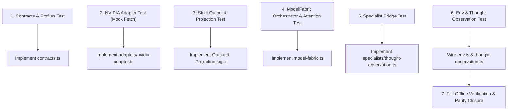

# MODEL-FABRIC-01 Final Implementation Packet

> **REFERENCE / PLANNING SNAPSHOT.** Canonical phase name is Model Fabric.
> This packet does not authorize implementation and does not outrank
> [`../Model_Fabric_Architecture.md`](../Model_Fabric_Architecture.md).
>
> Historical F1-obs planning packet. MF-M1 source baseline is
> `8eedad8bebbed2d8cd984849a269afe256a3d08a`. First **code** milestone is the
> existing-route seam, not this Lightning observation slice.

- **Status:** `REFERENCE` refined read-only planning snapshot
- **Planning Baseline SHA:** `bcc185e40f347a0235407896fc809d9de461fd7b`
- **First Slice Purpose:** `thought_observation` shadow dispatch replacement
- **First Slice Model:** NVIDIA `nvidia/nemotron-3.5-lightning-30b-a3b`
- **First Slice Semantic Route ID:** `thought_observation_shadow`
- **Default Mode:** `ASHLEY_MODEL_FABRIC_MODE=off` (verified behavioral parity with current production path)
- **Authorizing Role:** Read-Only Architectural Planning for Coding-Worker Execution

---

## 1. Baseline & Coding-Worker Git Handoff

### Planning Baseline
- **Planning Commit:** `bcc185e40f347a0235407896fc809d9de461fd7b` (`master`, clean working tree)
- **Runtime Environment:** Node 22+ ESM (`@types/node`: `^22.10.5`, `vitest`: `^3.0.5`, `typescript`: `^5.7.3`)

### Coding-Worker Handoff Procedure
The coding worker will begin after Sandbox Autonomy work concludes and may start on a newer `HEAD` commit. The worker must execute the following git handoff check before touching files:
1. **Record current HEAD commit:** `git rev-parse HEAD`.
2. **Compare against planning baseline:** `git diff --name-only bcc185e40f347a0235407896fc809d9de461fd7b...HEAD`.
3. **Inspect file deltas:**
   - If deltas are restricted to Sandbox (`apps/sandbox-*`, `apps/agent-service/src/core/sandbox/*`), documentation (`docs/*`), or scripts (`scripts/*`), proceed directly on current `HEAD`.
   - If deltas affect Model Fabric touch files (`apps/agent-service/src/env.ts`, `apps/agent-service/src/core/agency/thought-observation.ts`), verify whether changes conflict with the planned seams.
   - If conflicting source changes exist, **STOP** and report exact file conflicts before editing.
4. **Do NOT reset back to `bcc185e`:** `bcc185e` is the planning/reconnaissance reference, not a mandatory implementation commit.

---

## 2. Legacy Defect Classification

The 11 historical defects confirmed during reconnaissance are classified strictly to prevent unauthorized scope creep or drive-by fixes:

```
┌────────────────────────────────────────────────────────────────────────────────────────┐
│ FIRST-SLICE DEFECT CLASSIFICATION                                                      │
├────────────────────────────────────────────────────────────────────────────────────────┤
│ A. NATURALLY ADDRESSED BY FIRST SLICE:                                                 │
│    • Defect 3: thought_observation forced to 120B in shadow mode                       │
│      → Resolved: ModelFabric shadow bridge routes directly to NVIDIA Lightning         │
│    • Defect 2: CompletionOptions.model caller override                                 │
│      → Resolved: New ModelFabric dispatch request contracts omit model override        │
│    • Defect 9: JSON parsing / manual extraction drift                                  │
│      → Resolved: Strict whole-output OutputContract parser for this specialist         │
│    • Defect 10: Context labels not real bounded projections                            │
│      → Resolved: Real bounded ContextProjection for this specialist                    │
│    • Defect 8 (Partial): Dispatch truth / receipt normalization                        │
│      → Resolved: Stage-valid ModelAttemptReceipt and DispatchTruth taxonomy            │
├────────────────────────────────────────────────────────────────────────────────────────┤
│ B. REPRESENTED IN NEW CONTRACT ONLY (NO GLOBAL RETROFIT):                              │
│    • Defect 8: TokenUsage misses cached/reasoning tokens                               │
│      → Handled: ModelUsage represents provider-reported usage categories; NVIDIA      │
│        adapter populates them if returned. Do NOT retrofit Mistral or Groq. Missing    │
│        data remains null/unreported.                                                   │
├────────────────────────────────────────────────────────────────────────────────────────┤
│ C. EXPLICITLY DEFERRED / OUT OF SCOPE (DRIVE-BY FIXES FORBIDDEN):                      │
│    • Defect 1: Routing split across model-routing/config/callers (Full consolidation)  │
│    • Defect 4: Reflection uses Groq route with Mistral model override                 │
│    • Defect 5: Engineering proposal uses Groq route with Mistral override (Frozen)     │
│    • Defect 6: Curiosity consolidation missing owner/job correlations                  │
│    • Defect 7: Exchange cognition continuity compares Mistral model while using Groq   │
│    • Defect 11: Global routing metadata and quota TPM drift                            │
└────────────────────────────────────────────────────────────────────────────────────────┘
```

---

## 3. Current Production Call Graph

All external model calls enter `completeChat` in `apps/agent-service/src/mistral-client.ts` via `runAttentiveDispatch` in `apps/agent-service/src/core/attention/governor.ts`:

| ID | Purpose | Call Site | Route & Provider | Model Alias / Override | Downstream Consumer |
|---|---|---|---|---|---|
| **M1** | Full Expression | `expression.ts:55-169` (`expressSpeak`) | `ashley_expression` (Mistral) | `mistral-medium-latest` | Honesty filter -> Rendering -> Discord delivery |
| **M2** | Expression Fallback | `expression-fallback.ts:145-170` | `ashley_expression_fallback` (Groq) | `llama-3.3-70b-versatile` | One-hop fallback Expression |
| **M3** | Thought Decision | `thought.ts:145-251` (`runThoughtModel`) | `thought` (Groq) | `openai/gpt-oss-120b` | Ashley semantic validation -> Agency |
| **M4** | **Thought Observation (Target)** | `thought-observation.ts:23-77` (`enqueueThoughtObservation`) | `thought` (Groq) *(Intended: `utility_bulk`)* | `openai/gpt-oss-120b` | Shadow comparison -> `recordLiveShadowEvent` |
| **M5** | Exchange Cognition | `worker.ts:239-288` (`analyzeWithMistral`) | `utility_bulk` (Groq) | `openai/gpt-oss-20b` | Provenance gates -> Episode / Mind State / Facts |
| **M6** | Curiosity Consolidation | `consolidate.ts:103-236` (`consolidateCuriosityRead`) | `utility_bulk` (Groq) | `openai/gpt-oss-20b` | Provenance gates -> Takes / Opinions |
| **M7** | Reflection Review | `initiative.ts:210-256` (`modelReflectionAdjudicator`) | `thought` (Groq) | `env.mistralModel` *(Override)* | Advisory OCI action proposal |
| **M8** | Engineering Next Action | `engineering-model-adapter.ts:46-69` | Default utility | `env.mistralModel` *(Override)* | Engineering operator validation -> Broker (Frozen) |

---

## 4. Current thought_observation Path & Seam

### Execution Flow
1. **Trigger:** `runtime.ts:979-987` calls `enqueueThoughtObservation` after reactive deliberation, expression, and delivery reservation.
2. **Idempotency & Gating:** `enqueueThoughtObservation` (`thought-observation.ts:23-77`) checks API keys, shadow capability readiness, source key deduplication, and in-flight guards.
3. **Dispatch:** Calls `runThoughtModel(db, decision, motivations, trigger, input.complete, { decisionId, purpose: "thought_observation", lane: "exchange_cognition" })`.
4. **Current Route Bug:** `runThoughtModel` calls `complete(messages, { maxTokens: 450, temperature: 0.15, reasoningEffort: "medium", purpose: "thought_observation", route: "thought", ... })`. Because `route: "thought"` is passed explicitly, `completeChat` dispatches Groq 120B instead of utility bulk.
5. **Observation Recording:** `recordLiveShadowEvent` records comparison detail into `capability_events`.

### Integration Seam
The branch belongs strictly in `apps/agent-service/src/core/agency/thought-observation.ts` at `enqueueThoughtObservation`:
```ts
const complete =
  input.complete ??
  (env.modelFabricMode === "thought_observation_shadow"
    ? createThoughtObservationFabricComplete(input.db)
    : undefined);
```
- **Precedence:** Explicit test injection (`input.complete`) > Enabled shadow bridge > Existing default transport (`undefined`).
- **No Dual Dispatch:** Replaces the shadow transport; does NOT emit both legacy and ModelFabric requests.
- **Active Thought Untouched:** Active Thought decision (`runThoughtModel` called from `deliberateDecision`) does not pass `input.complete` and continues using current production routing.

---

## 5. Mode-Off Behavioral Parity

With `ASHLEY_MODEL_FABRIC_MODE=off` (the default), verified behavioral parity with the current production path is strictly required:
1. **Call Path:** `enqueueThoughtObservation` passes `complete: undefined` to `runThoughtModel`, invoking legacy `completeChat`.
2. **Routing:** Resolves route `"thought"` to Groq `openai/gpt-oss-120b`.
3. **Context & Budget:** Uses legacy ChatMessage structure, 450 max tokens, temperature 0.15, reasoning effort medium.
4. **Attention Admission:** Executes `runAttentiveDispatch` under lane `"exchange_cognition"`, bucket `"groq:openai/gpt-oss-120b"`.
5. **Persistence:** `recordLiveShadowEvent` writes identical event keys (`comparedKind`, `proposedKind`, `modelAlias`, `resolvedModelId`, `match`) to `capability_events`.
6. **Zero ModelFabric Dispatches:** Proved by unit test that `ModelFabric.invoke` and NVIDIA fetch adapter are never invoked when mode is `"off"`.

---

## 6. Module Decomposition: Minimum Viable Set vs Optional Splits

> **Core Instruction for Coding Worker:** Prefer the smallest coherent module set consistent with repository conventions. Do not create a file merely because this planning packet proposed one.

### Minimum Viable Module Set (Required Separate Modules)
The first slice can be cleanly implemented in **5 source files** under `apps/agent-service/src/core/model-fabric/`:

| Module Path | Primary Ownership & Responsibilities |
|---|---|
| `contracts.ts` | Branded types, profile contracts, route policy, projection types, output contracts, result types, stage-valid receipts, failure taxonomy, and `ModelFabric` interface. |
| `adapters/nvidia-adapter.ts` | Direct Ashley-owned HTTP transport adapter for NVIDIA NIM API (`https://integrate.api.nvidia.com/v1/chat/completions`), single-request mechanical invariant, test-injected `fetchFn`, AbortSignal propagation, and mechanical `TransportObservation` return. |
| `model-fabric.ts` | Core orchestrator: ContextProjection validation, Attention Governor integration (`runAttentiveDispatch`), adapter dispatch, receipt creation, failure normalization, and telemetry hooks. |
| `specialists/thought-observation.ts` | SpecialistSession instance, `ThoughtObservationObject` strict schema definition, and legacy `Complete` adapter bridge for `runThoughtModel`. |
| `index.ts` | Clean public barrel exports. |

### Mergeable / Inlineable in First Slice (Optional Future Splits)
The following proposed files may be inlined into the core modules above or created as separate files if cleaner:
- `capability-profiles.ts` -> May be co-located in `contracts.ts` or kept separate.
- `context-projection.ts` -> May be co-located in `model-fabric.ts` or kept separate.
- `output-contract.ts` -> May be co-located in `model-fabric.ts` or kept separate.
- `specialist-session.ts` -> May be co-located in `model-fabric.ts` or `specialists/thought-observation.ts`.
- `telemetry.ts` -> `NoopModelFabricTelemetry` and `InMemoryModelFabricTelemetry` may be co-located in `model-fabric.ts` or separate.
- `legacy-route-compat.ts` -> **Avoid creating as a separate module.** The narrow route policy mapping for `thought_observation_shadow` should be placed directly in `model-fabric.ts` or `contracts.ts`.

---

## 7. Legacy Route Compatibility & Deletion Criteria

### Design Rules
1. **Semantic Route ID:** The ModelFabric semantic route is `thought_observation_shadow`.
2. **No Routing V2:** `utility_bulk` is legacy compatibility evidence only. It must NOT become `ModelRoutePolicy.routeId`, `ResolvedModelRoute.routeId`, or persistent ModelFabric authority.
3. **No Caller Override:** ModelFabric requests accept NO caller `model?: string` overrides.

### Deletion Criteria
The legacy bridge code must be deleted when:
1. `thought_observation` shadow no longer references legacy route resolution functions.
2. All provider/model bindings for active routes are managed by a single unified ModelFabric registry snapshot.
3. No compatibility mapping metadata is persisted as ModelFabric semantic identity.

---

## 8. NVIDIA Adapter Design, TransportObservation & Dispatch Truth

### Direct HTTP Transport Pattern
The NVIDIA adapter is strictly a mechanical transport mechanism. It performs the single HTTP `fetch` and returns a `TransportObservation`. It does NOT classify `ModelFailure`, `DispatchTruth`, or construct `ModelReceipt`; those remain the exclusive responsibility of `ModelFabric`.

```ts
export type TransportObservation =
  | { kind: "response"; status: number; headers: Headers; bodyText: string }
  | { kind: "pre_send_error"; errorClass: string }
  | { kind: "send_ambiguity"; errorClass: string };

export type NvidiaFetch = (input: RequestInfo | URL, init?: RequestInit) => Promise<Response>;

export interface NvidiaTransportAdapter {
  execute(args: {
    modelId: string;
    messages: { role: string; content: string }[];
    maxTokens: number;
    temperature: number;
    signal?: AbortSignal;
  }): Promise<TransportObservation>;
}

export function createNvidiaTransportAdapter(
  config: { apiKey?: string; baseUrl?: string; fetchFn?: NvidiaFetch } = {},
): NvidiaTransportAdapter {
  const fetchFn = config.fetchFn ?? fetch;
  const apiKey = config.apiKey ?? env.nvidiaApiKey;
  const baseUrl = config.baseUrl ?? env.nvidiaBaseUrl;

  return {
    async execute(args): Promise<TransportObservation> {
      if (!apiKey) {
        return { kind: "pre_send_error", errorClass: "missing_api_key" };
      }
      const body = {
        model: args.modelId,
        messages: args.messages,
        max_tokens: args.maxTokens,
        temperature: args.temperature,
      };

      let res: Response;
      try {
        res = await fetchFn(`${baseUrl}/chat/completions`, {
          method: "POST",
          headers: {
            "Content-Type": "application/json",
            Authorization: `Bearer ${apiKey}`,
          },
          body: JSON.stringify(body),
          signal: args.signal,
          redirect: "manual",
        });
      } catch (err: unknown) {
        if (err instanceof Error && err.name === "AbortError") {
          return { kind: "send_ambiguity", errorClass: "aborted" };
        }
        return { kind: "send_ambiguity", errorClass: "transport_failure" };
      }

      const bodyText = await res.text();
      return {
        kind: "response",
        status: res.status,
        headers: res.headers,
        bodyText,
      };
    },
  };
}
```

### Mechanical Transport Invariants
1. **Request Invariant:** Exactly <= 1 `fetchFn` invocation per dispatch. No retry loop, no recursive retry.
2. **Redirect Policy:** `redirect: "manual"` prevents unexpected automatic secondary requests.
3. **No Retries / No Fallback:** First-slice route policy specifies `reliabilityClass: "single_attempt"`, `fallbackRouteIds: []`.
4. **DispatchTruth Ownership:** The adapter reports mechanical observations. **ModelFabric owns DispatchTruth and receipt creation:**
   - `pre_send_error` (e.g. missing API key / pre-send validation failure) -> `ModelFailure` with `dispatchTruth: "not_sent"`, receipt stage `resolved_not_sent`.
   - `send_ambiguity` (e.g. network disconnect in flight / timeout race) -> `ModelFailure` with `dispatchTruth: "sent_outcome_unknown"`, receipt stage `dispatch_attempted`.
   - `response` (HTTP status code 200, 4xx, 5xx) -> `dispatchTruth: "response_received"`. If status is non-200, ModelFabric normalizes the failure code (401/403 -> `configuration_error`, 404 -> `provider_model_unavailable`, 429 -> `provider_quota`, 5xx -> `provider_internal`/`provider_unavailable`).

### Stage-Valid Receipt Matrix
```
pre_resolution       + not_sent              (attemptCount: 0, unresolved facts omitted)
resolved_not_sent    + not_sent              (attemptCount: 0, immutable route facts retained)
dispatch_attempted   + sent_outcome_unknown  (attemptCount: 1, projection bound, no response facts)
provider_response    + response_received     (attemptCount: 1, projection bound, reported usage & model)
```

---

## 9. Strict Output Contract & Validation Boundary

### Strict Whole-Output Parser
```ts
export function parseStrictJsonOutput<T>(
  rawText: string,
  validator: (val: unknown) => val is T,
): { ok: true; value: T } | { ok: false; error: "malformed_output"; detail: string } {
  const trimmed = rawText.trim();
  let candidate = trimmed;

  // Accept optionally one exact whole fenced JSON block
  const fenceMatch = trimmed.match(/^```(?:json)?\s*\r?\n([\s\S]*?)\r?\n```$/);
  if (fenceMatch) {
    candidate = fenceMatch[1]!.trim();
  }

  let parsed: unknown;
  try {
    parsed = JSON.parse(candidate);
  } catch {
    return { ok: false, error: "malformed_output", detail: "json_parse_failed" };
  }

  if (!validator(parsed)) {
    return { ok: false, error: "malformed_output", detail: "schema_validation_failed" };
  }

  return { ok: true, value: parsed };
}
```

### Explicit Rejections
- Leading or trailing prose outside the code fence.
- Multiple concatenated JSON objects.
- Substring slice repairs (`indexOf("{")` ... `lastIndexOf("}")`).
- Heuristic regex extractions.

### Boundary Distinction
- **Structural Validation (ModelFabric OutputContract):** Validates whole JSON representation and field types for `ThoughtObservationObject` (`kind`, `delayClass`, `shouldSpeak`, `effort`, `completion`, `uncertainty`, `urgency`, `objective`, `reason`, `motivationIds`).
- **Ashley Semantic Validation (`runThoughtModel`):** Validates allowed decision kinds, delayClass consistency, shouldSpeak consistency, grounded motivation IDs, and refusal constraints.

---

## 10. Bounded Context Projection & SpecialistSession

### ContextProjection
- **Input Source:** Constructed from `trigger`, `base` (Decision), and `candidates` (Motivations).
- **Parts:** Bounded text parts with `classification: "system_private"`.
- **Content Binding:** SHA-256 over exact canonical parts (privacy-sensitive; excluded from general telemetry).
- **Telemetry Fingerprint:** Content-free structural summary (`projection_structure_v1:...` covering part count, kinds, size buckets; safe for tracing).

### SpecialistSession Invariants
- Belongs to one Ashley turn invocation.
- Authority-free: cannot invoke tools, cannot access Recall/Memory, cannot mutate Identity or Mind State.
- `maxCalls = 1`: Second call immediately yields `budget_exhausted` (`not_sent`) before dispatch.
- Bounded by deadline and correlation IDs (`decisionId`, `ownerId`).

---

## 11. Attention Governor Integration Invariant

### Single Admission Guarantee
For every enabled ModelFabric `thought_observation` dispatch:
1. Exactly one Attention Governor admission (`runAttentiveDispatch`) occurs.
2. Admission runs under lane `"exchange_cognition"` with quota bucket `"nvidia:nvidia/nemotron-3.5-lightning-30b-a3b"`.
3. There is **zero nested, redundant, or double `runAttentiveDispatch` accounting**.
4. The ledger in `attention_requests` increments by exactly one row per shadow dispatch attempt.

---

## 12. Files To Modify & Scope Boundaries

### Modified Files (3 Files Only + Documentation)

| File | Symbol | Proposed Change | Verification |
|---|---|---|---|
| `apps/agent-service/src/env.ts` | `env.modelFabricMode`, `env.nvidiaApiKey`, `env.nvidiaBaseUrl` | Parse `ASHLEY_MODEL_FABRIC_MODE` (`"off"` \| `"thought_observation_shadow"`), default `"off"`. Add `nvidiaApiKey` (`process.env.NVIDIA_API_KEY ?? ""`) and `nvidiaBaseUrl` (`process.env.NVIDIA_BASE_URL ?? "https://integrate.api.nvidia.com/v1"`). | `env.test.ts` |
| `apps/agent-service/src/core/agency/thought-observation.ts` | `enqueueThoughtObservation` | When `input.complete` is omitted and `env.modelFabricMode === "thought_observation_shadow"`, wire `createThoughtObservationFabricComplete(input.db)`. | `thought-observation.test.ts` |
| `apps/agent-service/src/core/agency/thought-observation.test.ts` | Test suite | Add test cases for mode precedence (`input.complete` > flag on > flag off default), single Attention Governor admission, and parity verification. | `thought-observation.test.ts` |
| `config/env.example` | Template documentation | Document `ASHLEY_MODEL_FABRIC_MODE=off`, `NVIDIA_API_KEY`, `NVIDIA_BASE_URL`. | Manual review |

### Files Explicitly Out of Scope
The following files **MUST NOT** be modified:
- `apps/agent-service/src/core/agency/thought.ts` (Active Thought decision unchanged).
- `apps/agent-service/src/mistral-client.ts`, `router.ts`, `registry.ts`, `config/models.json` (Legacy unchanged).
- `apps/agent-service/src/core/attention/**`, `apps/agent-service/src/core/perception/**` (Core untouched).
- `apps/agent-service/src/core/sandbox/**`, `apps/sandbox-policy/**`, `apps/sandbox-broker/**` (Sandbox frozen).
- All SQLite migration and schema files.
- All Expression, cognition, curiosity, and reflection caller files.

---

## 13. Test-First Implementation Sequence



### Step-by-Step Vertical Path

#### Step 1: Contracts & Capability Profiles
- **RED Test:** `contracts.test.ts` asserting branded types, `nvidia.nemotron-3.5-lightning-30b-a3b` profile definition, and deterministic SHA-256 profile fingerprint.
- **MINIMAL Implementation:** Create `contracts.ts` (and profile definition).
- **GREEN Test:** Passes deterministic profile checks.

#### Step 2: NVIDIA Transport Adapter
- **RED Test:** `adapters/nvidia-adapter.test.ts` with mocked `fetchFn` verifying:
  - Invariant: exactly <= 1 `fetchFn` invocation per dispatch.
  - Returns mechanical `TransportObservation` (`response`, `pre_send_error`, `send_ambiguity`).
  - No semantic `ModelFailure` or `AppError` thrown by adapter.
  - Status codes and bodyText passed faithfully to `TransportObservation`.
  - AbortSignal and `redirect: "manual"` propagated.
- **MINIMAL Implementation:** Create `adapters/nvidia-adapter.ts`.
- **GREEN Test:** Transport adapter tests pass with 0 real network calls.

#### Step 3: Context Projection & Strict Output Parsing
- **RED Test:** Output parsing tests verifying valid whole JSON, valid fenced JSON, rejection of leading/trailing prose, rejection of multiple objects, rejection of slice heuristics. Projection tests verifying content binding vs telemetry fingerprint.
- **MINIMAL Implementation:** Add projection and output contract parser in `model-fabric.ts` or separate helper.
- **GREEN Test:** Strict parsing tests pass.

#### Step 4: ModelFabric Core Orchestration & Attention Admission
- **RED Test:** `model-fabric.test.ts` testing `ModelFabric.invoke`:
  - Exactly one Attention Governor admission (`runAttentiveDispatch`) occurs; no double accounting.
  - Normalizes `TransportObservation` into stage-valid receipts (`pre_resolution`, `resolved_not_sent`, `dispatch_attempted`, `provider_response`) and DispatchTruth equality.
  - Normalizes HTTP error responses into closed `ModelFailure` taxonomy without leaking raw prompts or secrets.
- **MINIMAL Implementation:** Create `model-fabric.ts`.
- **GREEN Test:** Orchestrator and single-admission tests pass.

#### Step 5: Thought Observation Specialist Bridge
- **RED Test:** Specialist bridge tests converting `ChatMessage[]` -> `SpecialistSession` -> `ModelResult` -> `ThoughtModelResult`.
- **MINIMAL Implementation:** Create `specialists/thought-observation.ts`.
- **GREEN Test:** Specialist bridge tests pass.

#### Step 6: Environment Wiring & Thought Observation Seam
- **RED Test:** `thought-observation.test.ts` asserting:
  - `MODE=off`: ModelFabric is NOT invoked; legacy Groq 120B completion runs with verified behavioral parity.
  - `MODE=thought_observation_shadow`: ModelFabric bridge is invoked; exactly 1 shadow request sent; exactly 1 Attention Governor admission; identical `capability_events` detail recorded.
  - `input.complete` injection overrides both modes.
- **MINIMAL Implementation:** Update `env.ts` and `thought-observation.ts`.
- **GREEN Test:** All thought-observation tests pass.

#### Step 7: Full Offline Verification & Parity Closure
Run the full verification suite:
```powershell
npm test --prefix apps/agent-service -- src/core/model-fabric/
npm test --prefix apps/agent-service -- src/core/agency/thought-observation.test.ts
npm run build --prefix apps/agent-service
npm test
npm run phase0:offline
npm run eval:deterministic
git diff --check
```

---

## 14. Coding-Worker Goal

```text
================================================================================
CODING-WORKER GOAL: IMPLEMENT MODEL-FABRIC-01 (FIRST SLICE)
================================================================================

PURPOSE:
Implement the first slice of MODEL-FABRIC-01: default-off shadow Thought
observation dispatch replacement on NVIDIA Nemotron 3.5 Lightning 30B-A3B.

PRE-EXECUTION GIT HANDOFF:
1. Record current HEAD: git rev-parse HEAD.
2. Compare against planning baseline bcc185e40f347a0235407896fc809d9de461fd7b.
3. If changes exist only in Sandbox (apps/sandbox-*, apps/agent-service/src/core/sandbox/*),
   docs, or scripts, proceed directly on current HEAD.
4. If conflicting changes affect Model Fabric touch files (env.ts, thought-observation.ts),
   STOP and report exact conflicts before editing.
5. Do NOT reset back to bcc185e.

FROZEN ARCHITECTURAL CONSTRAINTS:
1. ZERO modifications to sandbox files (apps/sandbox-*, apps/agent-service/src/core/sandbox/*).
2. ZERO modifications to active Thought deliberation (thought.ts remains untouched).
3. ZERO modifications to legacy completeChat (mistral-client.ts) or router.ts / registry.ts.
4. ASHLEY_MODEL_FABRIC_MODE defaults to "off", preserving verified behavioral parity with the
   current production path.
5. In shadow mode (ASHLEY_MODEL_FABRIC_MODE=thought_observation_shadow), replace the shadow
   dispatch; DO NOT dual-dispatch.
6. Mechanical request invariant: exactly <= 1 fetchFn invocation per dispatch. No retry loop,
   no fallback routes (fallbackRouteIds = []).
7. NVIDIA adapter is strictly mechanical: returns TransportObservation. ModelFabric alone owns
   DispatchTruth, ModelFailure, and ModelReceipt creation.
8. Exactly one Attention Governor admission (runAttentiveDispatch) per enabled dispatch;
   no nested or double accounting.
9. Canonical environment variables are NVIDIA_API_KEY and NVIDIA_BASE_URL (no NIM_* aliases).
10. Output parsing must be strict whole-output (whitespace + optional single fenced code block;
    prose, multiple objects, and substring search heuristics strictly rejected).
11. Prefer the smallest coherent module set (target: ~5 source files under src/core/model-fabric/).
    Do not create unnecessary files merely because they appeared in initial planning drafts.

EXECUTION SEQUENCE:
1. Implement contracts and NVIDIA Lightning profile with deterministic SHA-256 fingerprint (contracts.ts + tests).
2. Implement direct NVIDIA HTTP adapter returning mechanical TransportObservation with mocked fetchFn (adapters/nvidia-adapter.ts + tests).
3. Implement strict whole-output JSON parser and bounded context projection.
4. Implement ModelFabric orchestrator with Attention Governor single-admission integration (model-fabric.ts + tests).
5. Implement Thought observation specialist bridge (specialists/thought-observation.ts + tests) and index.ts.
6. Update apps/agent-service/src/env.ts to parse ASHLEY_MODEL_FABRIC_MODE (default "off"), NVIDIA_API_KEY, NVIDIA_BASE_URL.
7. Update apps/agent-service/src/core/agency/thought-observation.ts to wire the bridge when enabled.
8. Update apps/agent-service/src/core/agency/thought-observation.test.ts and config/env.example.

VERIFICATION COMMANDS:
npm test --prefix apps/agent-service -- src/core/model-fabric/
npm test --prefix apps/agent-service -- src/core/agency/thought-observation.test.ts
npm run build --prefix apps/agent-service
npm test
npm run phase0:offline
npm run eval:deterministic
git diff --check
================================================================================
```
