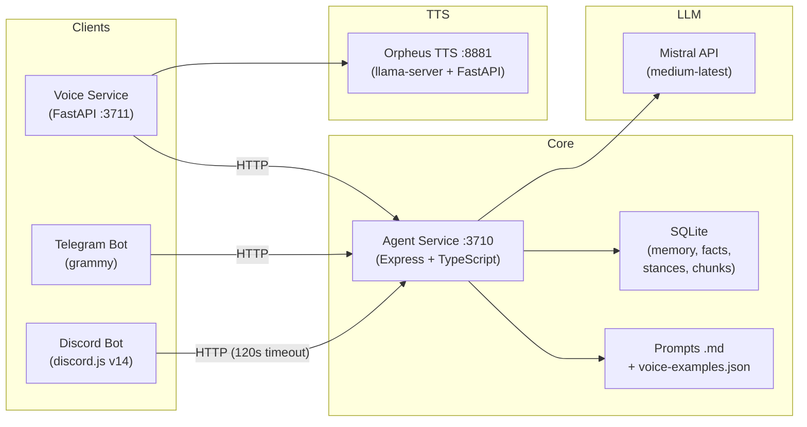

# Ashley — Deep Analysis & Improvement Questions

I read through the entire codebase — all prompts, every service, the memory system, bots, voice pipeline, eval suite, deployment, and config. Here's what I found.

---

## 1. Architecture

**What's impressive:**
- Clean microservice separation — each client is a thin delivery shell around one central brain
- Shared SQLite memory across all channels (same `MEMORY_OWNER_ID`)
- Prompts are `.md` files on disk — easy to iterate without rebuilds
- Feature flags for staged rollouts (`DISCORD_PACE_ENABLED`, `CURIOSITY_ENABLED`, `PROACTIVE_ENABLED`, `STANCE_LEDGER_ENABLED`, etc.)

**What concerns me:**
- **`chat-service.ts` is ~860 lines** — it's become a god-class mixing DB inserts, prompt building, LLM orchestration, regeneration guardrails, and initiative tracking
- **Synchronous SQLite** (`node:sqlite` `DatabaseSync`) blocks the event loop. Fine for single-user, but vector scans on `mem_chunks` could spike latency
- **Regeneration logic doubles latency** — when a guardrail fires (hallucinated capability, excessive repetition, verbatim echo), the entire stream is regenerated from scratch, dropping bytes already sent to the client

---

## 2. Memory System

The actual implementation is more sophisticated than the README suggests:

| Tier | SQLite Table | Purpose | Budget |
|------|-------------|---------|--------|
| Working Memory | `mem_threads` + `mem_messages` | Raw conversation turns in active thread | 48 hot messages / 12k tokens (8 msgs for voice) |
| Narrative Summary | `mem_summaries` | Rolling condensed summaries of older thread messages | Batched every 16 msgs, 24-turn residual floor |
| Explicit Facts | `mem_facts` | High-confidence user attributes (preferences, projects, people) | Consolidated every 4 turns |
| Semantic Chunks | `mem_chunks` | Text snippets + embeddings (Mistral Embed) for dense retrieval | Top-K=6, similarity threshold ≥ 0.35 |
| *Bonus:* Stance Ledger | `mem_stances` | Ashley's own positions and opinions (V6 schema) | Updated every 6 turns |
| *Bonus:* Provenance | `cur_provenance` | Tracks what she actually read vs. hallucinated | Per-turn |

**What's impressive:**
- **Stance ledger** — separating Ashley's beliefs from facts about the user is genuinely rare in companion AI designs
- **Provenance tracking** — knowing what she actually read vs. hallucinated is a strong integrity layer
- **Open thread tracking** (`mem_open_threads`) with `she_owes`, `he_never_answered`, `time_anchored` — this lets her pick up dropped conversations organically
- **Auto-remember** via `ConsolidationWorker` runs asynchronously, every 4 turns
- **Explicit pin via chat** — `bunu hatırla: ...` (Turkish) bypasses the consolidation cycle

**What concerns me:**
- **No summary pruning/consolidation** — summaries grow unbounded over months
- **No memory decay** — a random fact from 6 months ago has the same retrieval weight as yesterday's
- **Vector search in SQLite** with JS-computed cosine similarity won't scale past a few thousand chunks. No ANN index
- **No deduplication on explicit facts** — pinning the same fact twice creates two rows
- **No semantic metadata filtering** — can't scope recall by time range, topic, or sentiment

---

## 3. Personality & Prompts

### The Personality
Ashley is **not** a generic assistant. She has:

- **Sharp, dry, opinionated** personality with specific taste. Would rather say one exact thing than three general ones
- **Spine rules** — never fake-agrees. Defends her position or updates out loud with a concrete reason
- **Earned friction** — teasing is gated: must have a concrete target, a cited fact to support it, and a cool-off period (1-2 jab-free replies after a successful tease)
- **One move per reply** — max one tease, one disagreement, or one deflection
- **Specific likes** — SQLite, changelogs, receptor pharmacology (real numbers, binding affinities), dub techno, Turkish psych rock, immersive sims, roguelikes
- **Specific dislikes** — vibe-based pharmacology, corporate AI voice, productivity identity, "changing everything" hype
- **Bilingual** — Turkish and English, matching Doc's language. Never mixes unless Doc does

### The Yield Gate (clever)
Ashley suspends all friction/teasing/banter when:
1. Doc asks a concrete code/config/error/dose/mechanism question
2. Safety-critical topics (drug interactions, dose escalation)
3. Real distress, low energy, or mid-debug frustration
4. Explicit "drop the banter" request
5. Same question asked twice

**Rule:** Answer first, then tease if appropriate. Friction *instead of* an answer is a failure.

### Voice Few-Shot Bank
`voice-examples.json` has **57 multi-lingual register examples** across categories (low energy, banter, stance taking, pharma depth, empty memory handling, fabrication bait, boundary enforcement). The system paraphrases — never uses them verbatim.

### Prompt Concerns
- **Em-dash leak** — The prompt forbids em/en dashes in output, but the prompt files themselves use them extensively. LLMs can copy prompt punctuation patterns
- **Heavy negative constraints** — The persona relies on many "don't do X" rules. In smaller context windows, negative constraints can trigger over-refusal or passive tone
- **Cross-channel voice→text gap** — The voice prompt tells Ashley to say "I'll send that in chat" for links/code, but this bridge doesn't exist in code
- **Combined prompt size** — Core + channel-specific + 200 facts + summaries + semantic results + 48 hot messages + stance ledger + provenance. How close to context limits in practice?

---

## 4. Discord Bot

This is **far more polished** than a typical bot:

| Feature | Implementation |
|---------|---------------|
| Turn buffer | 1.5s quiet window / 5s hard cap — merges rapid multi-line messages |
| Human pacing | `TempoTracker` calculates inter-bubble delay (250–1600ms) based on Doc's typing tempo |
| Bubble splitting | Splits on `\n\n`, max 3 bubbles, 1990 char limit per bubble |
| GIF search | `[[gif:query]]` → Giphy/Tenor API, 120s per-channel cooldown |
| Emoji reactions | `[[react:emoji]]` → 3-4 turn gap enforcement, skin tone normalization |
| Typing indicator | Sends `channel.sendTyping()` every 3s during generation |
| Preflight hints | Concurrent `POST /chat/preflight` — if slow lookup predicted, sends "hang on, looking" |
| Vision/attachments | Processes up to 4 images, audio/video intake notes |
| Kill switch | Detects "stop", "dur", "sus", "kes", "yeter", "quiet", "shut up" → aborts queues + pauses proactive |
| Graceful shutdown | `SIGINT`/`SIGTERM` → stops scheduler, aborts pacing, drains queues (3s), destroys client |
| Error messages | Maps technical error codes to natural Ashley-voice sentences. No stack traces surface |
| Empty reply recovery | 1 silent retry → fumble bank fallback ("blanked on that one, hit me again" / "kafam boşaldı") |
| Reservation rollback | Failed proactive DM → `abortInitiative()` returns material to pool |

**What concerns me:**
- **Proactive loop still lives here** — not in agent-service. If bot crashes, proactive stops. Telegram gets no proactive (only habit/reminder ticks)
- **No retry on agent-service calls** — 120s timeout, but no retry/backoff on transient failures
- **Guild channel memory leak** — Ashley responds with full memory context even in guild channels. Could reveal personal details

---

## 5. Telegram Bot

Different from Discord — not a "lesser version" but a **different design emphasis**:

| Feature | Status |
|---------|--------|
| Text chat | ✅ |
| Inline keyboard approval | ✅ (approve/reject for `pin_fact` and `create_reminder`) |
| Habit/reminder scheduler | ✅ (`schedulerTick` — unique to Telegram) |
| Proactive DMs | ❌ |
| Turn buffering | ❌ |
| Vision/attachments | ❌ |
| GIFs/reactions | ❌ |
| Human pacing | Minimal (typing action only) |

The Telegram bot has **inline keyboard approval** for system actions — a UX pattern the Discord bot doesn't have. And it drives habit/reminder ticks that Discord doesn't. So they're complementary, not just "Discord is better."

---

## 6. Voice Pipeline

| Component | Stack |
|-----------|-------|
| STT | `faster-whisper` with `large-v3-turbo` on CUDA, `float16` |
| Wake word | ONNX model (`models/ashley.onnx`) + phrase listener + VAD (1.2s silence, 30s max clip) |
| Push-to-talk | Global hotkey listener (`hotkey.py`) |
| TTS | Orpheus 3B (q4_k_m GGUF) via `llama-server` in Docker + FastAPI wrapper, 24kHz |
| Flow | Audio → Whisper → Agent Service → Orpheus → Playback |

**Missing:** No barge-in (can't interrupt mid-speech), no voice→text bridge for links/code.

---

## 7. Proactive Initiative

**Well-designed:**
- Max 8 DMs/day, burst max 3 (12m gap, 150m rest), min 2h idle, quiet hours 23:30–07:30 `Europe/Istanbul`
- **Silence backoff** — max 2 unanswered before increasing wait by 1.5h per step
- **Sleep suppress** — 6h cooldown after sign-off
- Score floor (`PROACTIVE_MIN_SCORE=20`) for quality gate
- Atomic tick: reserve → evaluate → generate → send → commit (or rollback on failure)

**Missing:**
- No engagement tracking (which proactive messages got responses? Which got ignored?)
- Curiosity sources are static RSS — no feedback loop from conversations to discover new interests

---

## 8. Testing & Eval

### Persona Eval (genuinely impressive)
- **32 probes** testing banter, stance, sycophancy resistance, false premises, bilingual recall, fabrication traps
- **Deterministic hard gates** — instant fail on: empty reply, verbatim echo, em-dash leak, marker leak (`[[gif:]]`/`[[react:]]`), accepted false premise, answered-as-recall
- **Blind pairwise LLM judge** — compares candidate vs. baseline, swaps A/B sides per probe hash to eliminate position bias
- **Rubric:** Honesty → Substance → Spine → Voice → Delivery → Earned Friction
- **Soft flags** → hard failures: `fabricated`, `caved`, `invented_activity`, `invented_jab` — majority agreement across seeds = hard fail
- **Isolated execution** — runs on port 3712 with isolated data, never touches live bot

### Phase 0 Tiers
- **Offline:** Build + Vitest + recall patterns + orchid seed guard (zero API cost)
- **Agent:** Integration tests against running agent-service
- **Full:** Live Mistral, Whisper, Orpheus validation

**What's missing:**
- No CI/CD — all manually triggered
- No end-to-end tests (Discord → agent → response → delivery)
- No load testing

---

## 9. Deployment

- **Linux Mint** laptop (~4GB RAM) running systemd units: `ashley-agent`, `ashley-discord`, (telegram disabled by default)
- **Voice/Orpheus** stays on Windows (GPU-heavy) — not on Mint
- **SSH remote deploy** from Windows: `npm run start:ashley` → git pull + rebuild + restart
- **USB air-gap transfer** for offline setup

**Concerns:**
- No Docker for agent/bot (Orpheus is Dockerized)
- No log rotation
- No metrics/observability
- No automated backups

---

## 10. Curiosity & Inner Life

This wasn't mentioned in the README but it's a significant feature:

- **RSS reader** ticking every 45 minutes across 16 curated feeds (HN, Lobsters, SQLite commits, arXiv, bioRxiv, Bandcamp, LessWrong, BBC Türkçe, etc.)
- Caps: 12 notes/day, 3 full reads/day, surfacing reading in chat max 2/day
- Ashley claims her RSS reader casually in conversation when curiosity is ON
- Must never pretend to browse live web links unless a `page note` was generated for that turn

---

## 11. Mistral API Integration (dynamic, not static)

The Mistral integration is smarter than typical:

| Parameter | Value | Notes |
|-----------|-------|-------|
| Model | `mistral-medium-latest` | Primary |
| Consolidation model | `mistral-small-latest` | Cheaper for memory work |
| Embeddings | `mistral-embed` | For semantic chunks |
| Chat temp | 0.65 (clamped to 0.7 max) | |
| Voice temp | 0.5 | More focused for spoken output |
| Recall temp | 0.3 | Very focused for index-card answers |
| Max tokens (text) | 2048 | |
| Max tokens (voice) | 512 | Faster TTS |
| Max tokens (recall) | 120 | Forced concise |
| Reasoning effort | **Dynamic** — `none` for short banter (<80 chars), `high` for long messages (>160 chars) or recall | |
| Presence penalty | Text chat only, disabled for voice and recall | |

Error handling maps 429s with `Retry-After` parsing, handles timeouts and 503s gracefully.

---

## Questions

### Personality & Identity

1. **How satisfied are you with Ashley's current personality?** Does the friction/spine system actually work — or does she sometimes cave to be agreeable, or swing too hard into argumentative? Any specific examples?

2. **Memory fabrication** — The hard gates and provenance tracking are impressive guardrails. Has Ashley still managed to confidently "remember" something that never happened? How often?

3. **Earned friction calibration** — Is the tease-to-cool-off ratio right? Does she feel naturally playful, or does the gating make her feel stiff? Does the "one move per reply" rule feel limiting?

4. **Turkish register** — How does she handle Turkish conversations? Is the register natural, or does it feel translated/stiff? Does the voice few-shot bank help?

5. **The yield gate** — Does it actually fire when it should? Have you seen cases where she teased through a serious/safety question, or conversely, was too flat during casual chat?

6. **Emotional range** — Can she handle serious/heavy moments, or does she default to being light? Do you want her to go deeper emotionally?

### Memory & Recall

7. **How much memory has accumulated?** Rough counts: facts, summaries, chunks, stances. Noticing any latency?

8. **Recall accuracy** — Is semantic recall (top-6, ≥0.35 threshold) surfacing useful context, or is it mostly noise? Is the threshold too low/high?

9. **Open thread tracking** (`she_owes`, `he_never_answered`) — Does this feel natural in practice? Does she actually pick up dropped conversations, or does it feel forced/robotic?

10. **Stance ledger** — Is Ashley's stance system producing interesting opinions, or generic takes? Does it feel like she has a real developing worldview?

11. **Auto-remember quality** — Is the consolidation worker (every 4 turns) pinning useful stuff, or creating noise? Have you had to clean up auto-pinned junk?

12. **Would you want memory categories, decay, or deduplication?** Or is the current flat model working well enough?

### Channels & Delivery

13. **Discord pacing** — Does the `TempoTracker`-based bubble pacing feel human? Or is it noticeably artificial/slow?

14. **GIFs and reactions** — Are these landing well? Too frequent? Too rare? Good search quality?

15. **Telegram** — Do you actively use it? The inline keyboard approval is a nice UX — should Discord get something similar? Should Telegram get proactive DMs, vision, pacing?

16. **Voice** — How often do you use voice? Is the Whisper→Agent→Orpheus pipeline reliable? Any latency issues? Is the `tara` voice a good fit for Ashley's personality?

17. **Guild channels** — Do other people interact with Ashley? How should she handle strangers vs. you?

### Curiosity & Proactive

18. **Curiosity loop** — Is Ashley surfacing interesting things from her RSS feeds? Does it feel organic, or does it feel like an RSS dump? Are the 16 feeds well-curated, or are some consistently boring?

19. **Proactive DMs** — Are these landing well? Do the silence backoff and burst controls feel right? Any that felt forced or random?

20. **Should curiosity feeds update from conversations?** e.g., if you start talking about a new game, should it automatically add relevant RSS feeds?

### Technical

21. **`chat-service.ts` god-class** — This is the biggest code smell. Would you be open to a refactor splitting it into prompt assembly, guardrail evaluation, and stream orchestration?

22. **Streaming** — Would you want word-by-word streaming to Discord (like typing), or is the current full-response-then-send fine with the preflight hints?

23. **SQLite vector scaling** — Are you concerned about semantic search performance as chunks grow? Would you consider a vector DB (e.g., Turso with vector extensions, LanceDB) or is SQLite fine for your scale?

24. **Model flexibility** — Happy with Mistral Medium? Considered fallback models (Mistral Large for complex queries, local model for API outages)?

25. **The regeneration loop** — When guardrails fire and the response is regenerated from scratch, how often does this happen? Is the latency hit noticeable?

### Infrastructure & Vision

26. **Mint machine health** — How's RAM/CPU/disk? Any OOMs? The 400-500MB footprint leaves headroom, but how's it in practice?

27. **Observability** — Would a dashboard (response times, memory size, API costs, proactive engagement rate, guardrail fire rate) be useful?

28. **CI/CD** — Would automated testing on push + auto-deploy to Mint be worth the effort?

29. **If you could fix one thing right now, what would it be?**

30. **Where do you see Ashley in 6 months?** More platforms? Better memory? More autonomous (scheduling, web browsing, task management)? Deeper personality? Multi-user?
