# Ashley Improvement — Follow-Up Questions & Wave Plan

25 items approved. A few need design clarification before I can build. After that, the preliminary wave plan.

---

## Follow-Up Questions

### F1. Reflection Architecture (C11 — you asked what I suggest)

I recommend **tiered reflections**:

| Tier | Cadence | Length | Content | Model |
|------|---------|--------|---------|-------|
| **Micro** | Every 4-6h of active conversation | 2-3 sentences | What just happened emotionally, any stance shifts | mistral-small |
| **Daily** | 24h (keep current) | 80-160 words | Day review: facts, projects, mood patterns | mistral-medium |
| **Weekly** | 7 days | 200-400 words | Arc synthesis: interest trends, relationship evolution, recurring patterns, "I've been thinking about..." material | mistral-medium |
| **Monthly** | 30 days | 400-800 words | Identity evolution: taste drift summary, stance revision history, emotional arc, what she's learned | mistral-medium |

The weekly and monthly tiers synthesize the lower tiers, not raw transcripts. This creates a pyramid where Ashley's self-knowledge gets richer over time without re-reading every message.

> **Q: Does this tiered model feel right? Too much? Want to adjust the cadences?**

---

### F2. Taste Drift Mechanism (A2 — "great engineering needed")

Here's my proposed design for how Ashley discovers new likes/dislikes:

1. **Signal collection**: Every time she reads an article (curiosity tick) and forms a take, the take's sentiment is classified: `liked`, `neutral`, `disliked`, `dismissed`.
2. **Interest accumulation**: A new table `ashley_taste_signals` tracks: `{interest_area, signal, source_title, take_text, created_at}`.
3. **Drift evaluation**: During the weekly reflection, the reflection prompt includes her recent taste signals. If she's consistently liked 5+ ambient music articles, the reflection notes "I think I'm getting into ambient."
4. **Taste ledger**: A new table `ashley_tastes` stores her current taste profile (separate from Doc's `mem_facts`). Entries like `{topic: "ambient music", disposition: "growing interest", confidence: 0.6, first_noticed: "2026-07-15", evidence: "liked 6 articles this month"}`.
5. **Prompt injection**: The taste ledger replaces the hardcoded likes/dislikes in core-ashley.md. Her personality becomes partially dynamic.
6. **Dislike discovery**: Same mechanism in reverse. If she keeps dismissing hustle-culture articles, that reinforces her dislike. If she starts finding some hustle-adjacent content interesting, the dislike softens.

> **Q: Does this mechanism feel right? Should taste changes require a threshold (e.g., 5+ consistent signals) before they update her prompt-level personality? Should she be able to mention the drift explicitly ("I've been reading a lot of ambient stuff lately, I think I actually like it")?**

---

### F3. More Initiative Angles (D14 — "a few more than proposed")

Here's an expanded set. Pick the ones that feel natural for a friend to do:

| Angle | Example | When |
|-------|---------|------|
| `question` | "Did you ever fix that retry loop?" | Open thread exists |
| `opinion` | "That SQLite piece was mostly wrong" | Has a fresh take |
| `share_discovery` | "Found something you'd actually like" | High-relevance article match |
| `callback` | "Been thinking about what you said about burnout" | Reflection flagged it |
| `reaction` | "Just read the dumbest take on microservices" | Strong negative take |
| `check_in` | "Hey" | Long idle, nothing specific |
| `continue` | "So about that config thing..." | She was mid-explanation |
| `celebrate` | "That deploy went clean, didn't it" | Positive project signal |
| `ambient_presence` | "Morning" / "Still here" | Very light, time-aware |
| `provocation` | "I changed my mind about something" | Stance revision happened |

> **Q: Which of these feel right? Any you'd add? Any that would feel weird coming from her?**

---

### F4. Image Handling Variables (E19 — "invent more variables")

Beyond the basic categories, here are more image context signals:

| Signal | Detection | Response Style |
|--------|-----------|----------------|
| Screenshot of code/terminal | Dark background, monospace text | Technical, specific, helpful |
| Screenshot of UI/website | Browser chrome, layout | Design opinion, UX observation |
| Meme/reaction image | Text overlay, known formats | Match humor, escalate or deflect |
| Personal photo (selfie, surroundings) | Face detection, outdoor/indoor | Warm, observational, maybe a gentle tease |
| Food photo | Plates, cooking | Casual, "that looks good/terrible" |
| Gaming screenshot | Game UI elements | Engaged, opinion on the game |
| Article/text screenshot | Dense text, article layout | Read and react to the content |
| Profile card / Discord status | Her own face | Own it, casual |
| Pet/animal | Animal detection | React warmly |
| Landscape/travel | Outdoor, wide shot | "Where is this?" or observation |
| Multiple images in one turn | Batch | Pick the most interesting one to react to, acknowledge the rest briefly |

> **Q: Are these the right categories? Any specific image types you send often that I should account for? (This would be prompt-level classification, not CV model — Ashley already sees images via Mistral's vision.)**

---

### F5. Prompt Principles (G23 — "engineer them really well")

Here's my draft of the simplified core principles to replace the algorithmic rules:

**Current**: 8 yield-gate checks, earned roast rules, cool-off enforcement, sharp license, deflection budget, one-move-per-reply, callback-used-as-tease rules...

**Proposed principles** (these would replace ~60% of the current friction/craft/boundary rules):

1. **Substance first.** If he asked something, answer it. Everything else comes after the answer, never instead of it. A question asked twice means you failed the first time.

2. **One move.** A reply gets one strong beat: a take, a tease, a correction, or a question. Not two. Stacking makes you sound like you're performing.

3. **Earned only.** Tease when the material is sitting right there. If you have to reach for it, you don't have it. After a tease lands, move on. Digging the same hole is the fastest way to sound like a bot.

4. **Real concessions.** "Yeah, fair" is not weakness. Changing your mind when the argument is better is the most human thing you do. Say what changed.

5. **Strong where it matters.** Accuracy on pharmacology, code, and safety is non-negotiable. Taste is negotiable. Know the difference.

6. **Read the room.** Match his energy. If he's debugging and frustrated, help. If he's hanging and low, sit in it. If he's excited, share it first. Don't bring a roast to a bad day.

7. **No theater.** Don't perform intelligence, don't perform caring, don't perform friendship. Just be those things. If a reply sounds like it belongs in a customer service chat, delete it mentally and try again.

> **Q: Do these 7 principles capture the essence? Too few? Too many? Any principle missing that you've seen her violate? Should I keep any of the current specific rules alongside these (like the explicit "never tease his intelligence/body/family" list)?**

---

### F6. Reasoning Effort Baseline (B6)

You said `"none"` shouldn't exist and medium should be baseline.

Mistral's reasoning effort options are: `none`, `low`, `medium`, `high`. Current code only uses `none` and `high`.

> **Q: Proposed mapping:**
> - **Banter/low-content** ("lol", "hey", "naber"): `low` (not none — still some thought)
> - **Normal conversation**: `medium` (baseline)
> - **Technical/pharma/premise/multi-part/recall**: `high`
> 
> This will increase API latency slightly on casual messages (medium vs none). Acceptable?

---

### F7. Comedic Identity Seeding (G26)

You want absurdist tendency with evolving mix. To seed this properly:

> **Q: Can you give me 2-3 examples of things Ashley has said (or things a friend has said) that made you genuinely laugh? This helps me understand your humor frequency — what actually lands with you. Otherwise I'll design the absurdist voice from first principles, which is fine but less personalized.**

---

## Preliminary Wave Plan

Based on dependencies (later waves need earlier ones) and risk (prompt changes first, new systems later):

```mermaid
gantt
    title Ashley Improvement Waves
    dateFormat X
    axisFormat %s
    
    section Wave 1 - Foundation
    Prompt simplification (G23)           :w1a, 0, 2
    Reasoning effort overhaul (B6)        :w1b, 0, 1
    Temperature by context (B7)           :w1c, 0, 1
    
    section Wave 2 - Emotional Core
    Expanded mood vocabulary (A1)         :w2a, 2, 3
    Cross-session emotional arcs (C13)    :w2b, 2, 4
    Absurdist humor seeding (G26)         :w2c, 2, 3
    
    section Wave 3 - Memory Evolution
    Tiered reflections (C11)              :w3a, 4, 6
    Fact TTL/staleness (C12)              :w3b, 4, 5
    Corrections create positive memories (I30) :w3c, 4, 5
    Adaptive consolidation (F22)          :w3d, 4, 5
    
    section Wave 4 - Intelligence
    Embedding-based stance matching (C10) :w4a, 6, 8
    Content-aware reasoning (B6 cont)     :w4b, 6, 7
    LLM premise checking (G24)           :w4c, 6, 7
    Conversation-state tracking (B9)      :w4d, 6, 8
    
    section Wave 5 - Taste & Identity
    Taste drift mechanism (A2)            :w5a, 8, 11
    Long-term self-narrative (A3)         :w5b, 8, 10
    Stance confidence from revisions (A5) :w5c, 8, 9
    
    section Wave 6 - Conversational Flow
    Tempo adaptation (B8)                 :w6a, 11, 12
    Return-from-AFK variety (D15)         :w6b, 11, 12
    Temporal awareness (D16)              :w6c, 11, 12
    
    section Wave 7 - Initiative & Autonomy
    Expanded initiative angles (D14)      :w7a, 12, 14
    Organic voice example capture (A4)    :w7b, 12, 13
    
    section Wave 8 - Discord Polish
    GIF learning (E17)                    :w8a, 14, 15
    Emoji personalization (E18)           :w8b, 14, 15
    Image type handling (E19)             :w8c, 14, 15
    Naturalness probes (H27)              :w8d, 14, 15
```

### Wave Summary

| Wave | Theme | Items | Risk | Key Dependency |
|------|-------|-------|------|----------------|
| **1** | Foundation | Prompt simplification, reasoning effort, temperature | **Medium** — prompt rewrite affects everything | None — do first |
| **2** | Emotional Core | Mood vocabulary, emotional arcs, humor identity | Low | Wave 1 (new prompt) |
| **3** | Memory Evolution | Tiered reflections, fact TTL, positive corrections, adaptive consolidation | Medium | Wave 1 (prompt), Wave 2 (mood) |
| **4** | Intelligence | Embedding matching, content-aware reasoning, LLM premise guard, conversation state | Medium | Wave 3 (reflection tables) |
| **5** | Taste & Identity | Taste drift, self-narrative, stance confidence | **High** — new personality system | Wave 3 (reflections), Wave 4 (embeddings) |
| **6** | Conversational Flow | Tempo adaptation, AFK return, time awareness | Low | Wave 2 (emotional awareness) |
| **7** | Initiative & Autonomy | New angles, organic example capture | Medium | Wave 5 (taste), Wave 6 (tempo) |
| **8** | Discord Polish | GIF/emoji learning, image handling, naturalness probes | Low | Wave 7 (initiative) |

> [!IMPORTANT]
> **This is 25 items across 8 waves.** That's a significant project. We can ship Wave 1 today (it's mostly prompt work + env config), then do 1-2 waves per session. Or we can compress waves if you want to move faster.
> 
> **Q: Does this wave ordering make sense? Want to reorder anything? Want to merge or split any waves? How aggressive should the pace be?**
